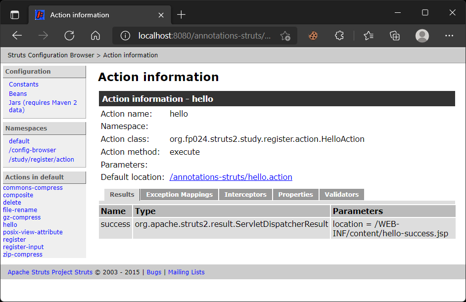

# 어노테이션

> 원문 : https://struts.apache.org/getting-started/annotations.html
>
> * ✨ Jetty의 ContextPath 설정을 프로젝트 이름 대신에 루트로 하기로해서 스크린샷의 브라우저 URL과 문서 내의 테스트 URL이 다를 수 있는데, 이부분 참고 부탁합니다.

* 소개
* Struts 2 컨벤션 플러그인
* Struts 2 구성 플러그인
* 어노테이션
* Struts 2 구성 값 
* 요약


이 튜토리얼의 예제 코드인 **annotations**는 [struts-examples](https://github.com/apache/struts-examples)에서 체크아웃할 수 있습니다.


## 소개

이전 튜토리얼에서는 XML 파일(`struts.xml`)을 사용하여 애플리케이션을 구성했습니다. XML 파일은 ActionSupport 클래스(`RegisterAction.java`)와 함께 액션 이름(`register`)을 연결하고 브라우저에 다시 렌더링할 결과(`register.jsp`)를 연결합니다. Struts 2는 XML을 사용하여 액션 이름, `ActionSupport` 클래스 및 결과에 대한 표준 명명 규칙 및 어노테이션을 사용하여 애플리케이션을 구성하는 대안을 제공합니다.  

이 튜토리얼에서는 Java 클래스 및 메서드에 어노테이션을 적용하는 방법을 이해하고 있다고 가정합니다. 어노테이션에 익숙하지 않은 경우 [Java 온라인 튜토리얼](http://download.oracle.com/javase/tutorial/java/javaOO/annotations.html)을 참조해보세요. 

Struts 2 [사용자 메일링](http://struts.apache.org/mail.html) 리스트는 도움을 받을 수 있는 훌륭한 장소입니다. 튜토리얼 예제 애플리케이션을 작동시키는데 문제가 있는 경우 Struts 2 메일리스트를 검색하세요. 문제에 대한 답을 찾지 못한 경우 메일링 리스트에 질문을 게시하세요.


## Struts 2 컨벤션 플러그인

Struts 2를 사용하면 애플리케이션의 클래스 경로에 컨벤션 플러그인을 포함할 때 표준 명명 규칙과 어노테이션을 사용할 수 있습니다. Maven을 사용하는 경우 의존성을 추가해야 합니다. 

### 컨벤션 플러그인 의존성

```xml
<dependency>
    <groupId>org.apache.struts</groupId>
    <artifactId>struts2-convention-plugin</artifactId>
    <version>X.X.X.X</version>
</dependency>
```

Ant를 사용하는 경우 Struts 2 다운로드에서 struts2-convention-plugin.jar 파일을 `WEB-INF/lib` 폴더로 복사합니다. 

컨벤션 플러그인은 XML을 사용하지 않고 Struts 2 애플리케이션을 구성할 수 있는 여러 가지 방법을 제공합니다. 자세한 내용은 [컨벤션 플러그인](https://struts.apache.org/plugins/convention/) 문서를 참조하세요. 이 튜토리얼은 컨벤션 플러그인이 제공하는 규약을 따르는 한 가지 간단한 방법만 살펴봅니다. 

예제 애플리케이션을 실행하면 `index.jsp` 페이지에 Get your hello 링크가 표시됩니다. 이 링크의 URL은 `hello.action`입니다. 이 링크를 클릭하면 `HelloAction.java` 클래스(Struts 2 `ActionSupport` 클래스)의 execute 메서드가 실행됩니다. execute 메서드가 success을 리턴한 후 브라우저에 다시 렌더링된 뷰 페이지는 `hello-success.jsp`입니다. 

위의 어떤 것도 XML을 사용하여 연결되지 않았지만 오히려 애플리케이션이 컨밴션 플러그인에서 예상하는 표준 명명 규칙을 따르기 때문에 발생합니다. 

첫 번째 규칙은 ActionSupport 클래스인 `HelloAction.java`가 `org.apache.struts.struts2annotations.action` 패키지에 있다는 것입니다. 컨벤션 플러그인의 기본값 중 하나는 action으로 끝나는 패키지 구조에 있는 `ActionSupport` 클래스를 찾는 것입니다. 애플리케이션이 따르는 다음 규칙은 `HelloAction.java`가 ActionSupport 클래스를 확장하고 execute 메서드를 정의한다는 것입니다. 링크는 hello.action입니다. Struts 2 필터는 hello.action에 대한 요청을 볼 때 사용 중인 컨벤션 플러그인으로 인해 해당 요청을 HelloAction 클래스의 execute 메소드에 매핑합니다. 

따라서 hello.action의 링크는 HelloAction 클래스의 execute 메서드를 실행하게 합니다. 그 메서드는 `success`을 반환합니다. 애플리케이션이 컨벤션 플러그인을 사용하고 있기 때문에 Struts 2는 WEB-INF/content에 있는 `hello-success.jsp`라는 뷰 페이지를 브라우저에 다시 렌더링합니다(기본적으로 컨벤션 플러그인은 모든 뷰 페이지가 이 위치에 있을 것으로 예상합니다). execute 메서드가 "input" 또는 "error"를 반환하면 렌더링된 뷰 페이지는 `hello-input.jsp` 또는 `hello-error.jsp`가 됩니다. 


## Struts 2 구성 플러그인

[이전 튜토리얼](../debugging-struts)에서 Struts 2가 애플리케이션을 구성한 방법에 대한 세부사항을 보기 위해 Struts 2 구성 플러그인을 사용하는 방법을 검토했습니다. 컨벤션 플러그인을 사용할 때 개발 중에 구성(Configuration) 플러그인도 함께 사용하면 매우 편리합니다. 예제 애플리케이션의 홈 페이지에는 애플리케이션 구성에 대한 링크가 있습니다. 해당 링크를 클릭한 다음 왼쪽 메뉴에서 Hello 링크를 클릭합니다(기본적으로 Actions 아래). Action 클래스, 결과 및 뷰 페이지를 포함하여 hello 액션에 대한 구성을 볼 수 있습니다. 




## 어노테이션

컨벤션 플러그인에서 제공하는 간단한 명명 규칙을 넘어서고 싶다면 플러그인에서도 제공하는 Struts 2 어노테이션을 사용할 수 있습니다. 예를 들어, Struts 2 애플리케이션의 일반적인 작업 흐름은 먼저 ActionSupport 클래스의 input 메서드를 실행하여 폼 필드 기본값을 설정한 다음 폼이 제출될 때 동일한 ActionSupport 클래스의 execute 메서드를 실행하는 것입니다(사용자 입력의 검증 및 저장).

예제 애플리케이션의 홈 페이지에 있는 Register for the drawing 링크는 이 작업 흐름을 따릅니다. 링크 값은 `register-input.action`입니다. RegisterAction.java 클래스를 조사하면 Action 어노테이션이 있는 input 메서드를 찾을 수 있습니다. 

### Action 어노테이션

```java
@Action("register-input")
public String input() throws Exception {
    logger.info("In input method of class Register");

    return INPUT;
}
```

Action 어노테이션은 Struts 2에게 action link 값이 Action 어노테이션의 값(`register-input`)과 같을 때 어노테이션이 붙은 메서드를 실행하도록 지시합니다. 따라서 `register-input.action`의 링크는 `RegisterAction` 클래스의 input 메서드를 호출합니다. 예제 애플리케이션의 홈 페이지에는 `register-input.action`  URL을 사용하는  Register for the drawing 링크가 있습니다. 

위의 input 메서드은 "input"을 반환합니다. 컨벤션 플러그인의 표준에 따라 렌더링된 보기 페이지는 `register-input.jsp` (`WEB-INF/content` 경로에서)가 됩니다. 해당 뷰 페이지에는 action 속성 값이 register인 Struts 2 폼 태그가 있습니다. 폼을 제출할 때 RegisterAction 클래스의 execute 메서드가 실행됩니다. execute 메서드가 success를 리턴하므로 렌더링된 뷰 페이지는 `register-success.jsp`입니다. 


## Struts 2 구성 값 

이전 예에서는 일부 Struts 2 구성 매개변수에 대한 struts.xml 값을 포함했습니다. 

### struts.xml 파라미터 구성

```xml
<constant name="struts.devMode" value="true" />
```

struts.xml 파일을 사용하지 않을 때 web.xml의 필터 매개변수를 사용하여 이러한 Struts 2 매개변수의 값을 설정할 수 있습니다. 

### struts.xml 파라미터 구성 - web.xml

```xml
<filter>
    <filter-name>struts2</filter-name>
    <filter-class>org.apache.struts2.dispatcher.filter.StrutsPrepareAndExecuteFilter</filter-class>
    <init-param>
        <param-name>struts.devMode</param-name>
        <param-value>true</param-value>
    </init-param>
</filter>
```


## 요약

XML 파일을 사용하여 Struts 2 애플리케이션을 구성할 필요를 줄이거나 없애기 위해 Struts 2 규칙 플러그인이 제공하는 기능들을 수박 겉핧기 식으로 진행해보았습니다. Struts 2 컨벤션 플러그인은 여러 액션을 동일한 메서드에 매핑하고, 결과를 다른 뷰 페이지에 매핑하고, 오류를 뷰 페이지에 매핑하는 등의 방법을 제공합니다.  Struts 2 애플리케이션을 구성하는 다른 방법에 대해서는 [컨벤션 플러그인](https://struts.apache.org/plugins/convention/) 문서를 읽어보세요. 


### >  [스프링과 Struts 2](../spring-and-struts-2)로 돌아가기 또는 [인터셉터 입문](../introducing-interceptors)로 이동

---


## 스텝 진행...

* 프로젝트 변경사항
  * 프로젝트명: [annotations-struts](annotations-struts) 로 변경.
  
    
  
* [x] 소개

* [x] Struts 2 컨벤션 플러그인

* [x] Struts 2 구성 플러그인

  * 구성 플러그인에 대한 코드는 원본 예제 소스에 없어서, 디펜던시와 링크 추가했다.
    * `<p><a href="<s:url action="index" namespace="config-browser" />">Launch the configuration browser</a></p>`

* [x] 어노테이션

* [x] Struts 2 구성 값 

* [x] 요약


## 진행 중 이슈사항

### struts2-convention-plugin 이 포함된 상태에서 액션 테스트 케이스를 수행하면, 아래 예외가 발생한다.

* NoClassDefFoundError 예외
    ```
    java.lang.NoClassDefFoundError: org/apache/commons/compress/compressors/CompressorException
    
        at java.base/java.lang.Class.getDeclaredMethods0(Native Method)
        at java.base/java.lang.Class.privateGetDeclaredMethods(Class.java:3166)
        at java.base/java.lang.Class.privateGetPublicMethods(Class.java:3191)
        at java.base/java.lang.Class.getMethods(Class.java:1904)
        at org.apache.struts2.convention.PackageBasedActionConfigBuilder.getActionAnnotations(PackageBasedActionConfigBuilder.java:874)
    ```

* commons-compress 디펜던시를 추가해주면 NoClassDefFoundError 예외 발생 문제는 해결된다.

  ```xml
  <dependency>
    <groupId>org.apache.commons</groupId>
    <artifactId>commons-compress</artifactId>
    <version>${commons-compress.version}</version>
  </dependency>
  ```

  

### 액션 메서드마다 정확하게 경로를 써서 `@Action` 어노테이션을 붙여야만 잘 동작했다.

```java
  @Action("/register-input")
  public String input() {
	// (...)
  }

  @Action("/register")
  @Override
  public String execute() {
	// (...)
  }
```

원본 예제 프로젝트에는 `execute` 메서드에는 별도 `@Action` 어노테이션 붙이는 부분이 없었는데, 내 환경에서 실제로 테스트 할 때는 위와 같은 방식으로 반드시 붙여줘야 정상 인식 되었다. 그리고 `register`만 쓰는게 아니라 경로 구분자(`/`)도 앞에 반드시 붙여줘야 액션을 잘 찾을 수 있었다.


### 액션 테스트 코드 수행을 위해서는 `@Result` 까지 완전하게 명시해줘야했다.

```java
  @Action(
      value = "/register-input",
      results = {@Result(name = INPUT, location = "register-input.jsp")})
  public String input() {
	// (...)
  }

  @Action(
      value = "/register",
      results = {
        @Result(name = INPUT, location = "register-input.jsp"),
        @Result(name = SUCCESS, location = "register-success.jsp")
      })
  @Override
  public String execute() {
	// (...)
  }
```

[Struts 2 JUnit 5 사용자 커스텀 플러그인](../plugins/struts2-junit5-user-custom-plugin)을 사용해서 액션 테스트를 할 때, 위 처럼 result를 명시하지 않으면 액션 테스트를 수행시 오류가 발생했다. 컨트롤러를 Component Scan으로 액션을 빈으로 만들어내는 것에 대해선 @Action 어노테이션 사용하는 것과 특별히 호환성문제는 없는 것 같다.


스프링의 어노테이션 설정에 비하면 복잡하게 느껴질 수는 있겠지만, 예전에 맡았던 프로젝트에서 너무 많은 액션 매핑들이 xml설정되어있을 때 (사용이 되는 것인지도 모를....),  꽤나~ 머리가 아플때가 있었다 🤪,  이렇게 어노테이션을 활용하는 것도 괜찮을 것 같긴하다.

