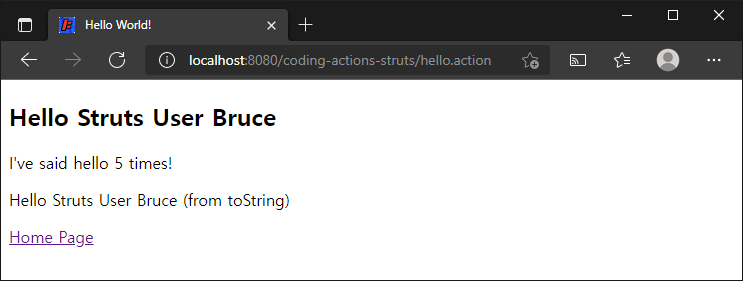
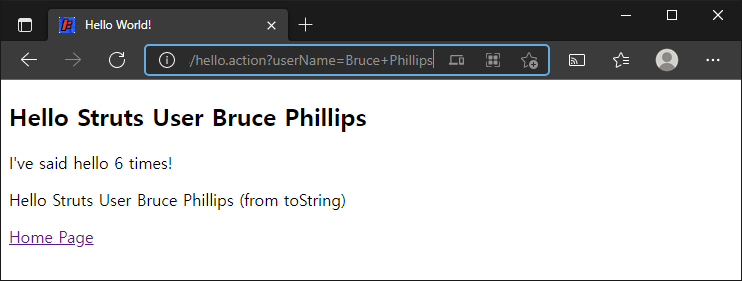

# 액션 코딩하기

> 원문 : https://struts.apache.org/getting-started/coding-actions.html

* 소개
* Struts 2 액션 클래스
* 액션 클래스에서 폼 입력 처리하기
* 요약

이 튜토리얼은 **[Struts 2 태그 사용하기](../using-tags)** 튜토리얼을 완료했고 **using-tags** 프로젝트가 작동한다고 가정합니다. 이 튜토리얼의 예제 코드인 **coding-actions**는 Struts 2 깃허브의 [struts-example](https://github.com/apache/struts-examples) 레파지토리에서 체크아웃 할 수 있습니다.


### 소개

Struts 2 액션 코딩에는 다음과 같은 몇가지 부분이 포합됩니다.:

1. 클레스에 액션 매핑
2. 뷰에 결과 매핑
3. 액션 클레스에 컨트롤러 로직 작성

이전 튜토리얼에서는 `hello.action`과 같은 URL을 `HelloWorldAction`이란 액션 클래스에 매핑하도록 Struts를 구성하는 방법을 다루었습니다. (특히 execute 메서드)

#### 액션 매핑

```jsp
<action name="hello" class="org.apache.struts.helloworld.action.HelloWorldAction" method="execute">
    <result name="success">/HelloWorld.jsp</result>
</action>
```

위의 액션 매핑은 `HelloWorldAction`클래스의 `execute`메서드가 `success`를 반환하면 `HelloWorld.jsp`가 브라우저에 반환되도록 지정했습니다.

이 튜토리얼에서는 액션 클래스에 컨트롤러 로직을 작성하는 기본 사항을 소개합니다.


### Struts 2  액션 클래스

액션 클래스는 MVC 패턴에서 컨트롤러 역활을 합니다. 액션 클래스는 사용자의 행위에 응답하고 비지니스 로직을 실행한 다음 (또는 이를 수행하기 위해 다른 클래스를 호출) Struts에게 랜더링할 뷰를 알려주는 결과를 반환합니다. 

Struts 2 액션 클래스는 일반적으로 Struts 2 프레임워크에서 제공하는 `ActionSupport` 클래스를 확장합니다. `ActionSupport` 클래스는 가장 일반적인 액션(예: execute, input)에 대한 기본 구현을 제공하고 몇 가지 유용한 Struts 2 인터페이스도 구현합니다. 액션 클래스가 ActionSupport 클래스를 확장할 때, 기본 구현을 재정의(Override) 하거나 상속할 수 있습니다.

Struts 2 태그 사용하기 튜토리얼에서 HelloWorldAction 클래스를 조사하면 `ActionSupport` 클래스를 확장한 다음 `execute`메서드를 재정의 한 것을 알 수 있습니다.

`execute` 메서드는 `hello.action`에 대한 응답으로 이 컨트롤러가 수행할 작업을 배치하는 위치입니다.

#### HelloWorldAction의 execute 메서드

```java
public String execute() throws Exception {
    messageStore = new MessageStore() ;

    helloCount++;

    return SUCCESS;
}
```

>execute 메서드는 Exception을 던질 수 있다고 선언합니다.  Action 클래스 메서드에서 던진 예외를 처리하도록 Struts에 설정하는 방법은 이후 튜토리얼에서 다룰 것입니다. 

 

### 액션 클래스에서 폼 입력 처리하기

액션 클래스의 가장 일반적인 책임중 하나는 폼에서 사용자 입력을 처리한 다음 처리 결과를 뷰 페이지에서 사용할 수 있도록 하는 것입니다. 이 책임을 설명하기 위해 `HelloWorld.jsp`에서 "Hello Struts User Bruce"와 같은 개인 인사를 표시하려한다고 가정하겠습니다.

[Struts 2 태그 사용하기](../using-tags) 예제 어플리케이션에서 `index.jsp`에 Struts 2 폼을 추가했습니다.

#### Struts 2 폼 태그

```jsp
<s:form action="hello">
    <s:textfield name="userName" label="Your name" />
    <s:submit value="Submit" />
</s:form>
```

Struts 2 textfield 태그의 name 속성 값이 userName인 것에 유의하세요. 사용자가 위의 폼의 submit 버튼을 클릭하면 hello 액션이 실행됩니다(`hello.action`). 폼 필드 값은 Struts 2 Action 클래스(`HelloWorldAction`)로 보내집니다. Action 클래스는 폼 필드 값과 일치하는 public set 메서드가 있는 경우 해당 폼 필드 값을 자동으로 받을 수 있습니다.

따라서 HelloWorldAction 클래스가 자동으로 userName 값을 수신하려면 public 메서드 setUserName이 있어야합니다. ([Hello World 튜토리얼](hello-world-using-struts-2)에서 논의된 JavaBean 규칙 참고).

이 튜토리얼과 연관된 예제 애플리케이션의 `HelloWorldAction` 클래스에 다음 Java 코드를 추가하세요.

#### HelloWorldAction에 userName 추가

```java
private String userName;

public String getUserName() {
    return userName;
}

public void setUserName(String userName) {
    this.userName = userName;
}
```

MessageStore의 message를 (MessageStore 클래스가 표시할 메세지를 저장하고 있음을 상기하세요) 개인화 하려면 HelloWorldAction의 execute 메서드의 MessageStore 객체를 인스턴스화하는 코드 문장 뒤에 다음 Java 코드를 추가하세요. 

#### message에 userName 값 추가

```java
if (userName != null) {
    messageStore.setMessage( messageStore.getMessage() + " " + userName);
}
```

이제 애플리케이션을 빌드하고 실행(`mvn jetty:run`)합니다.  폼에 이름을 입력하고 submit 버튼을 클릭합니다. 다음 페이지가 표시되어야합니다.  



폼이 제출 되면 Struts는 폼 필드 이름과 일치하는 HelloWorldAction의 set메서드를 호출합니다. 따라서 이 예제에서는 `setUserName`메서드가 호출되어 사용자가 `userName`폼 필드에 입력한 값이 전달 되었습니다.

`index.jsp`에는 쿼리 문자열 파라미터가 포함된 Struts 2 액션 링크([Struts 2 태그 사용하기](../using-tags) 참조)도 있습니다: `userName=Bruce+Phillips`. 해당 링크를 클릭하면 다음과 같은 결과가 표시되어야합니다.



쿼리 문자열 파라미터가 `userName`이므로, Struts는  해당 파라미터 값을 `setUserName`메서드에 전달 했습니다.

뷰 페이지인 HelloWorld.jsp에서 Struts 2 프로퍼티 태그를 사용하여 userName의 값에 접근할 수도 있습니다([Struts 2 태그 사용하기](../using-tags) 참조). 뷰 페이지에 userName 값만 표시해보십시오.


### 요약

이 튜토리얼에서는 폼에 대한 사용자 입력이나, 쿼리 문자열 파라미터의 값을 처리할 수 있도록 엑션 클래스의 코딩 방법을 소개했습니다. 만약 폼에 많은 필드가 있는 경우 각 폼 필드와 일치하는 set 메서드를 갖는 것이 번거로울 것입니다. 따라서 다음 자습서에서는 모델 클래스, 뷰의 폼 필드 및 Action 클래스의 폼 처리를 통합하는 방법을 다룹니다. 


### >  [Struts 2 태그 사용하기](../using-tags)로 돌아가기 또는 [폼 처리](../processing-forms)로 이동


---

## 액션 코딩하기 예제 진행...

* 변경사항
  * 프로젝트명: coding-actions-struts
* [x] 소개
* [x] Struts 2 액션 클래스
* [x] 액션 클래스에서 폼 입력 처리하기
* [x] 요약

