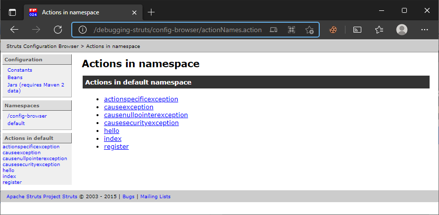
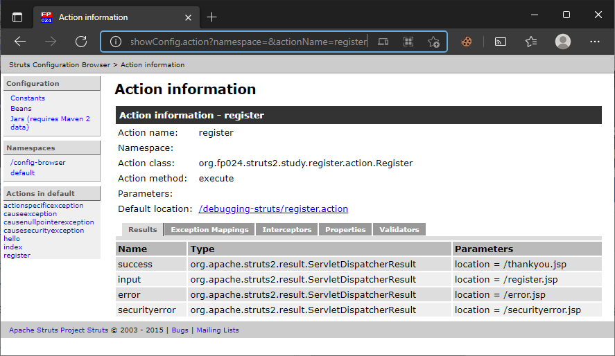
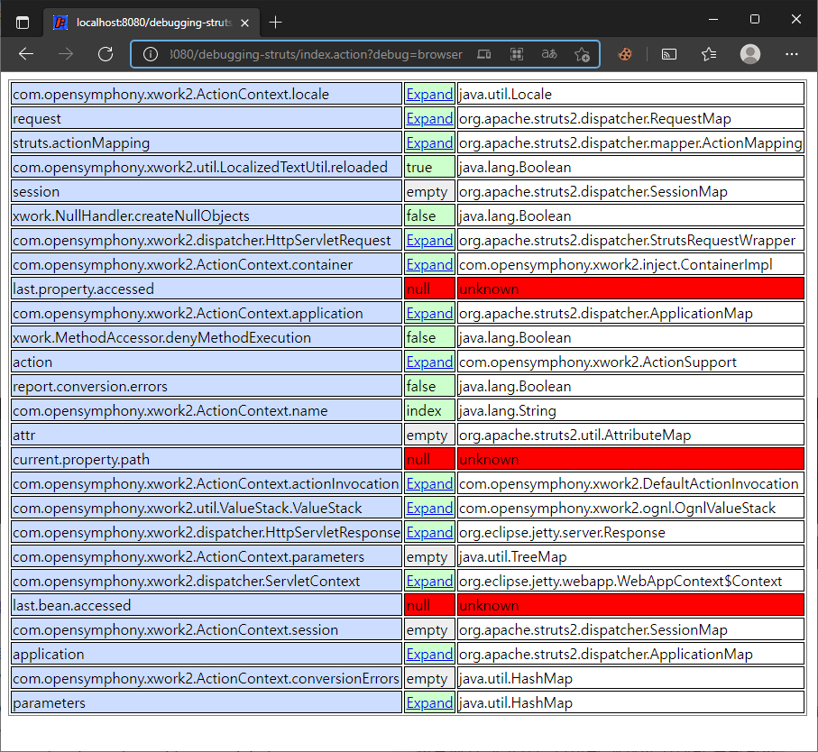

# Struts 디버깅

> 원문 : https://struts.apache.org/getting-started/debugging-struts.html
>
> * ✨ Jetty의 ContextPath 설정을 프로젝트 이름 대신에 루트로 하기로해서 스크린샷의 브라우저 URL과 문서 내의 테스트 URL이 다를 수 있는데, 이부분 참고 부탁합니다.

* 소개
* 구성 플러그인 
* 디버깅 인터셉터 사용
* Struts 2 로깅
* 요약

이 튜토리얼의 코드인 **debugging-struts**은 [struts-examples](https://github.com/apache/struts-examples)에서 체크아웃 할 수 있습니다.


### 소개

Struts 2 웹 애플리케이션을 개발하는 동안 Struts 2 웹 프레임워크가 관리하는 정보를 보고 싶을 수 있습니다. 이 튜토리얼에서는 Struts 2가 웹 애플리케이션을 보는 방법을 확인하는데 사용할 수 있는 두가지 도구를 다룹니다. 하나는 Struts 2 구성 플러그인이고 다른 하나는 디버깅 인터셉터 입니다. 이 문서에서는 로그 메시지를 적거나 또는 많게 표시하도록 로그 레벨을 설정하는 방법도 설명합니다.

Struts 2 [사용자 메일링](http://struts.apache.org/mail.html) 리스트는 도움을 받을 수 있는 훌륭한 장소입니다. 튜토리얼 예제 애플리케이션을 작동시키는데 문제가 있는 경우 Struts 2 메일리스트를 검색하세요. 문제에 대한 답을 찾지 못한 경우 메일링 리스트에 질문을 게시하세요.


### 구성 플러그인 

Struts 2 구성 브라우저 플러그인은 Struts 2 프레임워크가 애플리케이션을 실행하는데 사용하는 구성에 대한 세부 정보를 제공합니다. 플러그인을 사용하려면 애플리케이션의 클래스 경로에 struts2-config-browser-plugin-x.x.x.x.jar가 있어야 합니다. config-browser-plugin jar는 Struts 2 다운로드의 일부이며 Maven 저장소에서도 사용할 수 있습니다.

애플리케이션에서 플러그인을 사용하려면 네임스페이스 `config-browser`에서 index.action을 호출하기만 하면 됩니다. 예를 들어 관리 페이지(또는 개발 중 아무 곳에나)에 다음 링크가 있을 수 있습니다.

```xml
<a href='<s:url action="index" namespace="config-browser" />'>Launch the configuration browser</a>
```

예제 애플리케이션에는 index.jsp 페이지에 구성 브라우저에 대한 링크가 있습니다.

구성 브라우저에 대한 링크를 클릭하면 Struts 2 프레임워크가 이 페이지를 브라우저에 반환합니다.



액션 링크를 클릭하면 해당 작업에 대한 구성을 볼 수 있습니다. 예를 들어 register 액션 링크를 클릭하면 다음과 같은 결과가 나타납니다.



그런 다음 탭(Results, Exception Mappings, Interceptors, Properties, Validators) 중 하나를 클릭하여 Struts 2 프레임워크가 특정 작업을 구성한 방법에 대한 자세한 정보를 얻을 수 있습니다.

페이지 왼쪽에는 config 브라우저 플러그인 메뉴가 있습니다. Constants를 클릭하면 모든 Struts 2 상수와 애플리케이션의 속성을 나열하는 보기가 렌더링됩니다. Beans을 클릭하면 Struts 2가 관리하는 빈이 표시됩니다. Jars를 클릭하면 애플리케이션에서 사용 중인 jar가 표시됩니다.


### 디버깅 인터셉터 사용

`devMode`를 true로 설정했다면(예제 애플리케이션에서 `struts.xml` 참조) Struts 2가 액션을 처리할 때 활성화되는 인터셉터 중 하나는 DebuggingInterceptor입니다. DebuggingInterceptor는 액션 URL에서 값으로 xml, condole, command 또는 broswer가 설정될 수 있는 debug란 이름의 쿼리 스트링을 찾습니다.

`DebuggingInterceptor`가 해당 쿼리 문자열을 찾으면 액션의 추가 실행을 중지하고 대신 브라우저 디버깅 정보로 돌아갑니다. 반환된 정보의 형식은 디버그 쿼리 파라미터의 값에 따라 다릅니다. 자세한 내용은 [DebuggingInterceptor](https://struts.apache.org/core-developers/debugging-interceptor.html)를 참조하세요.

index.jsp의 예제 애플리케이션에서 디버깅 정보를 표시하기 위한 링크가 있습니다. 이 링크에는 쿼리 문자열 `debug=browser`가 포함되어 있습니다. 이 링크를 클릭하면 펼치고 접을 수 있는 열이 있는 표를 볼 수 있습니다. 이 테이블에는 Struts 2 프레임워크에서 관리하는 다양한 객체와 상태가 포함되어 있습니다.



디버깅 정보 웹 페이지에서 확장/축소 링크의 올바른 표시 및 상호 작용을 활성화하려면 JSP의 헤드 섹션에 `s:head` 태그를 포함하고(예제 애플리케이션의 index.jsp 참조) 애플리케이션의 클래스 경로에 Struts 2 dojo 플러그인도 포함해야 합니다. Struts 2 dojo 플러그인은 Struts 2 다운로드의 일부로 Maven 저장소에서 사용할 수 있습니다.  **<참고> Struts 2 dojo 은 2.3 까진 지원되었으나 2.5에서 제거됨.**  


### Struts 2 로깅

Struts 2 프레임워크는 디버그 레벨에서 로깅하도록 로그 속성을 구성한 경우 많은 양의 정보를 로그에 기록합니다. 예제 애플리케이션에서 `log4j2.xml`을 보세요.  Struts 2 프레임워크와 관련된 두 가지 주요 패키지인 `com.opensymphony` 및 `org.apache.struts2`는 디버그 및 위의 로그 메시지를 작성하도록 구성됩니다

어플리케이션을 실행할 때 로그에 기록된 모든 정보를 서블릿 컨테이너의 표준 출력으로 볼 수 있습니다. [Logging](https://struts.apache.org/core-developers/logging.html) 페이지에서 다른 옵션을 확인하세요.


### 요약

구성 브라우저 플러그인과 디버깅 인터셉터를 사용하면 Struts 2 웹 애플리케이션의 문제를 해결하는 데 도움이 될 수 있습니다. 이러한 도구는 개발 환경에서만 사용해야 합니다.

프로덕션에 배포하기 위해 war 파일을 생성하기 전에 `devMode`를 false로 변경하고 디버깅 링크를 제거해야 합니다. 로그 메시지 수를 줄이기 위해 로그 설정 파일의 로깅 레벨을 더 높은 레벨(INFO 또는 WARN)으로 조정할 수도 있습니다.


### >  [예외 처리](../exception-handling)로 돌아가기 또는 [폼 태그](https://struts.apache.org/getting-started/form-tags.html)로 이동


---

## Struts 디버깅 진행...

* 변경사항
  * 프로젝트명: [debugging-struts](debugging-struts)
  
* [x] 구성 플러그인 

  * struts2-config-browser-plugin 가 디펜던시에 포함되야한다.

      ```xml
      <!-- 버전 정의 -->
        <properties>
          ...
          <struts2.version>2.5.26</struts2.version>
          ...
        </properties>
      <!-- 부모 POM -->
      <dependencyManagement>
        <dependencies>
          <dependency>
            <groupId>org.apache.struts</groupId>
            <artifactId>struts2-bom</artifactId>
            <version>${struts2.version}</version>
            <type>pom</type>
            <scope>import</scope>
          </dependency>
          ...
        <dependencies>
      <dependencyManagement>
      ...
      <!-- 하위 프로젝트 -->
      <dependencies>
        <dependency>
          <groupId>org.apache.struts</groupId>
          <artifactId>struts2-config-browser-plugin</artifactId>
        </dependency>
      </dependencies>
      ```

  

* [x] 디버깅 인터셉터 사용

  * 원 저자님 브라우저 모드 디버깅 화면의 HttpServletResponse나 ServletContext 의 클래스를 보니 catalina 패키지 이름이여서, 왠지 Tomcat 환경에서 하신 것 같다. 나는 Jetty의  패키지로 나타남.

  * Struts 2 버전을 2.5로 낮추더라도, 확장/축소 링크 클릭시 ValueStack에서 해당 내용을 찾을 수 없어 NPE가 발생하는 경우들이 있었음.

  * Struts 2 Dojo Plugin 이 2.5에서는 제거됨. (따로 지정하지 않아도 드롭 다운에 크게 문제는 없었다.)

    * https://mvnrepository.com/artifact/org.apache.struts/struts2-dojo-plugin

    * https://cwiki.apache.org/confluence/display/WW/Struts+2.3+to+2.5+migration

      ```
      Remove the following plugin dependencies because they were dropped and aren't supported anymore.
      
      * Dojo Plugin
      * Codebehind Plugin
      * JSF Plugin
      * Struts1 Plugin
      ```

      

* [x] Struts 2 로깅

* [x] 요약


### `debug=browser` 로 디버깅 템플릿 페이지가 처리되지 않는 문제

* 테스트 URL: http://localhost:8080/debugging-struts/index.action?debug=browser

* `index.action?debug=browser` 같은 식으로 debug 파라미터로 browser 값을 넣어 호출 했을 때, NPE예외 발생으로 디버그 탬플릿이 정상 처리되지 않는다.

    ```
    2021-10-29 09:24:53,416 ERROR [qtp224468764-51] debugging.DebuggingInterceptor$3 (DebuggingInterceptor.java:237) - Unable to create debugging console
    java.lang.NullPointerException: null 
        at org.apache.struts2.interceptor.debugging.ObjectToHTMLWriter.write(ObjectToHTMLWriter.java:67) ~[struts2-core-2.5.26.jar:2.5.26]
        ...
    ```
    
    ```java
    // DebuggingInterceptor:216
    // rootObjectExpression 이 따로 전달되지 않으면 #context로 값이 설정됨
    Object rootObject = stack.findValue(rootObjectExpression);
    // 그런데 context에 대한 내용을 가져오지 못하고 null 을 반환한다.
    ```
    
    * **그동안 Struts 2의 보안 패치가 진행되면서,  관련부분이 보안상의 이유로 막혀서 그럴것 같다.  그런데 그 변경에 대한 내용이 현재 튜토리얼에 반영이 안된 것 같다.**
    
      * Struts 2 의 버전을 2.5로 낮추고 접근하면 #context 탐색이 문제가 없었다. (불가능했던 버전 2.5.26) 
          ```xml
          <!-- 하위 프로젝트의 pom.xml 에서 struts2.version 프로퍼티를 재정의한다. -->
          <properties>
            <struts2.version>2.5</struts2.version>
          </properties>
          ```
          
          잠깐 디버깅 뷰 페이지 모양 확인시에만 버전 낮춰서 확인해보면 되겠다. **이대로 커밋하면 Gitbub의 dependabot 보안 경고 알림 메일이 올 것 같다.**
      


### IntelliJ 에서  Maven의 jetty:run 으로 실행하더라도 디버깅 모드로 실행하면 중단점을 잡아 값과 실행흐름을 잘 추적할 수 있다.

* 처음엔 반드시 IDE에 서버 설정 후, 거기다 올려서 돌려야만 되는 줄알았음.

