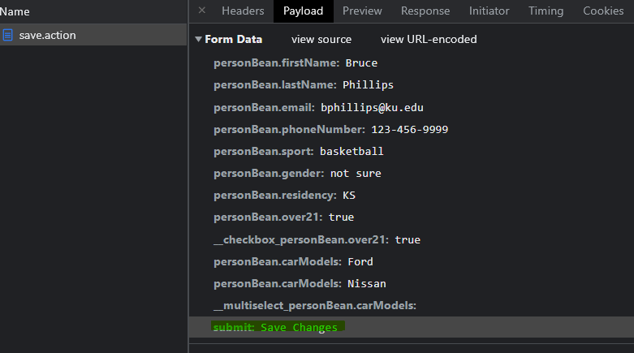

# 파라미터 제외하기

> 원문 : https://struts.apache.org/getting-started/exclude-parameters.html
>
> * ✨ Jetty의 ContextPath 설정을 프로젝트 이름 대신에 루트로 하기로해서 스크린샷의 브라우저 URL과 문서 내의 테스트 URL이 다를 수 있는데, 이부분 참고 부탁합니다.

* 소개
* 요청 파라미터 처리
* Struts 2 처리에서 요청 파라미터 제외하기
* 예제 애플리케이션
* 요약


이 튜토리얼의 예제 코드인 **exclude-parameters**는 [struts-examples](https://github.com/apache/struts-examples)에서 체크아웃할 수 있습니다.


## 소개

Struts 개발 모드가 true로 설정되면([Struts 디버깅](../debugging-struts) 참조) 프레임워크는 많은 정보 메시지를 로그 파일에 씁니다. 이러한 메시지에는 특정 파라미터가 파라미터 인터셉터에 의해 처리되고 액션 클래스에서 사용할 수 있는지 여부를 나타내는 메시지가 포함됩니다. 이러한 로그 메시지는 보안 또는 기타 이유로 파라미터 인터셉터가 처리하지 않기를 원하는 파라미터를 명확하게 식별하는 데 도움이 될 수 있습니다. 이 문서에서는 파라미터 인터셉터에서 처리되는 파라미터를 제외하는 방법에 대해 설명합니다.

Struts 2 [사용자 메일링](http://struts.apache.org/mail.html) 리스트는 도움을 받을 수 있는 훌륭한 장소입니다. 튜토리얼 예제 애플리케이션을 작동시키는데 문제가 있는 경우 Struts 2 메일리스트를 검색하세요. 문제에 대한 답을 찾지 못한 경우 메일링 리스트에 질문을 게시하세요.


## 요청 파라미터 처리

대부분의 요청 파라미터는 기본적으로 파라미터 인터셉터에 의해 처리되며 Struts 2는 해당 public  set 메서드를 호출하여 파라미터 이름과 일치하는 액션 클래스 필드의 상태를 수정하려고 시도합니다. 예를 들어 요청에 Phillips 값이 있는 lastName 파라미터가 포함된 경우 Struts 2는 setLastName(String lastName)의 서명을 사용하여 public 메서드를 호출하려고 시도합니다. 그러나 Struts 2가 액션 클래스의 값을 설정하려고 하지 않는 요청 파라미터가 있을 수 있습니다.

폼을 생성하는 다음 코드를 생각해보세요:

### Struts 2 폼 태그

```jsp
<s:form action="save" method="post">
    <s:textfield key="personBean.firstName" /> 
    <s:textfield key="personBean.lastName" /> 
    <s:textfield key="personBean.email" />
    <s:textfield key="personBean.phoneNumber" />
    <s:select key="personBean.sport" list="sports" />
    <s:radio key="personBean.gender" list="genders" />
    <s:select key="personBean.residency" list="states" listKey="stateAbbr" listValue="stateName" />
    <s:checkbox key="personBean.over21" />
    <s:checkboxlist key="personBean.carModels" list="carModelsAvailable" />
    <s:submit key="submit" />
</s:form>
```

s:submit 태그는 submit이라는 이름의 제출 버튼을 생성합니다. 액션 클래스에는 setSubmit(String name) 메서드가 없을 수 있으므로 다음 로그 메시지를 볼 수 있습니다(Struts 개발 모드가 true로 설정된 경우에만).

### 로그 메시지

```
Dec 31, 2012 3:43:53 PM 
com.opensymphony.xwork2.util.logging.commons.CommonsLogger warn
WARNING: Parameter [submit] is not on the excludeParams list of patterns and will be appended to action!

Dec 31, 2012 3:43:53 PM com.opensymphony.xwork2.util.logging.commons.CommonsLogger error
SEVERE: Developer Notification (set struts.devMode to false to disable this message):
Unexpected Exception caught setting 'submit' on 'class org.apache.struts.edit.action.EditAction: Error setting expression 'submit' with value ['Save Changes', ]
```


## Struts 2 처리에서 요청 파라미터 제외하기

Struts 2 애플리케이션을 위한 사용자 정의 인터셉터 스택을 설정하는 데 익숙하지 않다면 [인터셉터 입문](../introducing-interceptors)을 검토해보세요.

Struts 2 프레임워크에서 처리되는 특정 파라미터를 제외하려면 제외된 파라미터 목록에 해당 파라미터 이름을 추가해야 합니다. 이를 수행하는 한 가지 방법은 이러한 파라미터 이름을 Parameters 인터셉터에 대한 `excludeParams` 컬렉션에 추가하는 것입니다. Struts 2 애플리케이션에서 사용하는 인터셉터 스택을 설정할 때 파라미터 인터셉터를 수정하여 이를 수행할 수 있습니다. 예를 들면:

### submit 파라미터를 제외하는 인터셉터 스택 설정

```xml
<interceptors>
    <interceptor-stack name="appDefault">
        <interceptor-ref name="defaultStack">
            <param name="exception.logEnabled">true</param>
            <param name="exception.logLevel">ERROR</param>
            <param name="params.excludeParams">dojo..*,^struts..*,^session..*,^request..*,^application..*,^servlet(Request|Response)..*,parameters...*,submit</param>
        </interceptor-ref>
    </interceptor-stack>
</interceptors>
		
<default-interceptor-ref name="appDefault" />
```

`<param name="params.excludeParams">` 노드의 값은 파라미터 인터셉터에서 처리해서는 안 되는쉼표로 구분된 정규식 목록 또는 요청 파라미터를 식별하는 단순 문자열입니다. submit 파라미터(위의 폼 코드에서 제출 버튼 이름)를 제외하기 위해 목록에 submit을 추가했습니다.

제외할 매개변수 이름/정규 표현식의 초기 세트를 보려면 [여기에 설명된 인터셉터의 기본 스택](https://struts.apache.org/core-developers/struts-default-xml.html)을 참조하세요. 이미 제외된 파라미터 목록을 복사한 다음 쉼표로 구분된 끝에 자신의 파라미터를 추가해야 합니다.


## 예제 애플리케이션

요청 파라미터 제외를 보여주는 예제 애플리케이션, [exclude-params](https://github.com/apache/struts-examples/tree/master/exclude-parameters)를 다운로드하세요. 애플리케이션을 빌드하고 실행하는 방법은 프로젝트의 README.txt 파일을 참조해보세요.

submit 파라미터를 제외하지 않을 때 기록된 로그 메시지를 보려면 struts.xml 파일의 제외된 파라미터 값 목록에서 `,submit`을 제거하세요. 그런 다음 애플리케이션을 다시 빌드 및 재배포하고 애플리케이션을 실행할 때 콘솔을 봅니다.


## 요약

이것은 Struts 2 프레임워크의 좋은 기능으로 개발 중에 어떤 요청 파라미터가 처리되고 처리되지 않을지 기록합니다. Struts 2 웹 애플리케이션을 개발하는 동안 프레임워크가 처리하지 않아야 하는 파라미터가 있는지 확인하기 위해 이러한 로그 메시지를 검토하는 것이 좋습니다. 이러한 파라미터의 경우 Struts 2 프레임워크는 `<param name="params.excludeParams">` 노드의 값인 쉼표로 구분된 목록에 파라미터 이름(또는 여러 파라미터 이름을 식별하는 데 사용할 수 있는 정규식)을 추가한 것을 처리하지 않아야 합니다.


### >  [Preparable 인터페이스](../preparable-interface)로 돌아가기 또는 [메인 페이지](../README.md)로 이동

---

## 스텝 진행...

* 프로젝트 변경사항
  * 프로젝트명: [exclude-parameters-struts](exclude-parameters-struts) 
  
* [x] 소개

* [x] 요청 파라미터 처리

* [x] Struts 2 처리에서 요청 파라미터 제외하기

* [x] 예제 애플리케이션

* [x] 요약

  

---

###  Accepted / Excluded patterns

2.3.20 버전부터 프레임워크는 파라미터 이름과 값을 수락/제외하는 데 사용되는 두 개의 새로운 인터페이스(기본 구현이 있는 AcceptedPatternsChecker 및 ExcludedPatternsChecker)를 제공합니다. 이 두 인터페이스는 파라미터 인터셉터와 쿠키 인터셉터에서 파라미터를 허용할 수 있는지 또는 제외해야 하는지 확인하는 데 사용됩니다. 이전에 excludeParams를 사용했다면 기본 구현에서 프레임워크에서 제공한 패턴과 사용자가 사용한 패턴을 비교해보세요.


---

## 진행중 이슈 사항

직전 튜토리얼에서도 확인했지만, `<s:submit key="submit" name=""/>` 와 같이 name을 빈문자열로 오버라이드 해버리면 submit을 호출하는 일이 없긴한데... 이런건 아무 추가 설정이 없더라도 처음부터 보내지 않도록 구현되는게 나았을 것 같은 생각이 들었다.

요청 폼 데이터를 보면 아래와 같이 submit이라는 이름으로 데이터는 다국어 프로퍼티 파일에 있는 데이터 값(Save Changes)을 보내고 있다.



