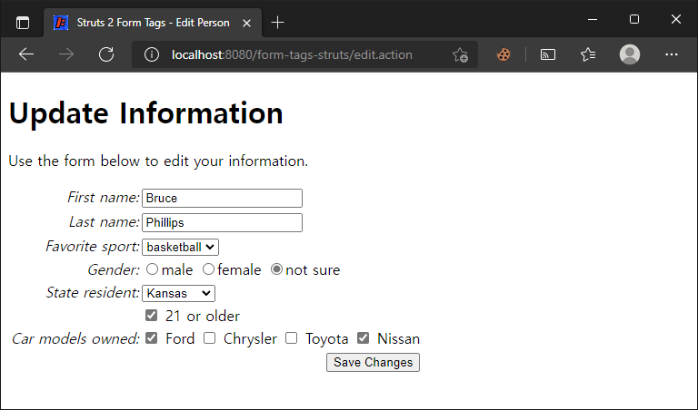

# 폼 태그

> 원문 : https://struts.apache.org/getting-started/form-tags.html

* 서문
* 예제 애플리케이션
* Struts 2 select 태그
* Struts 2 radio 태그
* Struts 2 select 태그 - 객체가 후원된(backed) 경우
* Struts  2 checkbox 태그
* Struts 2 checkboxlist 태그
* 요약

이 튜토리얼의 예제 코드인 **form-tags**은 Struts 2 깃허브의 [struts-example](https://github.com/apache/struts-examples) 레파지토리에서 체크아웃 할 수 있습니다.


### 서문

이 튜토리얼에서는 다른 Struts 2 폼 컨트롤 몇가지를 살펴봅니다 Struts 2 폼을 사용하는 방법을 설명한 이전 튜토리얼([폼 처리](../processing-forms), [폼 유효성 검사](../form-validation) 및 [메시지 리소스 파일](../message-resource-files))에서 Struts 2 `head`, `form`, `textfield` 컨트롤 및 key 속성을 사용하는 방법을 다루었습니다. 이 튜토리얼에서는 Struts 2 `select`, `radio`, `checkbox` 및 `checkboxlist` 폼 컨트롤 사용방법을 살펴볼 것 입니다.

Struts 2 [사용자 메일링](http://struts.apache.org/mail.html) 리스트는 도움을 받을 수 있는 훌륭한 장소입니다. 튜토리얼 예제 애플리케이션을 작동시키는데 문제가 있는 경우 Struts 2 메일리스트를 검색하세요. 문제에 대한 답을 찾지 못한 경우 메일링 리스트에 질문을 게시하세요. 


### 예제 애플리케이션

이 튜토리얼을 지원하는 예제 애플리케이션은 사용자가 자신의 정보를 편집할 수 있도록 Struts 2 폼 태그를 사용하는 방법을 보여줍니다. 편집할 수 있는 정보는 Person 클래스의 객체에 캡슐화됩니다. Person 객체는 이름, 성, 좋아하는 스포츠, 성별, 거주 상태, 21세 이상 여부, 소유한 자동차 모델 등을 알고 있습니다.

사용자가 Person 객체에 저장된 정보를 편집할 수 있도록 하려면 다음과 같은 양식을 만들어야 합니다.



사용자가 폼을 변경할 수 있습니다. 폼을 제출한 후 Struts 2 프레임워크는 Person 객체의 상태를 업데이트합니다.

이름과 성은 이전 튜토리얼에서 논의한 Struts 2 textfield 태그를 사용하여 폼(edit.jsp 참조)에 표시됩니다. 예제 애플리케이션은 Struts 2 select 태그를 사용하여 선택 상자에 대한 옵션 목록을 제공합니다.


### Struts 2 select 태그

사용자는 여러 선택 사항 중 좋아하는 스포츠를 하나를 선택할 수 있습니다. 예제 애플리케이션은 Struts 2 select 태그를 사용하여 선택 상자에 대한 옵션 목록을 제공합니다.


#### Struts 2 select 태그

```jsp
<s:select key="personBean.sport" list="sports" />
```

이 폼 태그에서는 [메시지 리소스 파일](../message-resource-files) 튜토리얼에서 설명한 대로 키 속성을 사용하고 있습니다. 키 속성은 Struts 2 프레임워크에서 다른 속성(예: 레이블 및 값)의 값을 결정하는 데 사용됩니다. 또한 키 속성 값을 기반으로 레이블 값을 제공하기 위해 EditAction 클래스와 연결된 프로퍼티 파일을 사용하고 있습니다(Struts 2 프로퍼티 파일 사용에 대한 정보는 [메시지 리소스 파일](../message-resource-files) 튜토리얼 참조).

> Struts 2 폼 태그에는 많은 속성이 있으며 대부분은 태그와 관련된 HTML 속성을 반영(mirror)합니다. Struts 2 문서를 참조하여 Struts 2 폼 태그의 모든 속성을 읽을 수 있습니다.

Struts 2 select 태그의 list 속성 값은 프레임워크에서 옵션 값을 생성하기 위해 호출할 액션 클래스의 메서드를 결정하는 데 사용됩니다. 예제 응용 프로그램에서 list 속성 값 "sport"는 프레임워크에서 클래스 EditAction의 getSports 메서드를 호출합니다. 이 메서드는 "football", "baseball" 및 "basketball"를 포함하는 문자열 배열을 반환합니다. 이들 값은 select 태그 내부에 option 태그를 생성하는 데 사용됩니다.

Struts 2 프레임워크는 key 속성의 값을 사용하여 personBean 객체의 메서드를 호출함으로써 어떤 옵션이 미리 선택되었는지를 결정합니다. key 속성의 값이 "personBean.sport"이기 때문에 프레임워크는 personBean 객체의 getSport 메서드를 호출합니다. 해당 메서드에서 반환된 값이 옵션 값 중 하나와 일치하는 경우 해당 옵션은 "selected"으로 표시됩니다.

다음은 위의 Struts 2 select 태그를 사용하여 생성된 HTML입니다.

```html
<tr>
    <td class="tdLabel">
        <label for="save_personBean_sport" class="label">Favorite sport:</label>
    </td>
    <td>
        <select name="personBean.sport" id="save_personBean_sport">
            <option value="football">football</option>
            <option value="baseball">baseball</option>
            <option value="basketball" selected="selected">basketball</option>
        </select>
    </td>
</tr>
```

Struts 2 select 태그를 사용할 때 Struts 2 프레임워크에 의해 생성된 테이블 형식에 유의하세요. CSS 클래스는 Struts 2 `s:head` 태그에 포함된 스타일 시트에 정의되어 있습니다. Struts 2 `s:head` 태그는 edit.jsp의 head 섹션 안에 위치합니다.

personBean의 getSport 메소드는 "baskeball"을 반환하므로 basketball 옵션 값은 선택됨으로 표시됩니다. 


### Struts 2 radio 태그

표준 HTML 태그와 같은 Struts 2 radio 태그는 2개 이상의 선택 항목을 표시하는 데 사용되며 그 중 하나만 사용자가 선택할 수 있습니다. 다음은 예제 애플리케이션의 Struts 2 라디오 버튼 코드입니다.

```jsp
<s:radio key="personBean.gender" list="genders" />
```

다시 이야기하지만,  키 속성의 값은 레이블 및 값 속성의 값을 결정합니다. 레이블의 텍스트는 EditAction.properties 파일(키 personBean.gender)에서 얻습니다. Struts 2 select 태그와 마찬가지로 Struts 2 radio 태그의 list 속성은 프레임워크가 EditAction 클래스의 getGenders 메서드를 호출하도록 합니다. 반환된 String 객체의 배열은 개별 라디오 버튼을 만드는 데 사용됩니다.

#### Struts 2 radio 태그에 의해 생성된 HTML

```jsp
<tr>
    <td class="tdLabel">
        <label for="save_personBean_gender" class="label">Gender:</label>
    </td>
    <td>
        <input type="radio" name="personBean.gender" id="save_personBean_gendermale" value="male"/>
        <label for="save_personBean_gendermale">male</label>
        
        <input type="radio" name="personBean.gender" id="save_personBean_genderfemale" value="female"/>
        <label for="save_personBean_genderfemale">female</label>
        
        <input type="radio" name="personBean.gender" id="save_personBean_gendernot sure" checked="checked" value="not sure"/>
        <label for="save_personBean_gendernot sure">not sure</label>
    </td>
</tr>
```

또한 Struts 2 select  태그와 마찬가지로 personBean 객체의 getGender 메서드를 호출하여 반환된 결과는 어떤 라디오 버튼이 선택되었는지 결정하는 데 사용됩니다.


### Struts 2 select 태그 - 객체가 후원된(backed) 경우

사용자에게 표시되는 옵션이 표시되는 것(option body 값)과 다른 고유한 값(option value 속성 값)을 갖는 Struts 2 select 태그를 생성해야 할 수도 있습니다. 예제 애플리케이션에서 사용자의 거주지는 두 글자 약어(예: KS)로 저장되지만 폼 선택 상자에는 전체 주 이름(예: Kansas)이 표시되어야 합니다. Struts 2에서 이러한 select 상자를 생성하려면 다음 코드를 사용합니다. 


#### 객체가 후원된 Struts 2 select 태그

```jsp
<s:select key="personBean.residency" list="states" listKey="stateAbbr" listValue="stateName" />
```

list 값은 프레임워크가 EditAction 클래스의 getStates 메서드를 호출하도록 지시합니다. 이 메서드는 State 객체의 ArrayList를 반환합니다. 각 State 객체에는 getStateAbbr 및 getStateName 메서드가 있습니다.

listKey 속성은 getStateAbbr 메서드를 호출하여 반환된 값을 HTML option 태그의 value 속성 값으로 사용하고 getStateName 메서드를 호출하여 반환된 값을 사용자에게 표시되는 값으로 사용하도록 프레임워크에 지시합니다. 그러면 위의 Struts 2 select 태그 코드는 아래의 HTML을 생성합니다.

Struts 2  select 태그에 의해 생성된 HTML

```jsp
<tr>
    <td class="tdLabel">
        <label for="save_personBean_residency" class="label">State resident:</label>
    </td>
    <td>
        <select name="personBean.residency" id="save_personBean_residency">
            <option value="AZ">Arizona</option>
            <option value="CA">California</option>
            <option value="FL">Florida</option>
            <option value="KS" selected="selected">Kansas</option>
            <option value="NY">New York</option>
        </select>
    </td>
</tr>
```

personBean 객체의 getResidency 메서드를 호출하여 반환된 값은 select 태그의 option 태그 중 선택된(selected) 것으로 표시하는 것을 결정합니다. 이 예에서 getResidency는 "KS"를 반환하므로 값 속성이 "KS"인 옵션 태그는 선택된 것으로 표시됩니다.


### Struts  2 checkbox 태그

Struts 2 checkbox 태그는 체크박스 태그와 동등한  HTML 입력 타입을 생성하는 데 사용됩니다. key 속성의 값은 체크박스가 선택되었는지 여부를 결정하기 위해 호출할 메서드를 프레임워크에 알려줍니다. 호출된 메서드는 부울 값(true 또는 false)을 반환해야 합니다. 반환 값이 true이면 체크박스가 선택되고 false이면 선택되지 않습니다.

#### Struts  2 checkbox 태그

```jsp
<s:checkbox key="personBean.over21" />
```

isOver21 메서드는 true를 반환하므로 체크박스가 선택됩니다.

#### Struts 2  checkbox 태그에 의해 생성된 HTML

```jsp
<tr>
    <td valign="top" align="right"></td>
    <td valign="top" align="left">
        <input type="checkbox" name="personBean.over21" value="true" checked="checked" id="save_personBean_over21"/>
        <input type="hidden" id="__checkbox_save_personBean_over21" name="__checkbox_personBean.over21" value="true" />
        <label for="save_personBean_over21" class="checkboxLabel">21 or older</label>
    </td>
</tr>
```

폼이 제출되고 체크박스가 선택되지 않은 경우 체그박스에 대한 값이 게시되지 않습니다(HTML 양식이 작동하는 방식). Struts 2 프레임워크는 체크박스가 선택되지 않은 경우 personBean의 over21 인스턴스 필드 값을 false로 업데이트해야 하므로 프레임워크는 양식 제출 후 확인란이 선택되지 않았는지 확인할 방법이 필요합니다.

Struts 2 체크박스 태그에 의해 생성된 HTML 코드를 살펴보면, personBean.over21 체크박스와 관련된 hidden 필드를 생성한 것을 볼 수 있습니다. Struts 2 프레임워크가 이 폼의 제출을 가로채면 이 숨겨진 폼 필드를 사용하여 관련 체크박스 필드가 게시된 폼 데이터에 존재하는지 확인합니다. 체크박스 필드가 존재하지 않는다면 Struts 2 프레임워크는 personBean 객체의 over21 인스턴스 변수 값을 false로 업데이트하는 것을 알게 될 것입니다.


### Struts 2 checkboxlist 태그

Struts 2 프레임워크는 일련의 연관된 체크박스를 생성하는 고유 폼 필드 컨트롤을 제공하며, 그 중 하나 이상을 선택할 수 있습니다. 예제 애플리케이션에서 Person 클래스에는 사람이 소유한 자동차 모델을 저장하는 데 사용되는 문자열 배열이 있습니다.

Struts 2 체크박스 태그를 사용하여 사용자가 소유할 수 있는 각 자동차 모델에 대해 하나씩 일련의 체크박스를 생성할 수 있습니다. personBean의 carModels 배열에 있는 각 문자열의 값은 체크할 체크박스를 결정합니다.

#### Struts 2 checkboxlist 태그

```jsp
<s:checkboxlist key="personBean.carModels" list="carModelsAvailable" />
```

checkboxlist 태그의 list 속성 값은 이용 가능한 자동차 모델을 가져오기 위해 호출할 메서드를 Struts 2 프레임워크에 알려줍니다. 예제 애플리케이션에서 프레임워크는 EditAction 클래스의 getCarModelsAvailable 메서드를 호출합니다. 해당 메서드는 문자열 배열을 반환합니다. Array의 각 요소에 대해 Struts 2 프레임워크는 체크박스를 생성합니다(위에서 설명한 관련 숨겨진 필드 포함).

checkboxlist 태그의 key 속성 값은 Struts 2 프레임워크에 체크된(checked) 체크박스를 결정하기 위해 personBean 객체에서 호출할 메서드를 알려줍니다. 예제 애플리케이션에서 프레임워크는 personBean 객체의 getCarModels 메서드를 호출합니다. getCarModels 메서드는 문자열 배열을 반환합니다. 이 배열의 각 문자열 값이 EditAction 클래스의 getCarModelsAvailable에 의해 반환된 배열의 문자열 값과 일치하는 경우 체크박스가 선택됩니다.

#### Struts 2  checkboxlist 태그에 의해 생성된 HTML

```jsp
<tr>
    <td class="tdLabel">
        <label for="save_personBean_carModels" class="label">Car models owned:</label>
    </td>
    <td>
        <input type="checkbox" name="personBean.carModels" value="Ford" id="personBean.carModels-1" checked="checked"/>
        <label for="personBean.carModels-1" class="checkboxLabel">Ford</label>
        
        <input type="checkbox" name="personBean.carModels" value="Chrysler" id="personBean.carModels-2"/>
        <label for="personBean.carModels-2" class="checkboxLabel">Chrysler</label>
        
        <input type="checkbox" name="personBean.carModels" value="Toyota" id="personBean.carModels-3"/>
        <label for="personBean.carModels-3" class="checkboxLabel">Toyota</label>
        
        <input type="checkbox" name="personBean.carModels" value="Nissan" id="personBean.carModels-4" checked="checked"/>
        <label for="personBean.carModels-4" class="checkboxLabel">Nissan</label>
        <input type="hidden" id="__multiselect_save_personBean_carModels" name="__multiselect_personBean.carModels" value="" />
    </td>
</tr>
```


### 요약

살펴봐야하는 몇 가지 다른 Struts 2 양식 컨트롤이 있습니다. Struts 2 폼 태그에 대한 추가 정보가 필요하면 http://struts.apache.org에서 Struts 2 문서를 참조해보세요.


### >  [Struts 디버깅](../debugging-struts)로 돌아가기 또는 [XML을 사용한 폼 유효성 검증](../form-validation-using-xml)으로 이동

---

## 폼 태그 예제 진행...

* 변경사항
  * 프로젝트명: form-tags-struts
  
* [x] 예제 애플리케이션

* [x] Struts 2 select 태그

* [x] Struts 2 radio 태그

* [x] Struts 2 select 태그 - 객체가 후원된(backed) 경우

* [x] Struts  2 checkbox 태그

  * 체크박스 폼을 제출할 때.. 체크를 안하고 제출을 하면 전송이 없어서 값이 안바뀌었었나? 

    CheckBoxTestAction 을 만들어서 확인해봤을 때, 전송 자체가 없었다. 현재 서버상의 값이 true일 때, 폼 제출 상에 체크박스를 체크하지 않고 제출할때  서버로 명시적 false 전송이 없어 서버의 값을 바꿀 수 없었다. 

    ```
    2021-12-06 10:09:59,326 INFO  [qtp2134194703-35] action.CheckBoxTestAction (CheckBoxTestAction.java:18) - param aaaChecked: Empty{name='aaaChecked'}, field aaaChecked true
    ```

* [x] Struts 2 checkboxlist 태그

* [x] 요약


## An illegal reflective access operation has occurred 

```
WARNING: An illegal reflective access operation has occurred
WARNING: Illegal reflective access by com.opensymphony.xwork2.util.AbstractLocalizedTextProvider (file:/C:/%USER_PROFILE%/.m2/repository/org/apache/struts/struts2-core/2.5.27/struts2-core-2.5.27.jar) to field java.util.ResourceBundle.cacheList
WARNING: Please consider reporting this to the maintainers of com.opensymphony.xwork2.util.AbstractLocalizedTextProvider
WARNING: Use --illegal-access=warn to enable warnings of further illegal reflective access operations
WARNING: All illegal access operations will be denied in a future release
```

* https://issues.apache.org/jira/browse/WW-5101

* https://linuxpip.org/an-illegal-reflective-access-operation-has-occurred/

* https://docs.oracle.com/en/java/javase/11/migrate/index.html#JSMIG-GUID-5657F44A-B2D7-4FB6-AAD7-295AC4533ABC

* Java 9 이상에서 리플렉션 호출에 의존하는 로직에의해 발생하는 경고 같은데, AbstractLocalizedTextProvider 클래스를 보았을 때, 관련해서 2.6버전에서는 주석으로 문제를 적어두고, 근본적인 코드수정이 되진 않은 것 같다.
  *  https://github.com/apache/struts/blob/master/core/src/main/java/com/opensymphony/xwork2/util/AbstractLocalizedTextProvider.java

  

