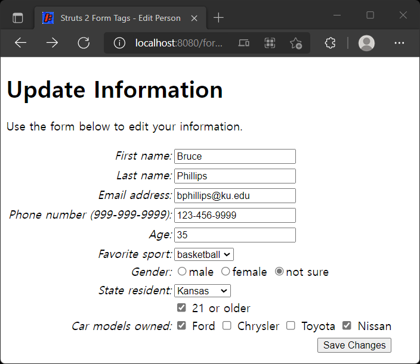
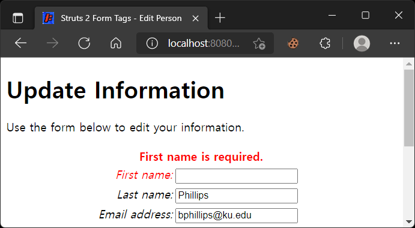
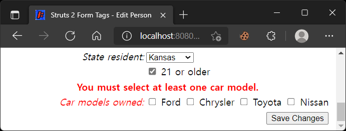

# XML을 사용한 폼 유효성 검증

> 원문 : https://struts.apache.org/getting-started/form-validation-using-xml.html
>
> * ✨ Jetty의 ContextPath 설정을 프로젝트 이름 대신에 루트로 하기로해서 스크린샷의 브라우저 URL과 문서 내의 테스트 URL이 다를 수 있는데, 이부분 참고 부탁합니다.

* 소개
* 예제 애플리케이션
*  XML을 사용한 유효성 검증
* XML 유효성 검사기 형식
* 이메일 주소 유효성 검증
* 정규 표현식을 사용한 사용자 입력 유효성 검증
* OGNL 표현식을 사용한 사용자 입력 유효성 검증
* 요약

이 튜토리얼의 예제 코드인 **form-xml-validation**은 Struts 2 깃허브의 [struts-example](https://github.com/apache/struts-examples) 레파지토리에서 체크아웃 할 수 있습니다.


## 소개

이 튜토리얼에서는 Struts 2의 XML 유효성 검증 방법론을 사용하여 양식 필드에서 사용자의 입력을 검증하는 방법을 다룰 것입니다. 이전에 [폼 유효성 검사](../form-validation) 튜토리얼에서 액션 클래스의 validate 메서드를 사용하여 사용자의 입력을 검증하는 것에 대해 논의했습니다. 별도의 XML 유효성 검사 파일을 사용하면 Struts 2 프레임워크에 내장된 유효성 검사기를 사용할 수 있습니다.

Struts 2 [사용자 메일링](http://struts.apache.org/mail.html) 리스트는 도움을 받을 수 있는 훌륭한 장소입니다. 튜토리얼 예제 애플리케이션을 작동시키는데 문제가 있는 경우 Struts 2 메일리스트를 검색하세요. 문제에 대한 답을 찾지 못한 경우 메일링 리스트에 질문을 게시하세요. 


## 예제 애플리케이션

이 튜토리얼을 지원하는 예제 애플리케이션은 Struts 2의 XML 유효성 검증 방법론을 사용하는 방법을 보여줍니다. 편집할 수 있는 정보는 Person 클래스의 객체에 캡슐화됩니다.

사용자가 Person 객체에 저장된 정보를 편집할 수 있도록 하기 위해 다음과 같은 폼이 있습니다:



사용자가 폼을 제출할 때 폼 필드에 입력한 내용을 확인하려고 합니다.


## XML을 사용한 유효성 검증

사용자의 폼 필드 항목을 검증하기 위해 유효성 검사 규칙이 포함된 별도의 XML 파일을 사용할 수 있습니다. 유효성 검사 규칙이 포함된 XML 파일의 이름은 ActionClassName-validation.xml로 지정해야 합니다. 예제 응용 프로그램에서 XML 유효성 검사 파일의 이름은 EditAction-validation.xml입니다 (참조: src/main/resources/org/apache/struts/edit/action).

Struts 2는 XML 유효성 검사 파일에서 사용할 수 있는 여러 가지 유효성 검사기를 제공합니다. 사용할 수 있는 유효성 검사기 목록은 [유효성 검사](https://struts.apache.org/core-developers/validation.html)를 참조하세요.

위의 폼에서 사용자가 필수로 이름을 입력하도록 하고 싶습니다. Struts 2 프레임워크가 해당 규칙을 적용하도록 하려면 Struts 2 [requiredstring 유효성 검사기](https://struts.apache.org/core-developers/requiredstring-validator.html)를 사용할 수 있습니다.


## XML 유효성 검사기 형식

XML 유효성 검사 파일(이 예의 경우 EditAction-validation.xml)은 다음 XML입니다.

### XML 유효성 검사기 - 필수 문자열

```xml
<!DOCTYPE validators PUBLIC "-//Apache Struts//XWork Validator 1.0.3//EN" "http://struts.apache.org/dtds/xwork-validator-1.0.3.dtd">

<validators>
    <validator type="requiredstring">
        <param name="fieldname">personBean.firstName</param>
        <message>First name is required.</message>
    </validator>
</validators>
```

`<validators>` 노드 내에서 하나 이상의 `<validator>` 노드를 가질 수 있습니다. type 속성은 Struts 2 프레임워크에서 사용할 유효성 검사기를 지정합니다 (참조: [Validation](https://struts.apache.org/core-developers/validation.html)). `<param name="fieldname">` 노드는 규칙을 적용할 폼 필드 항목을 프레임워크에 알리는 데 사용됩니다. 폼 필드와 이름 값에 대해서는 edit.jsp를 참조하세요(Struts 2 폼 태그를 사용하는 방법에 익숙하지 않은 경우 [Struts 2 폼 태그](../form-tags)를 검토해보세요). `<message>` 노드는 유효성 검사가 실패할 경우 표시할 메시지를 프레임워크에 알리는 데 사용됩니다.

> 유효성 검사 XML 파일에 들어가는 XML을 작성하는 다른 방법이 있습니다. 자세한 내용은 Struts 2 문서의 [Validation](https://struts.apache.org/core-developers/validation.html)을 참조해보세요.

예를 들어 사용자가 이름 폼 필드에 값을 입력하지 않고 변경 사항 저장 버튼을 클릭하면 다음이 표시됩니다.




## 이메일 주소 유효성 검증

Struts 2 [이메일 유효성 검사기](https://struts.apache.org/core-developers/email-validator.html)를 사용하여 이메일 필드에서 사용자의 입력을 확인할 수 있습니다. 다음은 EditAction-validation.xml 파일에 있는 유효성 검사기 노드입니다:

### 이메일 유효성 검사기

```xml
<validator type="requiredstring">
    <param name="fieldname">personBean.email</param>
    <message>Email address is required.</message>
</validator>
<validator type="email">
    <param name="fieldname">personBean.email</param>
    <message>Email address not valid.</message>
</validator>
```

이 예에서는 사용자에게 이메일 주소를 필수로 입력한 다음 사용자가 입력한 이메일 주소를 확인하도록 요구하고 있습니다.


## 정규 표현식을 사용한 사용자 입력 유효성 검증

Struts 2 프레임워크는 [regex 유효성 검사기](https://struts.apache.org/core-developers/regex-validator.html)를 사용하여 사용자의 폼 필드 입력을 검증하는 강력한 방법을 제공합니다. 예제 애플리케이션에서는 사용자가 999-999-9999 형식으로 전화번호를 입력하도록 하려고 합니다. 이 규칙을 적용하기 위해 정규식과 정규식 유효성 검사기를 사용할 수 있습니다.

### REGEX 유효성 검사기

```xml
<validator type="requiredstring">
    <param name="fieldname">personBean.phoneNumber</param>
    <message>Phone number is required.</message>
</validator>
<validator type="regex">
    <param name="fieldname">personBean.phoneNumber</param>
    <param name="regex"><![CDATA[\d{3}-\d{3}-\d{4}]]></param>
    <message>Phone number must be entered as 999-999-9999.</message>
</validator>
```

`<param name="regex">` 노드는 사용자 입력에 적용될 정규식을 지정하는 데 사용됩니다. 정규 표현식이 CDATA 섹션에 어떻게 포함되어 있는지 확인해보세요.


## OGNL 표현식을 사용한 사용자 입력 유효성 검증

예제 애플리케이션에서 사용자가 자동차 모델 확인란 중 하나 이상을 선택하도록 하려고 합니다. 이 규칙을 적용하기 위해 [필드 표현식 유효성 검사기](https://struts.apache.org/core-developers/fieldexpression-validator.html)를 사용할 수 있습니다. 다음은 해당 유효성 검사기 노드에 대한 XML입니다.

### 필드 표현식 유효성 검사기

```xml
<validator type="fieldexpression">
    <param name="fieldname">personBean.carModels</param>
    <param name="expression"><![CDATA[personBean.carModels.length > 0]]></param>
    <message>You must select at least one car model.</message>
</validator>
```

`<param name="expression">` 노드에는 true 또는 false로 평가되는 OGNL 표현식이 포함됩니다. 이전에 Object-Graph Navigation Language(https://github.com/jkuhnert/ognl 및 [OGNL](https://struts.apache.org/tag-developers/ognl.html) 참조)를 나타내는 OGNL에 대해 논의한 적이 없습니다. OGNL 표현식은 Struts 2 프레임워크에서 Java 문으로 평가할 수 있습니다.

위의 XML에서 `<param name="expression">` 노드의 값인 `personBean.carModels.length > 0`은 프레임워크에 의해 Java 문으로 평가됩니다. personBean.carModels 부분은 프레임워크가 Person 클래스의 getCarModels 메서드를 호출하도록 지시합니다. 해당 메서드는 배열을 반환합니다. Array 클래스에는 length 속성이 있으므로 프레임워크는 getCarModels 메서드에서 반환된 Array의 length 속성 값을 가져옵니다.

사용자가 체크박스 란을 선택하지 않은 경우 getCarModels 메서드에서 반환된 Array의 length 값은 0입니다. 완전한 OGNL 표현식은 길이 값이 0보다 큰 경우에만 true로 평가되므로 유효성 검사가 실패합니다. 사용자는 다음을 보게 될 것입니다. 



필드 표현식 유효성 검사기는 사용자 입력의 조건부 유효성 검사를 수행할 때 유용합니다. OGNL 표현식이 true로 평가되지 않으면 사용자의 입력이 허용되지 않습니다.


## 요약

Struts 2 프레임워크는 사용하기 쉬운 유효성 검증 방법론을 제공합니다. 유효성 검사 방법을 액션 클래스에 추가하거나 유효성 검사 규칙이 있는 별도의 XML 파일을 사용할 수 있으며, 두 방법론을 조합하여 사용할 수 있습니다.


### >  [폼 태그](../form-tags)로 돌아가기 또는 [제어 태그](../control-tags)으로 이동

---

## XML을 사용한 폼 유효성 검증 예제 진행...

* 변경사항
  * 프로젝트명: [form-xml-validation-struts](form-xml-validation-struts)
* [x] 서문
* [x] 예제 애플리케이션
* [x]  XML을 사용한 유효성 검증
* [x] XML 유효성 검사기 형식
* [x] 이메일 주소 유효성 검증
* [x] 정규 표현식을 사용한 사용자 입력 유효성 검증
* [x] OGNL 표현식을 사용한 사용자 입력 유효성 검증
* [x] 요약

