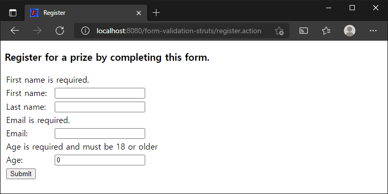
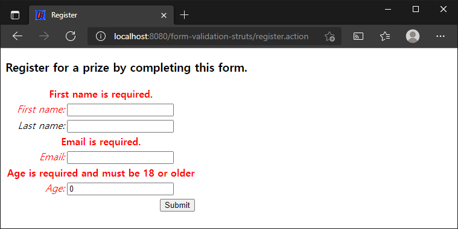

# 폼 유효성 검사

> 원문 : https://struts.apache.org/getting-started/form-validation.html

* 소개
* 유효성 검사 메서드 추가하기
* 반환되는 입력 처리
* 오류 메시지
* 오류 메시지 스타일 지정
* 요약
* 다음으로

이 튜토리얼은 **[폼 처리](../processing-forms)** 튜토리얼을 완료했고 **form-processing** 프로젝트가 작동한다고 가정합니다. 이 튜토리얼의 예제 코드인 **form-validation**은 Struts 2 깃허브의 [struts-example](https://github.com/apache/struts-examples) 레파지토리에서 체크아웃 할 수 있습니다.


### 소개

이 튜토리얼에서는 Struts 2를 사용하여 폼에 대한 사용자 입력의 유효성을 검사하는 방법을 살펴 보겠습니다. Struts 2를 사용하여 폼의 유효성 감사를 수행할 수 있는 방법에는 두가지가 있습니다. 이 튜토리얼은 Struts 2 액션 클래스에 유효성 검사가 포함된 보다 기본적인 방법을 다룰 것입니다.

Struts 2 [사용자 메일링](http://struts.apache.org/mail.html) 리스트는 도움을 받을 수 있는 훌륭한 장소입니다. 튜토리얼 예제 애플리케이션을 작동시키는데 문제가 있는 경우 Struts 2 메일리스트를 검색하세요. 문제에 대한 답을 찾지 못한 경우 메일링 리스트에 질문을 게시하세요.


### 유효성 검사  메서드 추가하기

Struts 2 액션 클래스가 Struts 2 폼의 사용자 입력의 유효성을 검사할 수 있도록 하려면 액션 클래스에 유효성 검사 메서드를 정의해야합니다.<br>[폼 처리](../processing-forms) 튜토리얼의 예제를 사용하여 다음과 같은 비지니스 규칙이 있다고 가정해보겠습니다:

1. first name은 반드시 제공해야함.
2. email address는 반드시 제공해야함.
3. 18세 미만 사용자는 등록할 수 없음.

폼 처리 튜토리얼에서 폼 필드에 대한 사용자 입력은 Strtus 2에 의해 Java 모델 클래스인 `personBean`에 배치됩니다. 따라서 firstName 필드에 대한 사용자 입력은 personBean의 firstName 인스턴스필드의 값이 됩니다. (`personBean.setFirstName` 메서드를 통해)

validate 메서드에서 적절한 get 메서드를 사용하여 personBean의 인스턴스 필드 값을 가져와서 참조할 수 있습니다. 일단 값이 있으면 비지니스 규칙을 적용하기 위해 로직을 쓸 수 있습니다. 

`Register.java`(액션 클래스)에 다음 유효성 검증 메서드를 추가하세요.

#### 유효성 검사 메서드

```java
public void validate(){
    if (personBean.getFirstName().length() == 0) {
        addFieldError("personBean.firstName", "First name is required.");
    }

    if (personBean.getEmail().length() == 0) {
        addFieldError("personBean.email", "Email is required.");
    }

    if (personBean.getAge() < 18) {
        addFieldError("personBean.age", "Age is required and must be 18 or older");
    }
}
```

사용자가 등록 폼에서 Submit 버튼을 누르면 Struts 2는 사용자의 입력을 personBean의 인스턴스 필드로 전송합니다. 그러면 Struts 2가 자동으로 validate 메서드를 실행할 것입니다. if 문중 하나라도 참이라면 Struts 2는`addFieldError`메서드(액션 클래스가 ActionSupport를 확장하여 상속됨)를 호출합니다. 

오류가 추가된 경우 Struts 2는 execute 메서드 호출을 진행하지 않습니다. 오히려 Struts 2 프레임워크는 액션을 호출한 결과로 `input`을 반환합니다.


### 반환되는 입력 처리

그렇다면 Struts 2가 폼에 있는 사용자의 입력이 유효하지 않음을 나타내는 `input`을 반환하려면 어떻게해야 할까요? 대부분의 경우 폼이 있는 웹 페이지를 다시 표시하고, 폼에 오류 메시지를 포함하여 사용자에게 무엇이 잘못되었는지 알려주고 싶을 것입니다.

`input`의 반환 값을 처리하려면 `struts.xml`의 action 노드에 다음 result를 추가해야합니다.

```xml
<result name="input">/register.jsp</result>
```

위의 result 노드는 register action 노드안의  succes result 노드 바로 뒤와 닫는 action 노드 사이에 추가합니다.


### 오류 메시지

그러면 유효성 검사가 실패하고 Struts 2 가 input을 반환하면 Struts 2 프레임워크는 `register.jsp`를 다시 표시합니다. Struts 2 폼 태그를 사용했기 때문에 Struts 2는 자동으로 오류 메시지를 추가합니다. 이러한 오류 메시지는 `addFieldError` 메서드 호출에서 지정한 것입니다. `addFieldError` 메서드는 두개의 인수를 취합니다. 첫 번째는 오류가 적용되는 폼 필드 이름이고 두 번째는 폼 필드 위에 표시할 오류 메시지 입니다.

따라서 다음 addFieldError 메서드를 호출합니다:

```java
addFieldError("personBean.firstName", "First name is required.")
```

폼의 `firstName` 필드 위해 *First name is required* 이란 메시지가 표시됩니다.

[폼 처리](../processing-forms) 튜토리얼에 위의 변경사항을 적용했거나 깃 허브의 [폼 검증](https://github.com/apache/struts-examples/tree/master/form-validation) 튜토리얼(프로젝트 루트 폴더의 README.txt 참조)을 다운로드한 경우 어플리케이션을 실행해봅니다. register 링크를 클릭해보세요. 등록 폼에서 Submit 버튼을 클릭하면 다음이 표시됩니다.



Struts 2는 validate 메서드를 호출했고, 유효성 검징이 실패했으며, `register.jsp`가 오류 메시지와 함께 표시됩니다.


### 오류 메시지 스타일 지정

Struts 2 `s:head` 태그는 오류 메시지에 대한 스타일을 포함하는 CSS를 제공하는데 사용할 수 있습니다. 닫는 HTML `</head>`태그 앞에 `<s:head />`를 `register.jsp`에 추가합니다. 위와 동일한 단계를 수행하면 다음이 표시됩니다.




### 요약

이 튜토리얼에서는 액션 클래스에 validate 메서드를 추가해서 사용자의 폼 입력의 유효성을 검사하는 방법을 다뤘습니다. XML을 사용하여 사용자 입력의 유효성을 검사하는 또다른 정교한 방법이 있습니다. Struts 2에서 XML을 사용한 유효성 검사 방법에 대해 자세히 알아보려면 [유효성 검사](https://struts.apache.org/core-developers/validation.html)를 참조하세요.


### 다음으로

다음 튜토리얼에서는 메시지 리소스 파일을 사용하여 뷰 페이지에서 텍스트를 분리하는 방법을 다룰 것입니다.


### >  [폼 처리](../processing-forms)로 돌아가기 또는 [메시지 리소스 파일](https://struts.apache.org/getting-started/message-resource-files.html)으로 이동


---

## 폼 유효성 검사 예제 진행...

* 변경사항
  * 프로젝트명: form-validation-struts
* [x] 소개
* [x] 유효성 검사 메서드 추가하기
* [x] 반환되는 입력 처리
* [x] 오류 메시지
* [x] 오류 메시지 스타일 지정
* [x] 요약
* [x] 다음으로
