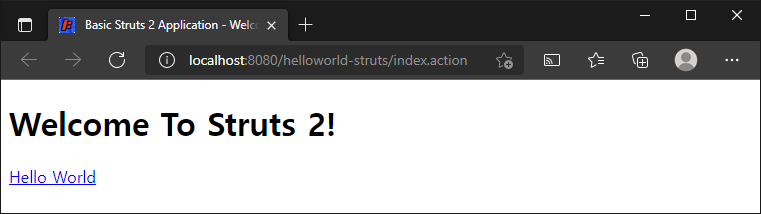
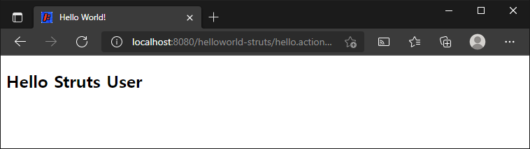

# Struts 2 를 사용한 Hello World

> 원문 : https://struts.apache.org/getting-started/hello-world-using-struts2.html
>
> * ✨ Jetty의 ContextPath 설정을 프로젝트 이름 대신에 루트로 하기로해서 스크린샷의 브라우저 URL이 다를 수 있는데, 이부분 참고 부탁합니다.

* 설명

* 코드

  * 스텝 1 - 모델 클래스 MessageStore.java 만들기
  * 스텝 2 - 액션 클래스 HelloWorldAction.java 만들기
  * 스텝 3 - 뷰 HelloWorld.jsp 만들기
  * 스텝 4 - struts.xml에 스트럿츠 설정 추가
  * 스탭 5 - URL 액션 만들기
  * 스탭 6 - WAR파일을 빌드하고 어플리케이션을 실행

* 코드가 작동하는 방식

* 기억해야할 사항

  

## 설명

Struts 2 웹 어플리케이션에서 하이퍼링크를 클릭하거나 HTML 양식을 제출하면 다른 서버 페이지로 전송되지 않고, 사용자가 제공하는 Java 클래스로 전송됩니다. 이러한 클래스들을 Action이라고 합니다. Action이 실행된 후 Result는 응답을 렌더링할 리소스를 선택합니다. 리소스는 일반적으로 서버 페이지이지만 PDF파일 Excel 스프레드시트 또는 Java 애플릿 창일 수도 있습니다.

환영 메시지를 표시하는 간단한 "Hello World" 예제를 만든다고 가정합시다.

비어있는 기본 Struts 2 웹 응용 프로그램을 설정한 후 ([Struts 2 웹 어플리케이션을 만드는 방법](../how-to-create-a-struts-2-web-application) 참조) "Hello World" 예제를 만드려면, 다음 4가지 작업을 수행해야합니다.

1. 환영 메시지를 저장할 클래스를 만들기 (모델)
2. 메시지를 표시하는 서버 페이지 만들기 (뷰)
3. 사용자, 모델 및 뷰 간의 상호작용을 제어하는 Action 클래스를 만들기 (컨트롤러)
4. Action 클래스와 뷰를 연결하는 매핑(struts.xml)을 만들기

이러한 구성요소를 만들어서 작업 흐름을 3가지 잘 알려진 문제들로 분리합니다:  뷰, 모델, 컨트롤러<br>관심사를 분리하면 애플리케이션이 복잡해짐에 따라 관리하기가 더 쉬워집니다. 

모델 클래스, Action, 서버 페이지 및 매핑 예제를 살펴보겠습니다. 원하는 경우 Java IDE를 실행하고 코드를 입력합니다.

>이 튜토리얼은  [Struts 2 웹 어플리케이션을 만드는 방법](../how-to-create-a-struts-2-web-application) 튜토리얼을 완료했고, 작동하는 기본 Struts 프로젝트가 있다고 가정합니다. 이 자습서의 예제 코드인 helloworld는 Struts 2 GitHub의 [struts-example](https://github.com/apache/struts-examples) 레파지토리에서 체크아웃 받을 수 있습니다. 예제 프로젝트는 메이븐을 사용하여 아티펙트 의존성을 관리하고, .war파일로 빌드합니다.


##  코드

basic-struts 프로젝트에 다음을 추가하여 수정해봅시다. (실제 진행시에는 프로젝트명을 helloworld-struts 로 새로 만들어도 되겠다.)

* 메시지를 저장하는 모델 클래스

* 메시지를 표시하는 뷰

* 컨트롤러 역활을 하는 Action 클래스

* 모든 것을 하나로 묶는 설정

  >[Struts 2 유저 메일링 리스트](https://struts.apache.org/mail.html)는 도움을 받을 수 있는 훌륭한 장소입니다. 이 애플리케이션을 작동시키는 데 문제가 있는 경우 Struts 2 메일링 리스트를 검색하세요. 이 문제에 대한 답을 찾지 못한 경우 메일링 리스트에 질문을 게시하세요.


### 스텝 1 - 모델 클래스 MessageStore.java 만들기

`src/main/java`에 MessageStore 클래스를 만듭니다. 아래 패키지 설명을 참고하세요.

>아래 표시된 코드에서는 JavaDoc 주석이 생략되어있습니다. 다운로드 예제에는 JavaDoc 주석이 포함되어있습니다. 

#### MessageStore.java

```java
package org.apache.struts.helloworld.model;

public class MessageStore {
    private String message;
    
    public MessageStore() {
        message = "Hello Struts User";
    }

    public String getMessage() {
        return message;
    }
}
```

private String message 필드에 접근 허용을 위해 getter 메서드를 사용하는 것을 참고하세요. Struts 2 프레임 워크에서는 뷰(helloworld.jsp)에 노출하려는 객체가 JavaBean 스타일 규칙을 따라야합니다.


### 스텝2 - 액션 클래스 HelloWorldAction.java 만들기

컨트롤러 역활을 하는 액션 클래스가 필요합니다. 액션 클래스는 사용자의 동작(`요청`)에 응답합니다 (이 예제에서 해당 동작은 HTML 하이퍼링크를 클릭하고 특정 URL을 서블릿 컨테이너로 보내는 것). 액션 클래스의 메서드 중 하나 이상이 실행되고, String 결과가 반환됩니다. 결과 값에 따라 특정 뷰 페이지(이 예에서는 뷰 페이지가 HelloWorld.jsp)가 렌더링됩니다.

아래 package 문과 import 문을 참고하세요.

#### HelloWorldAction.java

```java
package org.apache.struts.helloworld.action;

import org.apache.struts.helloworld.model.MessageStore;

import com.opensymphony.xwork2.ActionSupport;

public class HelloWorldAction extends ActionSupport {
    private MessageStore messageStore;

    public String execute() {
        messageStore = new MessageStore() ;
        
        return SUCCESS;
    }

    public MessageStore getMessageStore() {
        return messageStore;
    }
}
```

Struts 2 프레임워크는 `HelloWorldAction` 클래스의 객체를 생성하고  사용자의 동작에 대한 응답으로 execute 메서드를 호출합니다 (특정 URL을 서블릿 컨테이너로 보내는 하이퍼링크 클릭).

이 예제에서 execute 메서드는 `MessageStore` 클래스의 객체를 생성한 다음 String 상수 `SUCCESS` 를 반환합니다.

private `MessageStore` 객체를 위한 public getter 메서드에 유의하세요.

`MessageStore` 객체를 뷰 페이지 `HelloWorld.jsp`에서 사용할 수 있도록 하려면 필요한 경우 getter 및 setter 메서드를 제공하는 JavaBean 스타일을 따라야합니다.

 

### 스텝 3 - 뷰 HelloWorld.jsp 만들기

모델 클래스 MessageStore에 저장된 메세지를 표시하려면 서버 페이지가 필요합니다. `src/main/webapp`폴더에 아래 JSP를 생성합니다.

#### HelloWorld.jsp

```jsp
<!DOCTYPE html>
<%@ page language="java" contentType="text/html; charset=UTF-8" pageEncoding="UTF-8" %>
<%@ taglib prefix="s" uri="/struts-tags" %>
<html>
  <head>
    <meta http-equiv="Content-Type" content="text/html; charset=UTF-8">
    <title>Hello World!</title>
  </head>
  <body>
    <h2><s:property value="messageStore.message" /></h2>
  </body>
</html>
```

taglib 지시문은 이 페이지가 Struts 2 테그를 사용할 것이며 이러한 테그 앞에 s가 올 것임을 서블릿 컨테이너에 알립니다.

`<s:property>` 태그는 `HelloAction`클래스의 `getMessageStore` 메서드를 호출하여 반환된 값을 표시합니다.

이 메서드는 `MessageStore` 객체를 반환합니다. `.message`를 value속성의 messageStore 부분에 추가함으로써 Struts2 프레임워크가 해당 MessageStore 객체의 getMessage 메서드를 호출하도록 지시합니다. `MessageStore` 클래스의 `getMessage` 메서드는 String을 리턴합니다. `<s:property>` 태그에 의해 표시될 문자열입니다.

다음 튜토리얼에서 자세히 알아보겠습니다. 태그에 대한 자세한 내용은 Struts 태그를 참고하세요.


### 스텝 4 -  struts.xml에 스트럿츠 설정  추가

URL, `HelloWorldAction` 클래스(컨트롤러) 및 `HelloWorld.jsp`(뷰)를 함께 연결하는 매핑이 필요합니다. 매핑은 사용자의 동작(URL)에 응답할 클래스, 해당 클래스의 어떤 메서드가 실행될지, 메서드가 반환하는 String 결과에 따라 랜더링할 뷰를  Struts2 프레임워크에게 알려줍니다.

`struts.xml` 파일(Maven 프로젝트에서 해당 파일은 `src/main/resources` 폴더에 있음)을 편집하여 작업 매핑을 추가합니다.

action 노드를  (action `name="hello"`)  package 노드를 열고 닫는 안쪽의  `name="index"` 인 action  매핑 이후에  위치시킵니다. 전체 struts.xml은 다음과 같습니다.  

#### struts.xml

```xml
<?xml version="1.0" encoding="UTF-8"?>
<!DOCTYPE struts PUBLIC
		"-//Apache Software Foundation//DTD Struts Configuration 2.5//EN"
		"http://struts.apache.org/dtds/struts-2.5.dtd">
<struts>
    <constant name="struts.devMode" value="true" />

    <package name="basicstruts2" extends="struts-default">
        <action name="index">
            <result>/index.jsp</result>
        </action>
		
        <!-- 새로 추가한 action mapping -->
        <action name="hello" class="org.apache.struts.helloworld.action.HelloWorldAction" method="execute">
            <result name="success">/HelloWorld.jsp</result>
        </action>
    </package>
</struts>
```


### 스텝 5 -  URL 액션 만들기

사용자가 링크를 클릭하여 `HelloWorldAction` 클래스의 execute메서드를 실행하고 `HelloWorld.jsp` 뷰가 렌더링될 수 있게 Struts 2 프레임워크에 지시할 수 있도록 `index.jsp` 내부에 Action URL을 추가해보겠습니다. (`src/main/webapp` 폴더 참조)

먼저 jsp 상단에 taglib 지시문을 추가합니다 `<%@ taglib prefix="s" uri="/struts-tags" %> `. 다음으로 `h1` 태그 뒤에 `p` 태그 `<p><a href="<s:url action='hello'/>">Hello World</a></p>`를 추가합니다. 새 index.jsp는 다음과 같아야 합니다.

#### index.jsp

```jsp
<!DOCTYPE html>
<%@ page language="java" contentType="text/html; charset=UTF-8" pageEncoding="UTF-8" %>
<%@ taglib prefix="s" uri="/struts-tags" %>
<html>
    <head>
        <meta http-equiv="Content-Type" content="text/html; charset=UTF-8">
        <title>Basic Struts 2 Application - Welcome</title>
    </head>
    <body>
        <h1>Welcome To Struts 2!</h1>
        <p><a href="<s:url action='hello'/>">Hello World</a></p>
    </body>
</html>
```

Struts url 태그는 hello 액션으로 URL을 생성합니다. hello 액션은 `HelloWorldAction` 클래스 및 해당 `execute` 메서드에 매핑되었습니다. 사용자가 위의 URL을 클릭하면 Struts 2 프레임워크가 HelloWorldAction 클래스의 execute 메서드를 실행하게 됩니다. 해당 메서드가 문자열 `success`(상수 `SUCCESS`) 를 리턴한 후, 뷰 페이지 `HelloWorld.jsp`가 렌더링 됩니다.


### 스텝 6 - WAR파일을 빌드하고 어플리케이션을 실행

`mvn jetty:run`을 실행하여 애플리케이션을 실행합니다.

http://localhost:8080/index.action URL로 이동하면 다음이 표시됩니다.



Hello World 링크를 클릭하면 HelloWorld.jsp 페이지가 표시됩니다.




## 코드가 작동하는 방식

브라우저는 URL http://localhost:8080/hello.action에 대한 요청을 웹 서버에 보냅니다.

1. 컨테이너는 웹서보로부터 `hello.action`에 대한 요청을 받습니다. `web.xml`로부터 로드된 설정에 따라 컨테이너는`*.action` 요청을 포함하여 모든 요청이 `org.apache.struts2.dispatcher.filter.StrutsPrepareAndExecuteFilter`로 라우팅되는 것을 찾습니다. `StrutsPrepareAndExecuteFilter`는 프레임워크의 진입점입니다. 
2. 프레임워크는 "hello"라는 액션 매핑을 찾고 이 매핑이 `HelloWorldAction` 클래스에 해당하는 것을 찾습니다. 프레임워크는 Action을 인스턴스화하고 Action의 `execute` 메서드를 호출합니다.
3. `execute` 메서드는 MessageStore 객체를 생성하고 `SUCCESS` ( = `"success"`)를 반환합니다. 프레임워크는 `SUCCESS`가 반환되는 경우 로드할 페이지를 확인하기위해 액션 매핑을 확인합니다. 프레임워크는 요청에 대한 응답인 `HelloWorld.jsp` 리소스를 렌더링하도록 컨테이너에 지시합니다.
4. HelloWorld.jsp 페이지가 처리될 때, `<s:property value="messageStore.message" />` 태그는 HelloWorldAction의 `getMessageStore`메서드(getter메서드)를 호출한 다음 `getMessageStore`메서드가 반환한 MessageStore 객체의 `getMessage`메서드를 호출합니다. 테그는 메시지 속성의 값을 응답에 병합합니다.
5. 순수한 HTML 응답이 브라우저로 다시 전송됩니다.


## 기억해야할 사항

프레임워크는 액션들을 사용하여 HTML 양식 및 기타 요청을 처리합니다. `Action` 클래스는 `SUCCESS`, `ERROR`또는 `INPUT`과 같은 결과 이름을 반환합니다. struts.xml에서 로드된 매핑을 기반으로 주어진 result-name은 페이지, 다른 action 또는 일부 다른 웹 리소스(이미지, PDF)를 선택할 수 있습니다.

서버 페이지가 랜더링될 때, 대부분의 경우 Action에서 제공하는 동적 데이터가 포합됩니다. 동적 데이터를 쉽게 표시할 수 있도록 프레임워크는 HTML마크업과 함께 서버 페이지를 생성하는데 사용할 수 있는 테그 집합을 제공합니다.


### >  [Struts 2 웹 어플리케이션을 만드는 방법](../how-to-create-a-struts-2-web-application)으로 돌아가기 또는 [Struts 2 태그 사용하기](../using-tags)로 이동


---

## 스텝 진행...

* 약간의 변경사항
  * 프로젝트명: helloworld-struts
  * 로깅
    * log4j-core, log4j-api 의 디펜던시를 명시하지 않고, log4j-slf4j-impl 하나만 디펜던시를 걸고 코드 상에서 slf4j로 사용한다. log4j-slf4j-impl 가 앞의 두 모듈의 디펜던시도 가져옴
  * lombok 추가하였는데, 특별히 문제는 보이지 않았다.

* [x] 스텝 1 - 모델 클래스 MessageStore.java 만들기
* [x] 스텝 2 - 액션 클래스 HelloWorldAction.java 만들기
* [x] 스텝 3 - 뷰 HelloWorld.jsp 만들기
* [x] 스텝 4 - struts.xml에 스트럿츠 설정 추가
* [x] 스탭 5 - URL 액션 만들기
* [x] 스탭 6 - WAR파일을 빌드하고 어플리케이션을 실행
