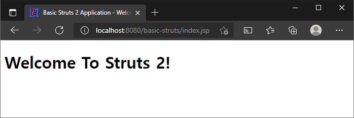
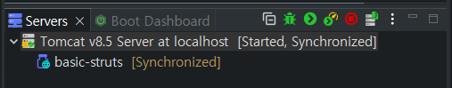

# Struts 2 웹 어플리케이션을 만드는 방법

> 원문 : https://struts.apache.org/getting-started/how-to-create-a-struts2-web-application.html

* Java 요구사항

* 우리의 첫번째 어플리케이션

* 아티펙트 관리하고 어플리케이션 빌드를 위해 메이븐을 사용하는 Struct 2 웹 어플리케이션 만들기

  * 스텝 1 - Java 웹 어플리케이션 만들기

    * Maven을 사용하여 어플리케이션을 실행하려면 Jetty Maven 플러그인을 pom.xml에 추가하세요.
  * 스텝 2 - index.jsp 추가
  * 스텝 3 - Struts 2 Jar 파일들을 클래스 패스에 추가
  * 스텝 4 - 로깅 추가
  * 스탭 5 - Struts 2 서블릿 필터 추가
  * 스탭 6 - struts.xml 만들기
    * 스탭 7 - 어플리케이션의 빌드 및 실행
  
* 도움 받기

  

이 튜토리얼은 프레임워크를 설치하고 간단한 애플리케이션을 만드는 과정을 안내합니다.

Struts 2 프레임워크는 사용이 간단하지만 중요한 응용 프로그램을 만들려면 다음을 포함한 많은 J2EE 기술에 대한 작업 지식이 있어야 합니다.

* Java
* Filters, JSP, and Tag Libraries
* JavaBeans
* HTML and HTTP
* Web Containers (such as Tomcat)
* XML

> 지원 기술에 대한 자세한 내용은, 다음을 보세요 [핵심 기술 입문서](https://struts.apache.org/primer.html).


## Java 요구사항

Struts 2 는 서블릿 API 2.4+, JSP 2.0+, Java 7+을 요구합니다.


##  우리의 첫번째 어플리케이션

Struts 2 사용을 시작하기 위해 Maven을 사용하여 아티팩트 종속성을 관리하는 웹 애플리케이션을 생성합니다. Struts 2 GitHub 저장소에서 모든 예제 애플리케이션을 확인할 수 있습니다.  [struts-examples](https://github.com/apache/struts-examples).


## 아티펙트 관리와 어플리케이션 빌드를 위해 Maven을 사용하는 Struts 2 어플리케이션 만들기

> 이 튜토리얼에서는 Maven을 사용하여 아티펙트 관리 및 웹 어플리케이션 아카이브(WAR)파일을 빌드하는 Java 웹 어플리케이션을 생성하는 방법을 알고 있다고 가정합니다.


### 스텝 1 - Java 웹 어플리케이션 만들기

Java IDE에서 표준 Maven 프로젝트 폴더 구조를 따르는 `basic_struts` 란 프로젝트 이름으로 Java 웹 어플리케이션을 생성하세요. pom.xml 에는 다음이 포함됩니다.

#### pom.xml -  build 노드

```xml
<build>
    <finalName>basic-struts</finalName>
</build>
```

Maven을 사용하여 애플리케이션을 실행하려면 POM.XML에 JETTY MAVEN-Plugin을 추가하세요.

#### pom.xml  - jetty 플러그인

```xml
<build>
    ...   
    <plugins>
        <plugin>
            <groupId>org.eclipse.jetty</groupId>
            <artifactId>jetty-maven-plugin</artifactId>
            <version>9.4.44.v20210927</version>
            <configuration>
                <webApp>
                    <contextPath>/${project.build.finalName}</contextPath>
                </webApp>
                <stopKey>CTRL+C</stopKey>
                <stopPort>8999</stopPort>
                <scanIntervalSeconds>10</scanIntervalSeconds>
                <scanTargets>
                    <scanTarget>src/main/webapp/WEB-INF/web.xml</scanTarget>
                </scanTargets>
            </configuration>
        </plugin>
    </plugins>
</build>
```

위의 플러그인을 사용하면 mvn jetty:run을 사용하여 애플리케이션을 실행할 수 있습니다.

### 스텝2 - index.jsp 추가

다음 단계는 이 웹 애플리케이션에 간단한 index.jsp를 추가하는 것입니다.  `src/main/webapp` 아래에 Basic Struts 2 Application이란 제목의 index.jsp를 만듭니다 - body에는 Welcome To Struts 2! 라는 h1 제목을 추가합니다. 

#### index.jsp

```jsp
<!DOCTYPE html>
<%@ page language="java" contentType="text/html; charset=UTF-8" pageEncoding="UTF-8" %>
<html>
  <head>
    <meta charset="UTF-8">
    <title>Basic Struts 2 Application - Welcome</title>
  </head>
  <body>
    <h1>Welcome To Struts 2!</h1>
  </body>
</html>
```

`mvn jetty:run`을 실행하여 어플리케이션을 실행합니다.

웹 브라우저에서 http://localhost:8080/basic-struts/index.jsp 로 이동합니다.  다음이 표시되야합니다.




### 스텝 3 - Struts 2 Jar 파일들을  클래스 패스에 추가

이제 Java 웹 어플리케이션이 작동하는 것을 알았으므로 웹 어플리케이션의 클래스 패스에 최소한으로 요구되는 Struts 2 프레임워크 Jar 파일들을 추가해보겠습니다. pom.xml에 다음의 디펜던시 노드를 추가합니다.

#### pom.xml - dependency 노드

```xml
<dependency>
    <groupId>org.apache.struts</groupId>
    <artifactId>struts2-core</artifactId>
    <version>${struts2.version}</version>
</dependency>
```

물론 `${struts2.version}`을 현재 Struts 2 버전으로 바꾸세요 (또는 pom의 properties로 정의하세요). Maven은 `struct2-core` Jar 및 `struct2-core`이 요구하는 다른 Jar파일들을 가져올 것입니다. (전이적 종속성)

* Struts 2.2.3 버전 부터 javassist에 대한 별도의  디펜던시를 지정할 필요가 없습니다.


### 스텝 4 - 로깅 추가

내부에서 무슨일이 일어나는지 확인하기위해 이 튜토리얼은 log4j2를 사용합니다. src/main/resources 폴더에 다음 구성을 포함하는 log4j2.xml을 설정하세요.

#### log4j2.xml

```xml
<?xml version="1.0" encoding="UTF-8"?>
<Configuration>
    <Appenders>
        <Console name="STDOUT" target="SYSTEM_OUT">
            <PatternLayout pattern="%d %-5p [%t] %C{2} (%F:%L) - %m%n"/>
        </Console>
    </Appenders>
    <Loggers>
        <Logger name="com.opensymphony.xwork2" level="debug"/>
        <Logger name="org.apache.struts2" level="debug"/>
        <Root level="warn">
            <AppenderRef ref="STDOUT"/>
        </Root>
    </Loggers>
</Configuration>
```

위의 log4j2 설정은 콘솔을 로그 대상으로 지정합니다.

log4j2를위한 디펜던시노드를 pom.xml에 추가할 필요가 있습니다.

#### pom.xml - log4j 디펜던시 노드

```xml
<dependency>
    <groupId>org.apache.logging.log4j</groupId>
    <artifactId>log4j-core</artifactId>
    <version>${log4j2.version}</version>
</dependency>
<dependency>
    <groupId>org.apache.logging.log4j</groupId>
    <artifactId>log4j-api</artifactId>
    <version>${log4j2.version}</version>
</dependency>
```

log4j-core와 logj4-api를 사용하면 프레임워크에서 제공되는 버전과 충돌없이 Log4j2의 최신 버전을 사용할 수 있습니다.

선택적으로 Struts와 log4j 모두에 대해 dependencyManagement 섹션에서 Maven BOM(`bill of materials`) 를 사용하는 경우 pom.xml 은 다음과 같습니다.

이런 식으로 사용된 모듈의 모든 version 줄을 줄일 수 있으며, 모든 struts2-* 와 log4j-* 모듈들이 동일한 버전으로 관리됩니다.<br>
struts2-bom은 2.3.20 부터 사용할 수 있습니다. 

```xml
<properties>
	<project.build.sourceEncoding>UTF-8</project.build.sourceEncoding>
	<project.reporting.outputEncoding>UTF-8</project.reporting.outputEncoding>
	<java.version>1.8</java.version>

	<struts2.version>2.5.26</struts2.version>
	<log4j2.version>2.14.1</log4j2.version>
</properties>

<dependencyManagement>
	<dependencies>
		<dependency>
			<groupId>org.apache.struts</groupId>
			<artifactId>struts2-bom</artifactId>
			<version>${struts2.version}</version>
			<type>pom</type>
			<scope>import</scope>
		</dependency>
		<dependency>
			<groupId>org.apache.logging.log4j</groupId>
			<artifactId>log4j-bom</artifactId>
			<version>${log4j2.version}</version>
			<scope>import</scope>
			<type>pom</type>
		</dependency>
	</dependencies>
</dependencyManagement>

<dependencies>
	<!-- Struts 2 -->
	<dependency>
		<groupId>org.apache.struts</groupId>
		<artifactId>struts2-core</artifactId>
	</dependency>

	<dependency>
		<groupId>org.apache.logging.log4j</groupId>
		<artifactId>log4j-core</artifactId>
	</dependency>
</dependencies>
```


### 스텝 5 - Struts 2 서블릿(Servlet) 필터 

Struts 2 프레임워크가 웹 애플리케이션과 함께 작동하도록 하려면 `web.xml`에 서블릿 필터 클래스와 필터 매핑 클래스를 추가해야합니다.

다음은 필터 및 필터-매핑 노드를 추가한 후의 `web.xml`의 모습입니다.
`web.xml`은` src/main/webapp/WEB-INF` 폴더에 있어야합니다. 


#### web.xml 서블릿 필터

```xml
<?xml version="1.0" encoding="UTF-8"?>
<web-app id="WebApp_ID" version="2.4"
	xmlns="http://java.sun.com/xml/ns/j2ee" 
	xmlns:xsi="http://www.w3.org/2001/XMLSchema-instance"
	xsi:schemaLocation="http://java.sun.com/xml/ns/j2ee http://java.sun.com/xml/ns/j2ee/web-app_2_4.xsd">
	<display-name>Basic Struts2</display-name>
	<welcome-file-list>
		<welcome-file>index</welcome-file>
	</welcome-file-list>

	<filter>
		<filter-name>struts2</filter-name>
		<filter-class>org.apache.struts2.dispatcher.filter.StrutsPrepareAndExecuteFilter</filter-class>
	</filter>

	<filter-mapping>
		<filter-name>struts2</filter-name>
		<url-pattern>/*</url-pattern>
	</filter-mapping>

</web-app>
```

Struts 2 용 배치 디스크립트 구성에 대한 자세한 정보는 [Core Developers Guide / web.xml page](https://struts.apache.org/core-developers/web-xml.html) 를 참조하세요.<br>url-pattern 노드 값은 `/*`이며 Struts 2 필터가 이 웹 애플리케이션의 모든 URL에 적용됨을 의미합니다.


### 스텝 6 - struts.xml 만들기

Struts 2는 XML 구성 파일 또는 Annotation(또는 둘다) 사용하여 URL, Java 클래스, View 페이지(예: `index.jsp`) 간의 관계를 지정할 수 있습니다.

기본 Struts 2 어플리케이션의 경우 최소 xml 구성을 사용합니다. 파일 이름은 `struts.xml`이고 `src/main/resources` 폴더에 있어야합니다.<br>(`struts.xml` 은 웹 어플리케이션의 root 클래스 패스에 있어야합니다.)

#### struts.xml

```xml
<?xml version="1.0" encoding="UTF-8"?>
<!DOCTYPE struts PUBLIC
    "-//Apache Software Foundation//DTD Struts Configuration 2.5//EN"
    "http://struts.apache.org/dtds/struts-2.5.dtd">

<struts>

    <constant name="struts.devMode" value="true" />

    <package name="basicstruts2" extends="struts-default">
        <action name="index">
            <result>/index.jsp</result>
        </action>
    </package>

</struts>
```

이 최소 Struts 2 구성 파일은 URL이 `index.action`으로 끝나는 경우 `index.jsp`로 리다이렉션 하도록 프레임워크에게 알려줍니다.

struts.xml 구성 파일에 대한 자세한 정보는 `struts.xml`을 참조하십시오.

### 스텝 7 - 어플리케이션 빌드 및 실행

`mvn jetty:run`을 실행하여 jetty maven-plugin 을 사용하여 웹 어플리케이션을 실행합니다.<br>Struts 2 프레임워크가 `basic-struts2` 웹 어플리케이션에 포함되어있음을 알려주는 수많은 디버그메시지가 표시되는 콘솔을 보세요.

웹 브라우저를 열고 http://localhost:8080/basic-struts/index.action 으로 이동합니다.(`index.jsp`가 아니라 `index.action` 입니다.)
http://localhost:8080/basic-struts/index.jsp 로 이동할 때와 동일한 페이지가 표시되야합니다.

콘솔에 기록된 로그 메시지를 보면 index.action 및 index.jsp에 대해 설명하는 몇몇 메시지를 찾을 수 있습니다.


#### Struts 2 로그 메시지

```
...
2021-10-11 22:13:30,469 DEBUG [qtp105663489-54] xwork2.DefaultActionProxy (DefaultActionProxy.java:86) - Creating an DefaultActionProxy for namespace [/] and action name [index]
...
2021-10-11 22:13:30,526 DEBUG [qtp105663489-54] ognl.SecurityMemberAccess (SecurityMemberAccess.java:67) - Checking access for [target: org.apache.struts2.result.ServletDispatcherResult@2edc970a, member: public void org.apache.struts2.result.StrutsResultSupport.setLocation(java.lang.String), property: location]
2021-10-11 22:13:30,527 DEBUG [qtp105663489-54] result.ServletDispatcherResult (ServletDispatcherResult.java:127) - Forwarding to location: /index.jsp
...
```


## 도움 받기

[Struts 2 유저 메일링 리스트](https://struts.apache.org/mail.html)는 도움을 받을 수 있는 훌륭한 장소입니다. 이 Basic Struts 2 애플리케이션을 작동시키는 데 문제가 있는 경우 Struts 2 메일링 리스트를 검색하세요. 이 문제에 대한 답을 찾지 못한 경우 메일링 리스트에 질문을 게시하세요.


## 스텝 진행...

* [x] 아티펙트 관리와 어플리케이션 빌드를 위해 Maven을 사용하는 Struts 2 어플리케이션 만들기
  * 웹 어플리케이션 프로젝트의 디렉토리 구조 및 기본 파일 배치를 어떻게 해줄 것인지에 대한 설명까진 없다.
  * 알려진 Maven Web Application Archetype 중에 단순한 것으로 프로젝트 구조를 될 것 같다.
  * maven-archetype-webapp 을 사용하자!
    * 참고: https://maven.apache.org/archetypes/maven-archetype-webapp/

    * 환경

      * Maven 3.8.2, Java 8

    * 진행

      1. basic-struts 란 프로젝트가 위차할 곳에 Maven 명령 프롬프트를 띄운다.

            ```
            mvn archetype:generate -DarchetypeGroupId=org.apache.maven.archetypes -DarchetypeArtifactId=maven-archetype-webapp -DarchetypeVersion=1.4
            ```
            
      2. 각 프로젝트 속성 입력

            * groupId: org.fp024.struts2.study
            * artifactId: basic-struts
            * version: 1.0-SNAPSHOT 변경 없이 유지
            * package: org.fp024.struts2.study.basic

    * 생성된 프로젝트 디렉토리/파일 구조

      ```
      basic-struts
          │  pom.xml
          │
          └─src
              └─main
                  └─webapp
                      │  index.jsp
                      │
                      └─WEB-INF
                              web.xml
      ```

    * Maven Wrapper 추가

      * 참조: https://www.baeldung.com/maven-wrapper

        > Maven Wrapper는 특정 버전의 Maven이 필요한 프로젝트(또는 Maven 설치를 전혀 원하지 않는 사용자)에 탁월한 선택입니다. 운영체제에 여러 버전을 설치하는 대신 프로젝트별 래퍼 스크립트를 사용할 수 있습니다.
    
      * 프로젝트 루트에서 아래 명령 수행 (Maven 버전을 3.8.2로 지정)
    
        ```
        mvn -N io.takari:maven:wrapper -Dmaven=3.8.2
        ```
    
      * Wrapper 내용이 추가된 프로젝트 디렉토리/파일 구조
    
        ```
        basic-struts
            │  mvnw
            │  mvnw.cmd
            │  pom.xml
            │
            ├─.mvn
            │  └─wrapper
            │          maven-wrapper.jar
            │          maven-wrapper.properties
            │          MavenWrapperDownloader.java
            │
            └─src
                └─main
                    └─webapp
                        │  index.jsp
                        │
                        └─WEB-INF
                                web.xml
        ```
    
    * 이후 basic-struts 프로젝트를 Java IDE(Eclipse, IntelliJ 등..)로 Maven 프로젝트로 불러옵니다.
    
      * IDE로 그대로 불러올시 pom.xml에 서블릿 관련 클래스가 빌드패스에 없어서 오류가 나타날 수 있음.
        * 보통 서블릿 관련 클래스들을 Provided로 pom.xml 에 설정함
    
    
  
* [x] 스텝 1 - Java 웹 어플리케이션 만들기

  * Jetty 관련 수정
    * 버전업: 9.4.44.v20210927
    * `${build.finalName}` 은 폐기되서 `${project.build.finalName}` 으로 사용해야함.

* [x] 스텝 2 - index.jsp 추가

  * 기존 파일이 있지만 예제 내용으로 교체

    * pom.xml에 서블릿 클래스를 추가하지 않아서 Ecipse에서는 에러가 나타난다. 

      * The superclass "jakarta.servlet.http.HttpServlet" was not found on the Java Build Path

        * 직접 관련된 내용은 javax.servlet-api 인데 javax.servlet.jsp-api, jstl 도 추가해주자

            ```xml
            <dependency>
                <groupId>javax.servlet</groupId>
                <artifactId>javax.servlet-api</artifactId>
                <version>3.1.0</version>
                <scope>provided</scope>
            </dependency>
            <dependency>
                <groupId>javax.servlet.jsp</groupId>
                <artifactId>javax.servlet.jsp-api</artifactId>
                <version>2.3.3</version>
                <scope>provided</scope>
            </dependency>
            <dependency>
                <groupId>javax.servlet</groupId>
                <artifactId>jstl</artifactId>
                <version>1.2</version>
                <scope>provided</scope> <!-- jetty에서는 두개 jstl관련 모듈이 중복되었다고 경고가 끈다. 그동안 일부러 provided를 지정하지 않았는데, 지정해준다. -->
            </dependency>
            ```
        
        

* [x] 스텝 3 - Struts 2 Jar 파일들을 클래스 패스에 추가

  * 버전 변경
    * struts2: 2.5.26
    * log4j2: 2.14.1

* [x] 스텝 4 - 로깅 추가

* [x] 스탭 5 - Struts 2 서블릿 필터 추가

  * [x] web-app 스키마를 3.1로 바꿈.

    ```xml
    <?xml version="1.0" encoding="UTF-8"?>
    
    <web-app xmlns="http://xmlns.jcp.org/xml/ns/javaee"
        xmlns:xsi="http://www.w3.org/2001/XMLSchema-instance"
        xsi:schemaLocation="http://xmlns.jcp.org/xml/ns/javaee
                            http://xmlns.jcp.org/xml/ns/javaee/web-app_3_1.xsd"
        version="3.1">
        <!-- ... -->
    </web-app>    
    ```

    

* [x] 스탭 6 - struts.xml 만들기

* [x] 스탭 7 - 어플리케이션의 빌드 및 실행

  * `mvnw jetty:run`  으로도 잘되고,  Eclipse에서 Tomcat 8.5에다 아래처럼 등록해서 실행해도 잘된다.

    

  

## 최종 폴더 구조

```
basic-struts
    │  .classpath (.gitignore 처리)
    │  .gitignore
    │  .project (.gitignore 처리)
    │  mvnw
    │  mvnw.cmd
    │  pom.xml
    │
    ├─.mvn
    │  └─wrapper
    │          maven-wrapper.jar              
    │                (.gitignore 처리, 없으면 mvnw 실행시점에 자동 다운로드된다, gradle의 경우, gradle-wrapper.jar를 삭제하면 오류남.)
    │          maven-wrapper.properties
    │          MavenWrapperDownloader.java    (.gitignore 처리, 삭제)
    │
    ├─.settings (.gitignore 처리)
    │      .jsdtscope
    │      org.eclipse.core.resources.prefs
    │      org.eclipse.jdt.core.prefs
    │      org.eclipse.m2e.core.prefs
    │      org.eclipse.wst.common.component
    │      org.eclipse.wst.common.project.facet.core.xml
    │      org.eclipse.wst.jsdt.ui.superType.container
    │      org.eclipse.wst.jsdt.ui.superType.name
    │      org.eclipse.wst.validation.prefs
    │
    ├─src
    │  └─main
    │      ├─java
    │      │  └─org
    │      │      └─fp024
    │      │          └─struts2
    │      │              └─study
    │      │                  └─basic
    │      │                          README.md
    │      │
    │      ├─resources
    │      │      log4j2.xml
    │      │      struts.xml
    │      │
    │      └─webapp
    │          │  index.jsp
    │          │
    │          └─WEB-INF
    │                  web.xml
    │
    └─target (.gitignore 처리)
        ├─classes
        ├─m2e-wtp
        └─test-classes
```


## 기타

* Eclipse가 이상한지? pom.xml, web.xml에 진짜 오류가 아닌 것 같은 오류들이 났었는데, 일단 CRLF를 LF로 모두 바꿨다. eclipse의 .settings나 .project, .classpath 등을 지웠다가 다시 Maven 프로젝트로 로드하다보니 경고가 그냥 없어졌다. ㅠㅠ
