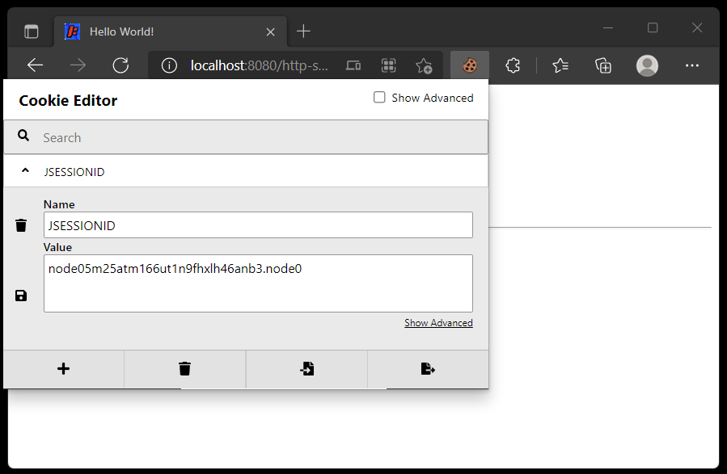

# HTTP 세션

> 원문 : https://struts.apache.org/getting-started/http-session.html

* 서문
* SessionAware 인터페이스
* 액션 클래스에서 HTTP 세션 객체 사용하기
* 뷰에서 세션 객체에 접근하기
* SessionAware의 모범 사용 사례
* 요약


이 튜토리얼의 예제 코드인 **httl-session**은 [struts-examples](https://github.com/apache/struts-examples)에서 체크아웃할 수 있습니다.


## 서문

여러분의 Struts 2 애플리케이션은 HTTP 세션 객체에 접근해야할 필요가 있을 수 있습니다. Struts 2는 HTTP 세션 객체에 대한 참조를 얻기 위해 액션 클래스가 구현해야 하는 SessionAware 인터페이스를 제공합니다.

Struts 2 [사용자 메일링](http://struts.apache.org/mail.html) 리스트는 도움을 받을 수 있는 훌륭한 장소입니다. 튜토리얼 예제 애플리케이션을 작동시키는데 문제가 있는 경우 Struts 2 메일리스트를 검색하세요. 문제에 대한 답을 찾지 못한 경우 메일링 리스트에 질문을 게시하세요.


## SessionAware 인터페이스

SessionAware 인터페이스에는 액션 클래스가 재정의해야 하는 하나의 메서드인 setSession이 있습니다. 예제 애플리케이션(위 참조)에서 HelloWorldAction 클래스는 SessionAware 인터페이스를 구현하고 다음 코드를 포함합니다:

### HelloWorldAction.java - setSession 메서드

```java
private Map<String, Object> userSession ;

public void setSession(Map<String, Object> session) {
   userSession = session ;
}
```

Struts 2 프레임워크에는 setSession 메소드를 호출하여 HTTP 세션 객체를 액션 클래스에 주입하는 인터셉터가 있습니다.


## 액션 클래스에서 HTTP 세션 객체 사용하기

예제 애플리케이션은 사용자가 Hello 링크를 클릭하거나 Hello 폼을 제출한 횟수를 추적합니다. increaseHelloCount 메서드는 HTTP 세션 객체에 이 카운트를 저장합니다. 

### HelloWorldAction.java - increaseHelloCount 메서드

```java
private void increaseHelloCount() {
    Integer helloCount = (Integer) userSession.get(HELLO_COUNT);

    if (helloCount == null ) {
        helloCount = 1;
    } else {
        helloCount++;
    }

    userSession.put(HELLO_COUNT, helloCount);
}
```

increaseHelloCount 메서드가 execute 메소드 내에서 호출될 때, userSession 객체는 Struts 2 프레임워크에 의해 주입된 HTTP 세션 객체의 참조입니다. 따라서 HTTP 세션에 저장된 모든 객체는 userSession 객체를 사용하여 검색할 수 있으며 userSession 객체에 저장된 모든 객체는 HTTP 세션 객체에 저장됩니다.


## 뷰에서 세션 객체에 접근하기

Struts 2는 뷰 페이지 내에서 HTTP 세션에 저장된 객체를 가져오는 쉬운 방법을 제공합니다. 예제 애플리케이션은 다음 마크업이 있는 `HelloWorld.jsp`입니다.

### HelloWorld.jsp  - HTTP 세션으로 부터 helloCount  값 얻기

```jsp
<p>I've said hello to you <s:property value="#session.helloCount" /> times!</p>
```

`s:property` 태그의 값 속성에는 `#session.helloCount` 값이 있습니다. session이라는 단어 앞의 "#"은 Struts 프레임워크에게 세션 범위에서 "helloCount" 키(이는 `increaseHelloCount` 메서드에서 참조하는 문자열 상수 `HELLO_COUNT`의 값)를 찾도록 지시합니다. Struts는 객체를 `helloCount` 키에 매핑한 다음 해당 객체의 toString 메서드를 호출하여 뷰 페이지에 표시할 항목을 결정합니다.


## SessionAware 의 모범 사용 사례

SessionAware를 사용하면 SessionAware 인터페이스를 구현하는 Action 클래스에서 다음의 모범 사용 사례를 따라 완화해야 하는 잠재적인 보안 취약점이 발생합니다.

1. 액션 클래스에 `public Map<String, Object> getSession`메서드가 없어야합니다. `SessionAware` 인터페이스를 구현하는 public void `setSession` 메서드만 있으면 됩니다.
2. 또한 액션 클래스가 [ParameterNameAware 인터페이스](https://struts.apache.org/maven/struts2-core/apidocs/com/opensymphony/xwork2/interceptor/ParameterNameAware.html)를 구현하고 acceptableParameterName 메서드를 재정의하도록 합니다.

### HelloWorldAction.java - acceptableParameterName 메서드

```java
public boolean acceptableParameterName(String parameterName) {
    boolean allowedParameterName = true ;

    if ( parameterName.contains("session")  || parameterName.contains("request") ) {
        allowedParameterName = false ;
    } 

    return allowedParameterName;
}
```

이 메서드는 request 스코프의 각 파라미터에 대해 Struts 2 프레임워크에 의해 호출됩니다. 파라미터 이름에 "session"이 포함되어 있으면 false를 반환함으로써 Struts 2 프레임워크에게 해당 파라미터를 무시하도록 지시합니다.<br>이렇게 하면 악의적인 사용자가 HTTP 세션 객체를 해킹하려는 것을 방지할 수 있습니다.

SessionAware를 구현하는 각 액션이 ParameterNameAware 인터페이스도 구현하도록 하는 대신 패키지의 모든 액션에 대한 특정 요청 속성을 제외하도록 params 인터셉터에 지시할 수 있습니다. struts.xml에서 struts-default 인터셉터 세트를 다음과 같이 설정하세요.

### struts.xml - params 인터셉터 설정

```xml
<package name="basicstruts2" extends="struts-default">
    <interceptors>
        <interceptor-stack name="appDefault">
            <interceptor-ref name="defaultStack">
                <param name="exception.logEnabled">true</param>
                <param name="exception.logLevel">ERROR</param>
                <param name="params.excludeParams">dojo..*,^struts..*,^session..*,^request..*,^application..*,^servlet(Request|Response)..*,parameters...*</param>
            </interceptor-ref>
        </interceptor-stack>
    </interceptors>

    <default-interceptor-ref name="appDefault" />
    ...
</package>
```

위의 코드는 SessionAware 인터페이스를 구현하는 "basicsstruts2" 패키지의 모든 액션이 `params.excludeParams` 노드에 제공된 문자열로 시작하는 파라미터들의 처리가 제외되도록 합니다.

예제 프로젝트에는 SessionAware 보안 취약점을 완화하기 위한 두 가지 방법이 모두 포함되어 있습니다.

>ServletRequestAware 인터페이스를 구현하는 경우에도 동일한 문제가 존재합니다. 이것이 파라미터 이름에 "request"가 포함된 경우 위의 메서드가 false를 반환하는 이유입니다.


## 요약

액션 클래스가 HTTP 세션 객체에 접근해야 하는 경우 SessionAware인터페이스를 구현하고 `setSession`메서드를 재정의해야 합니다. 또한 `ParameterNameAware` 인터페이스를 구현하고 `AcceptableParameterName` 메서드를 재정의하여 잠재적인 보안 취약성을 완화해야 합니다. `SessionAware`를 구현하는 여러 액션이 있는 경우 Struts 2 패키지 설정 부분에서 params 인터셉터의 `excludeParams` 값을 수정하는 것을 고려하세요.


### >  [단위 테스트](../unit-testing)로 돌아가기 또는 [Preparable 인터페이스](https://struts.apache.org/getting-started/preperable-interface.html)로 이동

---


## 스텝 진행...

* 프로젝트 변경사항
  * 프로젝트명: [http-session-struts](http-session-struts)
  * Struts + 스프링5 통합 프로젝트로 만들고, JUnit 5로 액션 클래스를 테스트 했다.
    * [HelloWorldActionTest.java](http-session-struts/src/test/java/org/fp024/struts2/study/helloworld/HelloWorldActionTest.java)

* [x] 소개

* [x] SessionAware 인터페이스

  * ServletConfigInterceptor 에 아래 코드가 존재한다. 

      * 액션 클래스가 SessionAware를 구현하면 setSession을 설정하게 되어있음.

          ```java
          if (action instanceof SessionAware) {
            ((SessionAware) action).setSession(context.getSession());
          }
          ```

  

* [x] 액션 클래스에서 HTTP 세션 객체 사용하기

* [x] 뷰에서 세션 객체에 접근하기

* [x] SessionAware의 모범 사용 사례

* [x] 요약

  


### 쿠키 에디터 플러그인

 * Cookie-Editor

   * https://chrome.google.com/webstore/detail/cookie-editor/hlkenndednhfkekhgcdicdfddnkalmdm?utm_source=chrome-ntp-icon

   * 이 플러그인을 사용해서 쿠키 에서 JSESSIONID 를 쉽게 삭제할 수 있고, helloCount를 초기화할 수 있다. (Chromium기반 Edge에서도 잘 설치된다.)

     


