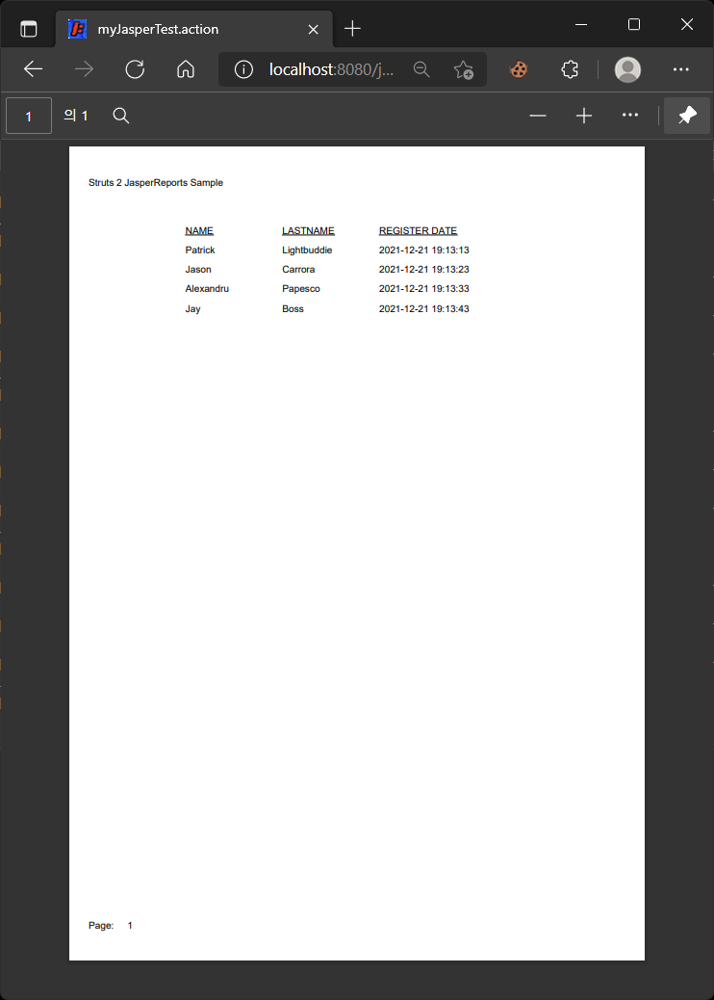

# JasperReports 튜토리얼

> 원문: https://struts.apache.org/getting-started/jasper-reports-tutorial

- 우리의 Person 클래스
- JasperReports 라이브러리
- 액션 만들기
- 우리의 Jasper 템플릿
  - 액션 등록하기
  - 결론

Struts 2 JasperReports 플러그인은 Struts 2에서 JasperReports로 연결되는 브리지이며 별도로 다운로드해야 하는 JasperReports 자체를 포함하지 않습니다. 

JasperReports는 최고의 오픈 소스 Java 리포트 라이브러리 중 하나입니다. `.jrxml`(XML 소스)을 `.jasper`(컴파일된) 파일로 컴파일한 다음 PDF, HTML, CSV 및 XLS를 포함한 여러 출력 유형으로 변환할 수 있습니다. 

다음 예에서는 프레임워크를 사용하여 사람 목록이 포함된 PDF를 만듭니다. 우리의 액션은 `Person` 객체가 있는 목록을 만드는 데 사용되며 JasperReports Result는 이 목록을 사용하여 템플릿을 채우고 PDF를 반환합니다. 


## 우리의 Person 클래스

간단한 `Person` POJO 클래스를 정의하는 것으로 시작합니다. 

#### com.acme.test.Person.java

```java
package com.acme.test;

public class Person {

    private Long id;

    private String name;

    private String lastName;

    public Person() {
    }

    public Person(String name, String lastName) {
        this.name = name;
        this.lastName = lastName;
    }

    public Person(Long id, String name, String lastName) {
        this.id = id;
        this.name = name;
        this.lastName = lastName;
    }

    public Long getId() {
        return id;
    }

    public void setId(Long id) {
        this.id = id;
    }

    public String getLastName() {
        return lastName;
    }

    public void setLastName(String lastName) {
        this.lastName = lastName;
    }

    public String getName() {
        return name;
    }

    public void setName(String name) {
        this.name = name;
    }
}
```


## JasperReports 라이브러리

계속하기 전에 클래스 경로에 JR(JasperReports) 라이브러리를 추가해야 합니다. 여기에서 JR 프로젝트를 다운로드할 수 있습니다. http://www.sourceforge.net/projects/jasperreports 

`jasperreports-X-project.zip`을 하드 디스크에 저장하고 파일의 압축을 풉니다. 

다음 파일이 필요합니다. 

* dist/jasperreports-X.jar
* lib/commons-*.jar (아마도 commons-logging을 제외한 commons 모듈)
* lib/itext-X.jar
* lib/jdt-compiler.jar

이 jar를 S2_WEBAPP/WEB-INF/lib 디렉토리에 복사하고 클래스 경로에 추가하세요. 


## 액션 만들기

```java
package com.acme.test.action;

import java.util.ArrayList;
import java.util.List;

import net.sf.jasperreports.engine.JasperCompileManager;

import com.acme.test.Person;
import com.opensymphony.xwork.ActionSupport;

public class JasperAction extends ActionSupport {

    /** JasperReports 데이터 소스로 사용할 List.  */
    private List<Person> myList;

    public String execute() throws Exception {

        // 가상의 인물을 만듦.
        Person p1 = new Person(new Long(1), "Patrick", "Lightbuddie");
        Person p2 = new Person(new Long(2), "Jason", "Carrora");
        Person p3 = new Person(new Long(3), "Alexandru", "Papesco");
        Person p4 = new Person(new Long(4), "Jay", "Boss");

        // 사람들을 dataSource 목록에 저장 (일반적으로 데이터베이스에서 가져옴). 
        myList = new ArrayList<Person>();
        myList.add(p1);
        myList.add(p2);
        myList.add(p3);
        myList.add(p4);

        // 일반적으로 사전 컴파일된 .jrxml 파일을 제공합니다. 
        // 또는 모든 요청에 대해 컴파일하지 않는지 확인하세요. 
        try {
            JasperCompileManager.compileReportToFile(
                    "S2_WEBAPP/jasper/our_jasper_template.jrxml",
                    "S2_WEBAPP/jasper/our_compiled_template.jasper");
        } catch (Exception e) {
            e.printStackTrace();
            return ERROR;
        }

        return SUCCESS;
    }

    public List<Person> getMyList() {
        return myList;
    }
}

```


## 우리의 Jasper 템플릿

JR은 XML 구성을 사용하여 .jasper 파일로 컴파일되는 템플릿을 정의합니다. 이러한 템플릿은 결과 레포트를 정의합니다. 이것은 손으로 쓴 버전입니다 - 더 복잡한 버전의 경우 다양한 GUI 디자이너를 살펴보는 것이 좋습니다.

### our_jasper_template.jrxml

```xml
<?xml version="1.0"?>
<!DOCTYPE jasperReport PUBLIC "-//JasperReports//DTD Report Design//EN" "http://jasperreports.sourceforge.net/dtds/jasperreport.dtd">
<jasperReport name="jasper_test">
  <!-- Our fields from the Person class. -->
  <field name="name" class="java.lang.String"/>
  <field name="lastName" class="java.lang.String"/>
  <title>
    <band height="50">
      <staticText>
        <reportElement x="0" y="0" width="180" height="15"/>
        <textElement/>
        <text><![CDATA[Struts 2 JasperReports Sample]]></text>
      </staticText>
    </band>
  </title>
  <pageHeader>
    <band/>
  </pageHeader>
  <columnHeader>
    <band height="20">
      <staticText>
        <reportElement x="180" y="0" width="180" height="20"/>
        <textElement>
          <font isUnderline="true"/>
        </textElement>
        <text><![CDATA[NAME]]></text>
      </staticText>
      <staticText>
        <reportElement x="360" y="0" width="180" height="20"/>
        <textElement>
          <font isUnderline="true"/>
        </textElement>
        <text><![CDATA[LASTNAME]]></text>
      </staticText>
    </band>
  </columnHeader>
  <detail>
    <band height="20">
      <textField>
        <reportElement x="180" y="0" width="180" height="15"/>
        <textElement/>
        <textFieldExpression><![CDATA[$F{name}]]></textFieldExpression>
      </textField>
      <textField>
        <reportElement x="360" y="0" width="180" height="15"/>
        <textElement/>
        <textFieldExpression><![CDATA[$F{lastName}]]></textFieldExpression>
      </textField>
    </band>
  </detail>
  <columnFooter>
    <band/>
  </columnFooter>
  <pageFooter>
    <band height="15">
      <staticText>
        <reportElement x="0" y="0" width="40" height="15"/>
        <textElement/>
        <text><![CDATA[Page:]]></text>
      </staticText>
      <textField>
        <reportElement x="40" y="0" width="100" height="15"/>
        <textElement/>
        <textFieldExpression class="java.lang.Integer"><![CDATA[$V{PAGE_NUMBER}]]></textFieldExpression>
      </textField>
    </band>
  </pageFooter>
  <summary>
    <band/>
  </summary>
</jasperReport>
```

이 파일을 `our_jasper_template.jrxml`로 `S2_WEBAPP/jasper/`에 저장합니다. 

가장 중요한 것은 name 및 lastName 필드(`Person` 클래스의 두 속성)를 선언했다는 것입니다. 이것은 이제 Jasper 템플릿에서 이러한 필드를 사용할 수 있음을 의미합니다. 

두 개의 열 헤더(NAME 및 LASTNAME)를 정의한 다음 필드를 detail band에 추가합니다(더 나은 설명을 위해 JR 자습서 참조). 이 'detail' band는 사람 목록을 반복합니다. 이것은 JR의 기본 동작입니다. 따라서 Person에서 더 많은 정보를 표시하려면 이 band에 추가하십시오. 

detail band에서는 `$F{name}` 표현식을 사용합니다. JasperReports는 Struts에게 `Person` 객체에서 `name` 필드 값을 검색하도록 요청할 것입니다. `lastName` 필드도 같은 방식으로 처리됩니다. 

나머지는 레이아웃을 정의하기 위한 마크업입니다. 

> 문제가 있는 경우 로거(commons-logging, log4j, …)를 사용하여 디버그 모드에서 `org.apache.struts2.views.jasperreports`를 관찰하십시오. 


### 액션 등록하기

JasperReports 플러그인을 사용하려면 JasperReports 결과 타입과 일반 액션 구성을 추가해야 합니다. 

#### struts.xml

```xml
<package name="default" namespace="/" extends="jasperreports-default">
    <action name="myJasperTest" class="com.acme.test.action.JasperAction">
        <result name="success" type="jasper">
            <param name="location">/jasper/our_compiled_template.jasper</param>
            <param name="dataSource">myList</param>
            <param name="format">PDF</param>
        </result>
    </action>
    ...
</package>
```

JasperReports 결과 타입을 사용하려면 (a) 이를 정의하는 `jasperreports-default` 패키지를 확장하거나 (b) JasperReport `jasper` 결과 타입을 직접 정의해야 합니다. 

위의 예에서 우리는 `jasperreports-default` 패키지를 확장합니다. JasperReport 플러그인과 동일한 방식으로 정의하여 수동으로 `jasper` 결과 타입을 정의할 수 있습니다. 

#### "jasper" 결과 타입 수동 정의 

```xml
<result-types>
    <result-type name="jasper" class="org.apache.struts2.views.jasperreports.JasperReportsResult"/>
</result-types>
```


`myJasperTest`라는 이름으로 JasperAction을 구성합니다. 이는 브라우저에서 `myJasperTest.action`에 요청을 보내 이 액션을 실행할 수 있음을 의미합니다. 

```xml
<action name="myJasperTest" class="com.acme.test.action.JasperAction">
```


JasperAction이 올바르게 실행되면 jasper라는 이름으로 등록된 결과 타입을 사용합니다. 위에서 논의한 바와 같이 `jasper` 결과 타입은 `jasperreports-default` 패키지를 확장하거나 수동으로 결과 타입을 정의하여 사용할 수 있습니다. 

```xml
<result name="success" type="jasper">
```


`location` 파라미터는 컴파일된 Jasper 파일의 위치를 정의합니다. 이 파일은 Struts 2에 의해 우리의 dataSource로 채워질 것입니다: 

```xml
<param name="location">/jasper/our_compiled_template.jasper</param>
```


dataSource 파라미터는 레포트에 사용할 객체 컬렉션을 포함하는 액션 속성을 정의합니다. 이 경우 일부 Person 객체로 수동으로 채운 myList 속성입니다. 

```xml
<param name="dataSource">myList</param>
```


format 파라미터는 레포트의 출력 형식을 지정합니다. 가능한 값에는 PDF, CSV, XLS 및 HTML이 포함됩니다. 

```xml
<param name="format">PDF</param>
```


### 결론

이제 `http://localhost:8080/YOUR_WEBAPP/myJasperTest.action`을 실행할 수 있어야 합니다. 

* 멋진 이름 목록이 표시되어야 합니다. 

Struts는 JasperReport 파일을 처리하는 가장 우아한 방법을 제공합니다. .jasper 파일의 위치를 지정하고 사용하려는 데이터 소스를 지정하면 됩니다. 


---

## 스탭 진행

*  프로젝트 변경사항
  * 프로젝트명: [jasper-reports-struts](jasper-reports-struts)
  * [struts-example](https://github.com/apache/struts-examples)에서 참조할 수 있는 예제가 없어서, 기존에 Person 객체를 다루는 예제를 기반으로 튜토리얼 프로젝트를 생성하자!

- [x] 우리의 Person 클래스

  

- [x] JasperReports 라이브러리

  * 현재는 JR 라이브러리가 Maven 레파지토리에 업로드되어있어, 의존관계 설정으로 바로 사용가능하다.

    * JasperReports (2021-10-29 최신버전)

      * https://mvnrepository.com/artifact/net.sf.jasperreports/jasperreports

        ```xml
        <dependency>
            <groupId>net.sf.jasperreports</groupId>
            <artifactId>jasperreports</artifactId>
            <version>6.18.1</version>
        </dependency>
        ```

        

- [x] 액션 만들기

- [x] 우리의 Jasper 템플릿
  - [x] 액션 등록하기
  - [x] 결론


## 진행중 이슈 사항

### struts2-jasperreports-plugin 을 디펜던시해줘야한다.

```xml
<dependency>
  <groupId>org.apache.struts</groupId>
  <artifactId>struts2-jasperreports-plugin</artifactId>
  <version>${struts2.version}</version>
</dependency>
```


### 템플릿(`jrxml`), 컴파일된 템플릿(`jasper`) 파일 경로 설정

튜토리얼 설명서에서 경로에 대한 설명은 탬플릿(`jrxml`), 컴파일된 템플릿(`jasper`) 둘다 `S2_WEBAPP/jasper/` 에 저장하고 있어서, 명확하게 규칙을 정해서 하기로 했다.

* 템플릿 파일은 `src/main/resources/jasper`에 저장
* 컴파일된 템플릿 파일은 `webapp/WEB-INF/jasper`에 생성되도록 함.

```java
@Slf4j
public class JasperAction extends ActionSupport implements ServletContextAware {
  @Setter private ServletContext servletContext;

  /** JasperReports 데이터 소스로 사용할 List. */
  @Getter private List<Person> myList;

  @Override
  public String execute() {
    LocalDateTime registerDate = LocalDateTime.now();
    // 가상의 인물을 만듦.
    Person p1 = new Person(1L, "Patrick", "Lightbuddie", registerDate.minusSeconds(30));
    Person p2 = new Person(2L, "Jason", "Carrora", registerDate.minusSeconds(20));
    Person p3 = new Person(3L, "Alexandru", "Papesco", registerDate.minusSeconds(10));
    Person p4 = new Person(4L, "Jay", "Boss", registerDate);

    // 사람들을 dataSource 목록에 저장 (일반적으로 데이터베이스에서 가져옴).
    myList = new ArrayList<>();
    myList.add(p1);
    myList.add(p2);
    myList.add(p3);
    myList.add(p4);

    try {
      JasperCompileManager.compileReportToFile(
          getClass().getResource("/jasper/our_jasper_template.jrxml").getFile(),
          servletContext.getRealPath("/WEB-INF/jasper") + "/our_compiled_template.jasper");
    } catch (Exception e) {
      LOGGER.error(e.getMessage(), e);
      return ERROR;
    }

    return SUCCESS;
  }
}
```

그런데 Jetty Embedded 모드로 실행할때,  `servletContext.getRealPath("/WEB-INF/jasper")` 의 반환 경로가 `src/main/webapp/WEB-INF/jasper`가 되므로 이부분은 버전관리 되지 않도록 .gitignore에 추가했다.

war로 배포해서 실행했으면 문제 없을 부분 같다.


## The ‘isSplitAllowed’ attribute is deprecated 경고

jasperreports 버전을 6.18.1을 사용하고 있는데, 잘못된 경고 로그가 계속 나온다, 검색을 해보니, DTD를 지워주면 된다하여 지웠고, 스키마 정보를 추가했다.

```xml
<?xml version="1.0"?>
<jasperReport xmlns = "http://jasperreports.sourceforge.net/jasperreports"
              xmlns:xsi = "http://www.w3.org/2001/XMLSchema-instance"
              xsi:schemaLocation = "http://jasperreports.sourceforge.net/jasperreports
                                    http://jasperreports.sourceforge.net/xsd/jasperreport.xsd" name="jasper_test">
  <!-- ... -->
```

* 참조: https://blog.jonschneider.com/2013/11/fix-jasper-reports-logs-spurious.html


## 출력 화면

요청마다 변화과정을 보고 싶어서 REGISTER DATE 필드를 추가했다.




---

## 기타

### ✨ getRealPath()가 null을 반환하는 문제

Spring이나 ServletContextListener를 활용해서 getRealPath() 얻어오는 부분이 있는데...

Jetty 12 에서는 null을 반환해서 제대로 할 수 가 없다.  Tomcat 9, Jetty 10에서는 문제가 없던 부분임.

* Spring의 ServietContext 주입 활용

  ```java
  @Component
  @Slf4j
  public class JasperInitializer {
    private final String compiledJapserFilePath;
  
    public JasperInitializer(ServletContext servletContext) {
      this.compiledJapserFilePath =
          servletContext.getRealPath("/WEB-INF/jasper/our_compiled_template.jasper");
    }
    ...
  ```

* ServletContextListener 활용

  ```java
    @Override
    public void contextInitialized(ServletContextEvent sce) {
      ...  
      sce.getServletContext().getRealPath("/WEB-INF/jasper/our_compiled_template.jasper")
    }  
  ```

위의 두 경우 모두 getRealPath()가 null을 반환함.

그래서 일단  [jasper-reports-struts](jasper-reports-struts) , [jasper-reports-with-contextlistener](jasper-reports-with-contextlistener) 이 두개 예제는 Jetty 10을 유지했다.

그런데 Struts 인터셉터를 활용해서 인터셉터 메서드 내에서 `ServletActionContext.getServletContext()` 를 통해 얻은 reahPath 값은 null이 아니였다.

```java
 ServletActionContext.getServletContext()
            .getRealPath("/WEB-INF/jasper/our_compiled_template.jasper");
```

 [jasper-reports-with-interceptor](jasper-reports-with-interceptor)  이 프로젝트는 Jetty 12를 사용하기로 했다.

이 문제 관련해서 단순 예제를 만들어서 Jetty Github에 문의글 올려봐야겠다. 😅

