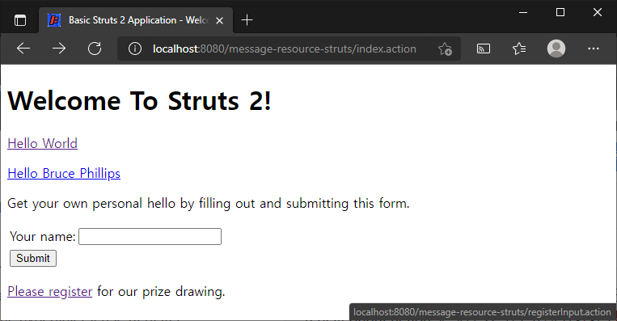
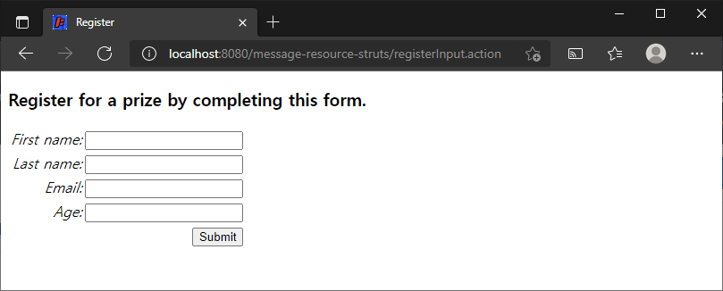
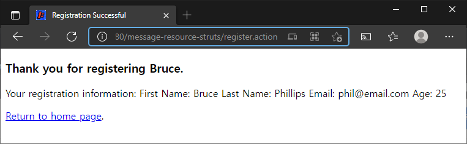
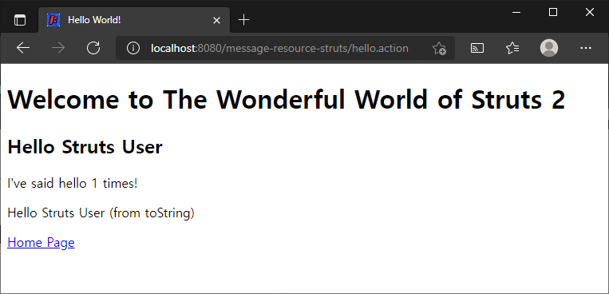
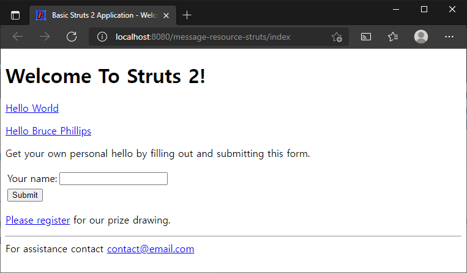
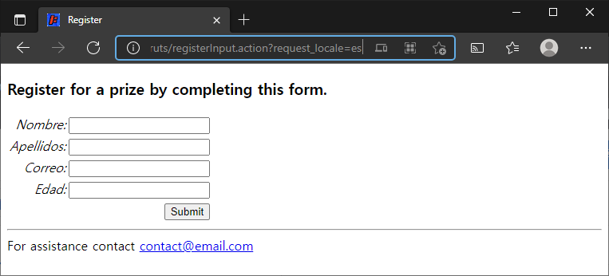

# 메시지 리소스 파일

> 원문 : https://struts.apache.org/getting-started/message-resource-files.html

* 서문
* 메시지 리소스 프로퍼티 파일
* Struts 2 key 속성
* Struts 2 text 태그
* 패키지 레벨 프로퍼티
* 전역 프로퍼티
* 국제화 (i18n)
* 요약

이 튜토리얼은 **[폼 유효성 검증](../form-validation)** 튜토리얼을 완료했고 **form-validation** 프로젝트가 작동한다고 가정합니다. 이 튜토리얼의 예제 코드인 **message-resource**은 Struts 2 깃허브의 [struts-example](https://github.com/apache/struts-examples) 레파지토리에서 체크아웃 할 수 있습니다.


### 서문

이 튜토리얼에서는 Struts 2 메시지 리소스 기능(메시지 리소스 번들이라고도 함) 을 살펴보겠습니다. 메시지 리소스는 어플리케이션에서 동일한 뷰 페이지에 텍스트를 입력하고, 폼 필드 라벨을 만들고, 사용자의 로케일(i18n)에 따라 텍스트를 특정 언어로 변경하는 간단한 방법을 제공합니다.

Struts 2 [사용자 메일링](http://struts.apache.org/mail.html) 리스트는 도움을 받을 수 있는 훌륭한 장소입니다. 튜토리얼 예제 애플리케이션을 작동시키는데 문제가 있는 경우 Struts 2 메일리스트를 검색하세요. 문제에 대한 답을 찾지 못한 경우 메일링 리스트에 질문을 게시하세요.


### 메시지 리소스 프로퍼티 파일

Struts 2 웹 어플리케이션에서 액션 클래스와 이름이 같고 확장자가 .properties인 프로퍼티 파일을 생성하여 메시지 리소스 프로퍼티 파일을 각 Struts 2 액션 클래스와 연결할 수 있습니다. 이 프로퍼티 파일은 액션 클래스와 동일한 패키지에 있어야합니다. 튜토리얼 예제에서 폼 필드 라벨을 쉽게 변경할 수 있고 다른 언어로도 라벨을 표시할 수 있는 기능을 제공할 수 있는 별도의 파일에 배치한다고 가정하겠습니다.

폼 유효성 검사를 완료한 후 이 튜토리얼을 수행하는 경우 해당 자습서의 예제 어플리케이션을 변경할 수 있습니다.

`src/main/resources` 폴더의 `org.apache.struts.register.action` 패키지에 Register.properties 파일을 새로 만들어 아래 텍스트 내용을 입력합니다.

#### Register.properties

```properties
personBean.firstName=First name
personBean.lastName=Last name
personBean.age=Age
personBean.email=Email
thankyou=Thank you for registering %{personBean.firstName}.
```

위의 내용은 표준 Java 프로퍼티 파일일 뿐입니다. 키는 = 기호 왼쪽에 있고 키 값은 오른쪽에 있습니다. Register 액션이 실행되면 키 이름을 참조하여 뷰 페이지에서 이러한 속성을 사용할 수 있습니다.


### Struts 2 key 속성

Struts 2 key 속성은 textfield의 name 및 label 속성에 사용할 값을 프레임워크에 지시하게 위해 [textfield 태그](https://struts.apache.org/tag-developers/textfield-tag.html)에서 사용할 수 있습니다. 이러한 속성과 해당 값을 직접 제공하는 대신 key 속성만 제공할 수 있습니다.

폼 유효성 검사 튜토리얼에서 register.jsp를 열면 다음 Struts 2 textfield 태그를 볼 수 있습니다:

#### textfield 태그

```jsp
<s:textfield name="personBean.firstName" label="First name" />
```

name과 label 속성을 지정하는 대신 key 속성을 사용할 수 있습니다.

#### key 속성이 있는 textfield 태그

```jsp
<s:textfield key="personBean.firstName"  />
```

key 속성의 값은 Struts 2 프레임워크가 name 속성(personBean.firstName)에 대해 동일한 값을 사용하도록 지시합니다. labal 속성의 값에는 Struts 2 프레임워크가 프로퍼티 파일에서 찾은 동일한 key 속성의 값이 사용됩니다.  따라서 이 예제에서 Struts 2는 Register.properties 에서 personBean.firstName key를 찾습니다. 해당 key의 값(`First name`)이 label 속성의 값으로 사용됩니다.

key 속성이 프로퍼티 파일을 찾을 수 있게 하려면 뷰 표시의 결과가 Struts 2 액션 클래스를 실행한 결과여야합니다.

지금 [폼 유효성 검사](../form-validation) 튜토리얼에서 index.jsp를 확인해보면, register.jsp 페이지에 대한 링크가 표준 URL입니다.

#### register.jsp 링크

```jsp
<p><a href="register.jsp">Please register</a> for our prize drawing.</p>
```

Register.java Struts 2 액션 클래스를 거치도록 위의 링크를 변경해야합니다. 위의 내용을 아래 마크업으로 바꿉니다.

```jsp
<s:url action="registerInput" var="registerInputLink" />
<p><s:a href="%{registerInputLink}">Please register</s:a> for our prize drawing.</p>
```

Struts 2 url 태그를 사용하여 registerInput 액션에 대한 링크를 만듭니다. 그런 다음 해당 링크를 a태그의 `herf` 속성 값으로 사용합니다. struts.xml에 registerInput 액션을 정의해야합니다. struts.xml에 다음을 추가하세요.

#### struts.xml에 registerInput action 노드 추가

```xml
<action name="registerInput" class="org.apache.struts.register.action.Register" method="input" >
    <result name="input">/register.jsp</result>
</action>
```

위의 action 노드는 Struts 2 프레임워크에 `registerInput` 액션에 대한 응답으로 Register 클래스의 input 메서드를 실행하도록 지시합니다. input 메서드는 `ActionSupport` 클래스에서 `Register` 클래스로 상속됩니다. 상속된 input 메서드의 기본 동작은 String 타입 input을 반환하는 것입니다. 위의 result 노드는 반환된 result가 `input`이면 `register.jsp`를 렌더링하도록 지정합니다.

위의 뷰 페이지를 수행하면 register.jsp가 Register.properties에 정의된 속성에 접근할 수 있습니다.  Register.java(Struts 2 액션 클래스)가 실행된 이후 뷰 페이지가 렌더링 되었기 때문에 Struts 2 프레임워크는 Register.properties에 정의된 속성을 사용할 수 있습니다.

프로젝트의 지침(README.txt)에 따라 war파일을 만들고 war파일을 서블릿 컨테이너에 복사합니다. 웹 브라우저를 열고 README.txt파일(`index.action`)애 지정된 홈페이지로 이동합니다. `Please Register` 하이퍼링크에 마우스를 가져가면 `registerInput.action`에 대한 링크가 표시되어야 합니다.



Plase Register 링크를 클릭하면 브라우저에 `register.jsp`가 표시되어야합니다. 폼 필드 라벨은 `Register.properties` 파일의 키 값이어야 합니다.




### Struts 2 text 태그

Struts 2 text 태그를 사용하여 프러퍼티 파일의 값을 표시할 수 도 있습니다. `thankyou.jsp`에 있는 `h3`태그 대신에 아래 text 태그를 추가하세요

#### text 태그

```jsp
<h3><s:text name="thankyou" /></h3>
```

`thankyou.jsp`도 `Register.java` 액션 클래스를 실행한 후에 렌더링되기 때문에 뷰 페이지에서 `thankyou` key와 값을 사용할 수 있습니다.



이름 input 필드에 입력한 입력한 값이 `thankyou.jsp`에 어떻게 표시됩니까? `Register.properties` 파일에서 `thankyou` 키의 값을 다시 살펴보세요

#### Register.properties

```properties
thankyou=Thank you for registering %{personBean.firstName}.
```

마크업 `%{personBean.firstName}`은 이 부분을 Person 객체를 반환하는 `getPersonBean` 호출결과로 대체하도록 Struts 2에 지시합니다. 그런 다음 String (사용자가 `register.jsp`의 `personBean.firstName` 폼 필드에 입력한 값)을 반환하는 `getFirstName` 메서드를 호출합니다.


### 패키지 레벨 프로퍼티

여러 뷰 페이지에서 참조할 수 있는 key와 값이 있는 프로퍼티파일을 원하고, 해당 뷰 페이지가 다른 액션 클래스를 실행한 후 렌더링되는 경우 어떻게 해야할까요? Struts 2는 프로퍼티 파일이 패키지 계층 구조에 있는 경우 여러 속성 파일을 사용할 수 있습니다.

다음의 내용의 package.properties 파일을 만들어 src/main/resources의 org.apache.struts 에 저장합니다.

#### package.properties

```properties
greeting=Welcome to The Wonderful World of Struts 2
```

이제 org.apache.struts... 계층에 있는 액션에 의해 랜더링된 모든 보기는 `name` 속성 값이 `greeting`인 Struts 2 `text` 태그를 사용하여 `greeting` 속성 key의 값을 표시할 수 있습니다. 예를 들어 `helloworld.jsp`의 `h2` 태그 앞에 다음 마크업을 추가합니다.

#### package.properties에 설정된 속성 사용하기

```jsp
<h1><s:text name="greeting" /></h1>
```

그런다음 war파일을 다시 빌드하고 서블릿 컨테이너에 배포합니다. index.action으로 이동하여 Hello World 링크를 클릭합니다. 다음 화면이 보일 것입니다.:



`package.properties`에 정의된 속성 key와 값은 package.properties를 포함하는 패키지 계층 구조에 있는 액션 클래스를 실행한 후 렌더링 되는 모든 뷰에서 사용할 수 있습니다.


### 전역 프로퍼티

`struts.xml`에서 전역 프로퍼티 파일을 지정할 수도 있습니다. 해당 프로퍼티 파일에 정의된 key와 값은 액션 클래스를 실행한 후 렌더링되는 모든 보기 페이지에서 사용할 수 있습니다.

`global.properties`라는 파일을 만들어 다음을 추가합니다. (이름이 반드시 global일 필요는 없습니다.)

#### global.properties

```properties
contact=For assistance contact <a href='mailto:contact@email.com'>contact@email.com</a>
```

`global.properties` 파일을 `src/main/resources` 폴더에 저장합니다. 

`global.properties` 파일에 대해 Struts 2 프레임워크에게 알려 주려면 struts.xml의  `<constant name="struts.devMode" value="true" />`  노드 아래에 다음 노드를 추가합니다.

```xml
<constant name="struts.custom.i18n.resources" value="global" />
```

뷰 페이지에서 contact 키를 사용하려면 index.jsp의 닫는 body 태그 앞에 다음 마크업을 추가하세요.

####  contact 프러퍼티 사용하기

```jsp
<hr />
<s:text name="contact" />
```

war파일을 빌드하고 서블릿 컨테이너에 배포한 다음 index.action으로 이동합니다. 다음화면이 보일 것입니다:



Struts 2는 액션 클래스와 일치하는 프로퍼티 파일로 시작하여 액션 클래스의 패키지 계층에 있는 프로퍼티 파일 및 `struts.xml`에 지정된 프로퍼티 파일에서 contact 속성 키를 찾습니다. 이 예에서 Struts 2는 `global.properties`에서 contact 키를 찾습니다. contact 키의 값은 text 태그를 넣은 위치에 표시됩니다.

이 예제의 모든 JSP에 위의 텍스트 테그를 추가할 수 있습니다.


### 국제화 (i18n)

메시지 리소스 파일(리소스 번들)을 사용하면 다른 언어로 텍스트를 제공할 수도 있습니다. 기본적으로 Struts 2는 사용자의 기본 로케일을 사용합니다. 해당 로케일이 영어로  en인경우 로케일 사양이 없는 프로퍼티 파일(예: `Register.properties`)이 사용됩니다. 로케일이 스페인어(es)인 경우 Struts 2는 `Register_es.properties`라는 프로퍼티 파일을 찾습니다. 

i18n에 대한 Struts 2 지원의 예를 제공하려면 `Register_es.properties`라는 파일을만들고 해당 파일에 다음 스페인어 번역을 추가하십시오.

#### Register_es.properties

```properties
personBean.firstName=Nombre
personBean.lastName=Apellidos
personBean.age=Edad
personBean.email=Correo
thankyou=Gracias por registrarse, %{personBean.firstName}. 
```

> 스페인어 번역 실수에 대해 스페인어 사용자에게 사과드립니다.

`Register_es.properties` 파일을 `Register.properties`와 동일한 패키지에 저장합니다.

예제 어플리케이션에서 우리는 Struts 2에게 우리 위치의 기본 로케일값(en) 대신 es(스페인어 로케일이 아니기 때문에) 로케일 값을 사용하도록 지시해야합니다. index.jsp에 다음 마크업을 추가하십시오

#### 로케일을 URL 파라미터로 지정 

```jsp
<h3>Registro español</h3>
<s:url action="registerInput" var="registerInputLinkES">
    <s:param name="request_locale">es</s:param>
</s:url>
<p><s:a href="%{registerInputLinkES}">Por favor, regístrese</s:a> para nuestro sorteo</p>
```

위의 마크업에서 request_locale이라는 파라미터를 추가했습니다. 해당 파라미터의 값은 `es`입니다. 이 URL(`Register.java`)에 응답하는 액션 클래스는 로케일이 es입을 확인하고 `_es`가 있는 프로퍼티 파일(예: `Register_ex.properties`)을 찾습니다. 프로퍼티 파일을 사용하여 뷰 페이지에서 참조하는 속성 키의 값(예: `personBean.firstName`)을 찾습니다. 

위의 링크를 클릭하면 이전과 동일한 양식을 볼 수 있지만 필드 라벨이 스페인어로 표시됩니다.



`global.properties`(`global_es.properties`) 및 `package.properties`(`package_es.properties`)의 _es.properties 버전을 생성하여 동일한 개념을 구현하면 스페인어로 완전한 등록 웹 페이지를 생성할 수 있습니다. 이 튜토리얼의 완성된 예제 어플리케이션을 Github - [message-resource](https://github.com/apache/struts-examples/tree/master/message-resource)에서 다운로드하여 해당 속성 파일을 확인하고 스페인어로 된 등록 폼으로 전체 예제를 실행해보세요.


### 요약

이 튜토리얼에서 Struts 2에서 메시지 리소스(리소스 번들)를 사용하는 방법과 국제화(i18n)를 가능하게 하는 방법을 소개했습니다. 이러한 개념을 완전히 이해하고 Struts 2에 대해 자세히 알아보려면 [http://struts.apache.org](http://struts.apache.org)에서 제공되는 주요 Struts 2 설명서를 참조하세요.


### >  [폼 유효성 검사](../form-validation)로 돌아가기 또는 [예외 처리](../exception-handling)로 이동


---

## 메시지 리소스 파일 예제 진행...

* 변경사항
  * 프로젝트명: [message-resource-struts](message-resource-struts)
  * 원저자님 예제를 보니 모든 프로퍼티파일에 대해 스페인어 파일을 만들어 두셨는데, request_locale 을 설정하는 부분은 본문 내용대로 등록창을 열 때의 한 곳이다.
  * request_locale 파라미터로 전달이 일어나면 현재 사용자 세션에 대해 해당 로케일을 유지 하는 것 같다. JSSIONID 쿠키를 명시적으로 지우면 기본 로케일 로 돌아와서 영문으로 표시됨.
    * 쿠키 값 확인 편집으로 아래 확장 크롬 확장 프로그램이 좋은 것 같다.
      * https://chrome.google.com/webstore/detail/cookie-editor/hlkenndednhfkekhgcdicdfddnkalmdm
* [x] 서문
* [x] 메시지 리소스 프로퍼티 파일
* [x] Struts 2 key 속성
* [x] Struts 2 text 태그
* [x] 패키지 레벨 프로퍼티
* [x] 전역 프로퍼티
* [x] 국제화 (i18n)
* [x] 요약

