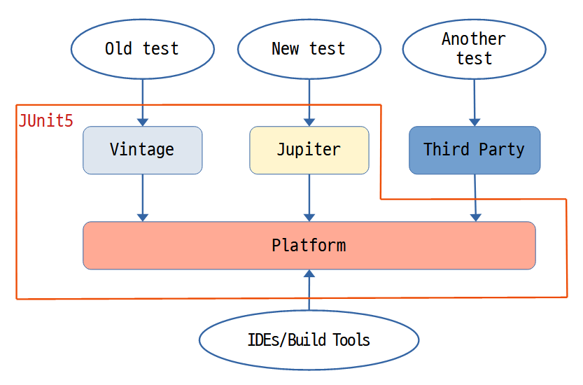

# Struts 2 JUnit Plugin을 JUnit 5 사용가능하도록 바꿔보기!


## 목표

Struts2 JUnit 플러그인 코드를 보니 JUnit 4 기준으로 되어있는데, 이것을 JUnit 5 기준으로 작동가능하도록 개선해보자!

* Struts 2 JUnit Plugin
  * https://github.com/apache/struts/tree/master/plugins/junit

* JUnit in Action 3rd의 맨 첫 페이지의 다이어그림이 이해하기 쉽고 맘에 들어서 Draw로 따라 그려봤다.

  


## 진행

### 1. 플러그인 소스 받기

git에서 그냥 받으면 `2.6.0-SNAPSHOT` 버전이기 때문에, 최신 Current 버전인 2.5.26 현재 버전 태깅으로 브랜치를 만든다

* **실행시점 최신 RELEASE 버전으로 태깅을 따서 브랜치로 만들어 주면 되겠다.**

 ```bash
 USER@HOSTNAME MINGW64 /c/git-others/apache/struts (master)
 $ git tag -l
 STRUTS_2_0_0
 ...
 STRUTS_2_5_26
 ...
 
 USER@HOSTNAME MINGW64 /c/git-others/apache/struts (master)
 $ git checkout tags/STRUTS_2_5_26 -b STRUTS_2_5_26
 Switched to a new branch 'STRUTS_2_5_26'
 
 USER@HOSTNAME MINGW64 /c/git-others/apache/struts (STRUTS_2_5_26)
 $
 ```


### 2. 플러그인 프로젝트 복사 및 IDE 등에서 불러온다.

`/plugins/junit`  경로의 Maven 프로젝트를 여기 `{스트럿츠 스터티 홈}/unit-testing/struts2-junit5-plugin` 으로 복사하고, IDE 등에서 Maven 프로젝트로 연다.


### 3.  프로젝트 정리 - pom.xml 정리

1. struts2-plugin과의 상속 관계는 때어낸다.

   붙은 채로 하니까, 해깔려서 때어내고, groupId와 artifactId등을 새로 딴다.

   ```xml
     <groupId>org.fp024.struts2.study</groupId>
     <artifactId>struts2-junit5-user-custom-plugin</artifactId>
     <packaging>jar</packaging>
     <name>Struts 2 JUnit 5 User Custom Plugin</name>
     <version>1.0.0-SNAPSHOT</version>
   ```

2. struts2-core < struts2-plugn < {플러그인 프로젝트}  관계에서 core까지 관계가 분리되어서, struts2-bom을 포함하자

   ```xml
   <properties>
       <maven.compiler.source>11</maven.compiler.source>
       <maven.compiler.target>11</maven.compiler.target>
       <struts2.version>2.5.26</struts2.version>
       <spring.platformVersion>5.2.18.RELEASE</spring.platformVersion>
       <project.build.sourceEncoding>UTF-8</project.build.sourceEncoding>
       <junit.version>5.8.1</junit.version>
       <log4j2.version>2.14.1</log4j2.version>
   </properties>
   ...
   ...
   <dependencyManagement>
       <dependencies>
         <dependency>
           <groupId>org.apache.struts</groupId>
           <artifactId>struts2-bom</artifactId>
           <version>${struts2.version}</version>
           <type>pom</type>
           <scope>import</scope>
         </dependency>
         <dependency>
           <groupId>org.springframework</groupId>
           <artifactId>spring-framework-bom</artifactId>
           <version>${spring.platformVersion}</version>
           <type>pom</type>
           <scope>import</scope>
         </dependency>
         <dependency>
           <groupId>org.apache.logging.log4j</groupId>
           <artifactId>log4j-bom</artifactId>
           <version>${log4j2.version}</version>
           <scope>import</scope>
           <type>pom</type>
         </dependency>
         <dependency>
           <groupId>org.junit</groupId>
           <artifactId>junit-bom</artifactId>
           <version>${junit.version}</version>
           <type>pom</type>
           <scope>import</scope>
         </dependency>
       </dependencies>
     </dependencyManagement>
   ```

   * 넣는 김에 spring, junit, log4j2 관련 bom도 한번에 넣어주자.

3. 디펜던시 추가 / 변경

   * struts2 parent에서 분리 되었기 때문에 struts2-core 디펜던시가 필요하다
   * 테스트 코드 실행시 로그 보려고 log4j2도 추가했는데..  스프링 테스트시 commons-compress 가 없을 경우 예외가 발생해서 실패했다. 
   * 액션 테스트를 하기 때문에 javax.servlet-api, javax.servlet.jsp-api 등도 넣고 버전을 설정해주자! 
   * junit(JUnit4) 는 제거하고 junit-jupiter(JUnit 5) 를 넣어주자!

   ```xml
   <dependencies>
       <dependency>
         <groupId>org.apache.struts</groupId>
         <artifactId>struts2-core</artifactId>
       </dependency>
   
       <!-- Apache Log4j SLF4J Binding  -->
       <dependency>
         <groupId>org.apache.logging.log4j</groupId>
         <artifactId>log4j-core</artifactId>
         <scope>test</scope>
       </dependency>
       <dependency>
         <groupId>org.apache.commons</groupId>
         <artifactId>commons-compress</artifactId>
         <version>1.21</version>
         <scope>test</scope>
       </dependency>
   
       <dependency>
         <groupId>org.springframework</groupId>
         <artifactId>spring-test</artifactId>
       </dependency>
       <dependency>
         <groupId>org.springframework</groupId>
         <artifactId>spring-core</artifactId>
       </dependency>
       <dependency>
         <groupId>org.springframework</groupId>
         <artifactId>spring-context</artifactId>
       </dependency>
       <dependency>
         <groupId>org.apache.struts</groupId>
         <artifactId>struts2-spring-plugin</artifactId>
         <optional>true</optional>
       </dependency>
       <dependency>
         <groupId>javax.servlet</groupId>
         <artifactId>javax.servlet-api</artifactId>
         <version>3.1.0</version>
         <scope>provided</scope>
       </dependency>
       <dependency>
         <groupId>javax.servlet.jsp</groupId>
         <artifactId>javax.servlet.jsp-api</artifactId>
         <version>2.3.3</version>
         <scope>provided</scope>
       </dependency>
   
       <!-- JUnit 4 디펜던시는 제거 -->
       <!--
       <dependency>
         <groupId>junit</groupId>
         <artifactId>junit</artifactId>
       </dependency>
       -->
       <!-- JUnit 5 디펜던시 추가 -->
       <dependency>
         <groupId>org.junit.jupiter</groupId>
         <artifactId>junit-jupiter</artifactId>
       </dependency>
   
   
       <!-- Convention Plugin tests -->
       <dependency>
         <groupId>org.apache.struts</groupId>
         <artifactId>struts2-convention-plugin</artifactId>
         <scope>test</scope>
       </dependency>
   
       <!-- Portlet -->
       <dependency>
         <groupId>javax.portlet</groupId>
         <artifactId>portlet-api</artifactId>
         <version>2.0</version>
         <scope>test</scope>
       </dependency>
     </dependencies>
   ```

4. src/main 소스 변경 또는 제거

   * **불필요한 소스 제거**
     * StrutsTestCase, StrutsSpringTestCase 클래스는 JUnit 4 이전 테스트를 위한 테스트 케이스이다 제거한다!!!
       * StrutsSpringTestCaseTest, StrutsTestCaseTest 는 관련 테스트 코드이고 이것도 제거하자~

   * **com.opensymphony.xwork2.XWorkJUnit4TestCase 내부에서  @Before, @After 를 사용하는 부분 변경** 

     * @BeforeEach, @AfterEach로 바꾸자.

     * 그런데 이 클래스가 struts2-core 모듈에 있으므로 패키지 명 동일하게 현재 소스로 가져와서 바꾼다.
       * com.opensymphony.xwork2.XWorkJUnit5TestCase 로 이름도 바꿈.

   * org.apache.struts2.StrutsJUnit4TestCase 에서도 @Before, @After가 있다. 그런데 JUnit의 어노테이션이 아니다.

     * 처음에는 xwork2의 어노테이션이라서 그냥 두었는데.. 실제 테스트 코드 수행시 제대로 동작이 안되서 initServletMockObjects() 가 수행이 안되서 request가 null이 되는 바람에 테스트 코드 수행시 NPE가 발생한다.

       * com.opensymphony.xwork2.interceptor.annotations.After
       * com.opensymphony.xwork2.interceptor.annotations.Before

     * **결국 이부분도 @BeforeEach, @AfterEach로 변경해야 JUnit 5에서 잘돌아갔다.**

       * 변경 없는 원본 프로젝트에서는 xwork2 어노테이션을 그대로 두더라도 문제는 없었다.

       

5. src/test 소스 변경

   * 테스트 실행시 콘솔 로그를 보기위해 src/test/resources에 log4j2.xml 넣어주자.

   * JUnit 5 클래스 및 test 메서드들은 public일 필요가 없으므로 public 지정자를 제거하자!

   * @Before, @After 들은 @BeforeEach, @AfterEach 로 바꿔주면 되었다.

   * StrutsSpringJUnit4TestCaseTest 의 어노테이션 설정부는 아래와 같이 변경해주면 된다.

     * Spring도 5.x으로 쓸거니까..ㅎㅎ

     ```java
     // 변경 전
     @RunWith(SpringJUnit4ClassRunner.class) 
     @ContextConfiguration(locations={"classpath*:applicationContext.xml"})
     
     // 변경 후 (Spring 5.0부터 가능)
     @SpringJUnitConfig(locations = {"classpath*:applicationContext.xml"})
     ```


## 후기

테스트 코드 모두 잘 돌아가는 것을 확인했다. 일단 잘 바뀐 것 같은데..

Struts2 Getting Started의 Unit Testing 항목을 이 개조한 플러그인을 사용해서 진행해봐야겠다. ㅎㅎ

* Maven 레파지토리에 올릴수는 없으니 로컬에 install 한후 진행 하자!
* 그리고 pom.xml 오류가 있을 때, IntelliJ 가 정확하게 오류를 잡아내지 못하는 것 같다. 
  * `mvnw validate` 로 커맨드로 보는게 정확할 때가 있다.
* IntelliJ에서 에러 아닌데 자꾸 JUnit 실행 실패하면 커멘드에서 직접 test 돌려보고 이상 없으면 .idea폴더 날리고 다시해보자~
* 어떻게 보면.. [JUnit Vintage Engine](https://mvnrepository.com/artifact/org.junit.vintage/junit-vintage-engine) 모듈을 포함시켜서 JUnit 4 용 클래스를 그대로 남겨두고 5용으로 새로 추가하는게 나았을지도 모르겠다. 그런데, 스터디 프로젝트에서는 JUnit 4용 클래스를 사용할 일이 없어서 일단은 그대로 두자.


---

# Struts 2 버전업

## STRUTS 2의 2.5.27 버전업 대응

플러그인 코드를 2.5.26 기준으로 작성한 것이여서, 2.5.27 버전업이 되면서 junit 플러그인에 무언가 바뀐점이 있는지 확인해보았다.


### 2.5.27 테그로 브랜치를 만들고 차이점(diff) 확인

```bash
사용자명@호스트명 MINGW64 /c/git-others/apache/struts (STRUTS_2_5_26)
$ git checkout tags/STRUTS_2_5_27 -b STRUTS_2_5_27
Switched to a new branch 'STRUTS_2_5_27'

사용자명@호스트명 MINGW64 /c/git-others/apache/struts (STRUTS_2_5_27)
$ git diff STRUTS_2_5_26 STRUTS_2_5_27

```

* diff 결과를 보니? 원하는 파일만 찾기가 힘들었다. 경로나 파일을 지정해서 보는것이 편해보인다.
* 변경 확인이 필요한 디렉토리나 경로는 아래 두가지이다.
  * `plugins/junit` 디렉토리 이하 모든 파일의 변경사항
  * `XWorkJUnit4TestCase` 클래스
    * 이 프로젝트에서는 `XWorkJUnit5UserCustomTestCase`으로 이름을 바꿔서 JUnit 5 어노테이션을 설정하여 사용하고 있다.


### plugins/junit 디렉토리 이하 모든 변경 내용

```bash
사용자명@호스트명 MINGW64 /c/git-others/apache/struts (STRUTS_2_5_27)
$ git diff 4cf909 plugins/junit   # git show STRUTS_2_5_26 명령 실행해서 상위에 나타난 해시값 6자리 알아냄
diff --git a/plugins/junit/pom.xml b/plugins/junit/pom.xml
index b70a9e913..4dc8ac4fb 100644
--- a/plugins/junit/pom.xml
+++ b/plugins/junit/pom.xml
@@ -24,7 +24,7 @@
     <parent>
         <groupId>org.apache.struts</groupId>
         <artifactId>struts2-plugins</artifactId>
-        <version>2.5.26</version>
+        <version>2.5.27</version>
     </parent>

     <artifactId>struts2-junit-plugin</artifactId>

사용자명@호스트명 MINGW64 /c/git-others/apache/struts (STRUTS_2_5_27)
$ git diff STRUTS_2_5_26 plugins/junit
warning: refname 'STRUTS_2_5_26' is ambiguous.  # 버전규칙을 안따라서 그런건지? 이 경고가 나타남
diff --git a/plugins/junit/pom.xml b/plugins/junit/pom.xml
index b70a9e913..4dc8ac4fb 100644
--- a/plugins/junit/pom.xml
+++ b/plugins/junit/pom.xml
@@ -24,7 +24,7 @@
     <parent>
         <groupId>org.apache.struts</groupId>
         <artifactId>struts2-plugins</artifactId>
-        <version>2.5.26</version>
+        <version>2.5.27</version>
     </parent>

     <artifactId>struts2-junit-plugin</artifactId>

사용자명@호스트명 MINGW64 /c/git-others/apache/struts (STRUTS_2_5_27)
$


```

* 실제 테그명을 적었을 때, 참조이름이 모호하다고 나오는데, hash 앞자리 6자리를 적어 입력한 것과 차이는 없었다.

* 변경사항은 struts2-plugins의 버전 올린 것 말고는 없음.

* 현재 프로젝트는 struts2-plugins를 상속받는 구조를 제거해서, 관련해서 변경되는 부분은... 아래 밖에 없다.

  ```xml
    <properties>
  	...
      <struts2.version>2.5.27</struts2.version>
  	...
    </properties>
  ```


### XWorkJUnit4TestCase 변경 내용

* XWorkJUnit4TestCase.java의 변경사항 없음

  ```bash
  사용자명@호스트명 MINGW64 /c/git-others/apache/struts (STRUTS_2_5_27)
  $ git diff 4cf909 core/src/main/java/com/opensymphony/xwork2/XWorkJUnit4TestCase.java
  
  사용자명@호스트명 MINGW64 /c/git-others/apache/struts (STRUTS_2_5_27)
  $
  
  ```


junit 플러그인 관련해서 변경사항이 코어 모듈 버전업 외에는 없어서 다시 빌드하고 로컬에 install만 해두면 될 것 같다.

SNAPSHOT 버전은 올리지 말고 전체 프로젝트를 parent pom을 통해 전체 빌드 테스트를 하면 되겠다.

