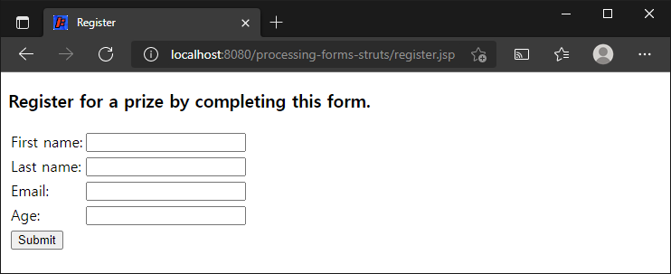
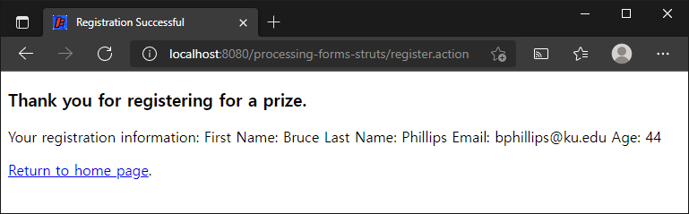

# 폼 처리

> 원문 : https://struts.apache.org/getting-started/processing-forms.html

* 소개
* 폼과 Java 모델 클래스
* 폼 구조
* 폼 제출을 처리하는 액션 클래스 만들기
* 결과를 위한 뷰 추가
* struts.xml에 액션 매핑 만들기
* register.jsp에 링크 만들기


이 튜토리얼은 **[Struts 2 액션 코딩하기](../coding-actions)** 튜토리얼을 완료했고 **coding-actions** 프로젝트가 작동한다고 가정합니다. 이 튜토리얼의 예제 코드인 **form-processing**는 Struts 2 깃허브의 [struts-example](https://github.com/apache/struts-examples) 레파지토리에서 체크아웃 할 수 있습니다.


### 소개

이 튜토리얼에서  Struts 2를 사용해서 좀 더 복잡한 폼 제출 처리를 수행하는 방법을 살펴보겠습니다.  Java 모델 클래스를 사용하여 폼 입력을 저장하는 방법과 해당 모델 클래스와 일치하도록 Struts 2 양식을 만드는 방법을 다룰 것입니다.

이 튜토리얼에서 제공하는 코드는 [Struts 2 액션 코딩하기](../coding-actions) 예제에 추가되거나 [깃허브 레파지토리](https://github.com/apache/struts-examples)에서 전체 예제를 다운로드 할 수 있습니다. 

Struts 2 [사용자 메일링](http://struts.apache.org/mail.html) 리스트는 도움을 받을 수 있는 훌륭한 장소입니다. 튜토리얼 예제 애플리케이션을 작동시키는데 문제가 있는 경우 Struts 2 메일리스트를 검색하세요. 문제에 대한 답을 찾지 못한 경우 메일링 리스트에 질문을 게시하세요.


### 폼과 Java 모델 클래스

이 튜토리얼에서는 사용자가 경품 제출에 등록하기 위해 제출할 수 있는 폼을 제공해야한다고 가정해보겠습니다. 우리의 비지니스 규칙는 사용자가 자신의 이름, 성, 이메일 주소 및 나이를 제공해야하는 것으로 명시되어 있습니다.

데이터를 캡슐화하기 위해 기본 Java Bean 사양을(각 인스턴스 필드에 대한 public set/get 메서드) 따르는 간단한 Java 클래스를  사용합니다. 따라서 아래의 클래스를 [Struts 2 액션 코딩하기](coding-actions) 예제의 `org.apache.struts.register.model` 패키지에 추가하세요.

#### Person.java

```java
public class Person {
    private String firstName;
    private String lastName;
    private String email;
    private int age;

    public String getFirstName() {
        return firstName;
    }

    public void setFirstName(String firstName) {
        this.firstName = firstName;
    }

    public String getLastName() {
        return lastName;
    }

    public void setLastName(String lastName) {
        this.lastName = lastName;
    }

    public String getEmail() {
        return email;
    }

    public void setEmail(String email) {
        this.email = email;
    }

    public int getAge() {
        return age;
    }

    public void setAge(int age) {
        this.age = age;
    }

    public String toString() {
        return "First Name: " + getFirstName() + " Last Name:  " + getLastName() + 
        " Email:      " + getEmail() + " Age:      " + getAge() ;
    }
}
```

위의 클래스에 대한 몇가지 사항에 유의하세요. 각 인스턴스 필드에 대한 public set/get 메서드가 있습니다. age 속성은 정수 타입입니다. 객체의 상태를 나타내는 String을 반환하는 toString 메서드를 정의했습니다. 생성자를 지정하지 않았기 때문에, Java는 모든 인스턴스 필드 값을 null 값으로 설정하는 기본 생성자를 제공합니다.


### 폼 구조

위의 정보를 수집하기 위해 우리는 Struts 2 폼을 사용할 것 입니다. 이 폼을 만들 때 채택해야하는 핵심 개념은 각 폼 필드를 Person 타입 객체의 특정 인스턴스 필드에 연결하는 것입니다. 먼저 폼을 살펴본 다음 몇 가지 핵심 사항에 대해 논의해보겠습니다.  `register.jsp` 라는 이름의 페이지를 `src/main/webapp`에 만듭니다.

#### register.jsp

```jsp
<%@ taglib prefix="s" uri="/struts-tags" %>
<%@ page language="java" contentType="text/html; charset=UTF-8" pageEncoding="UTF-8"%>
<!DOCTYPE html>
<html>
  <head>
    <meta http-equiv="Content-Type" content="text/html; charset=UTF-8" />
    <title>Register</title>
  </head>
  <body>
    <h3>Register for a prize by completing this form.</h3>

    <s:form action="register">
      <s:textfield name="personBean.firstName" label="First name" />
      <s:textfield name="personBean.lastName" label="Last name" />
      <s:textfield name="personBean.email"  label ="Email"/>  
      <s:textfield name="personBean.age"  label="Age"  />
      <s:submit/>
    </s:form>	
  </body>
</html>
```

Struts 2 태그를 사용하기 때문에, 페이지 상단에 Struts 2 태그 라이브러리 선언이 필요합니다.

Struts 2 폼은 register라는 액션에 제출됩니다. `struts.xml`파일에 해당 액션을 정의해야합니다.

4개의 Struts 2 textfield 태그에 유의하세요. 각 태그에는 Person 클래스의 속성 (예: `firstName`)을 포함하는 이름 값이 있습니다. name 속성의 값에는 `personBean`이라는 객체에 대한 참조도 있습니다. 이 객체는 `Person`타입입니다. 이 폼 제출을 처리하는 액션 클래스를 만들 때 해당 액션 클래스에서 해당 객체를 지정해야합니다. (아래 참조)

완전한 이름 값인 `personBean.firstName`은 Struts 2가 해당 textfield의 입력값을 personBean 객채의 `setFirstNam` 메서드에 대한 인수로 사용하도록 지시합니다. 따라서 사용자가 First name 라벨이 있는 textfield에 "Bruce"를 입력하면 personBean의 firstName 인스턴스 필드는 "Bruce"값을 갖게 됩니다.

Person 클래스의 각 인스턴스 필드에 대해 Struts 2 textfield가 있음을 유의하세요. Person 클래스의 age 속성은 정수 타입입을 기억하세요. 모든 양식 필드 입력 값은 문자열입니다.  Struts 2 는 `personBean` 객체의 `setAge` 메서드를 호출 할 때, 사용자가 age 양식 필드에 입력한 문자열 값("25")을 25로 자동 변환합니다. 


### 폼 제출을 처리하는 액션 클래스 만들기

사용자가 위의 폼 submit 버튼을 제출하면 "register" 액션과 폼 데이터가 Struts 2 프레임워크로 전송됩니다. 이 양식을 처리하려면 액션 클래스가 필요합니다. [Struts 2 액션 코딩하기](../coding-actions) 튜토리얼을 돌이켜 생각해보면 액션 클래스는 Struts 2 ActionSupport 클래스를 확장해야합니다. 

다음은 이 예제에 사용된 액션 클래스입니다. org.apache.struts.register.action 패키지에 넣습니다.

#### Register.java Struts 2 액션 클래스

```java
package org.apache.struts.register.action;

import com.opensymphony.xwork2.ActionSupport;
import org.apache.struts.register.model.Person;

public class Register extends ActionSupport {
    
    private static final long serialVersionUID = 1L;
    
    private Person personBean;


    public String execute() throws Exception {
        //call Service class to store personBean's state in database
        
        return SUCCESS;
    }
    
    public Person getPersonBean() {
        return personBean;
    }
    
    public void setPersonBean(Person person) {
        personBean = person;
    }

}
```

`Register`클래스에서 `Person`타입의 `personBean`속성을 선언 했으며 이 객체에 대한 public get 및 set 메서드가 있는 것에 주목하세요.

`Register` 클래스는 `execute` 메서드도 재정의합니다. `execute`메서드는 register 액션에 응답으로 호출될 `struts.xml`에 지정할 메서드입니다. 이 예제에서 `execute` 메서드는 String 상수 `SUCCESS`(`ActionSupport` 클래스에서 상속됨)를 반환합니다.  그러나 실제 애플리케이션에서는 execute 메서드 내에서 사용자의 입력을 데이터 레파지토리에 저장하는 것과 같은 폼 비지니스 처리를 수행하기 위해서는 다른 클래스(서비스 객체)를 호출합니다. (참고: 지금 예제는 이런 구현이 없지만, 주석으로 데이터베이스에 저장하기위해 서비스 클래스를 호출할 수 있다고 표시되어있음.)

Register 액션 클래스에 선언된 `Person`타입의 `personBean`객체는 폼의 textfiled에서 사용한 `personBean`이름과 일치합니다. 폼이 제출되면 Struts 2 프레임워크는  액션 클래스를 검사하고 `personBean`이라는 객체를 찾습니다.  Person 클래스의 기본 생성자를 사용하여 객체를 생성합니다. 그런 다음 이름 값이 personBean.someAttribute(예: `personBean.firstName`)인 각 폼 필드들의 속성에 대한 personBean의 public set 메서드를 호출하고 폼 필드의 값(사용자 입력)을 전달합니다. 이 모든 일들은 execute 메서드 실행 전에 일어납니다.

Struts 2가 `Register`클래스의 `execute`메서드를 실행할 때, `Register`클래스의 `personBean`객체는 이제 사용자가 해당 폼 필드에 입력한 값과 동일한 인스턴스 필드 값을 갖습니다.

폼에 제공하는 데이터를 Java 모델 클래스를 사용하여 캡슐화하면 각 폼 필드에 대한 별도의 속성이(public set/get 메서드 포함) 액션 클래스(Register)에 필요하지 않습니다.


### 결과를 위한 뷰 추가

`execute` 메서드에 의해 `SUCCESS`가 반환되면 사용자 등록을 보여주는 간단한 감사 페이지를 표시하려고 합니다. 아래의 `tankyou.jsp`를 `src/main/webapp`에 추가합니다.

#### thankyou.jsp

```jsp
<%@ taglib prefix="s" uri="/struts-tags" %>
<%@ page language="java" contentType="text/html; charset=UTF-8" pageEncoding="UTF-8"%>
<!DOCTYPE html>
<html>
  <head>
    <meta http-equiv="Content-Type" content="text/html; charset=UTF-8" />
    <title>Registration Successful</title>
  </head>
  <body>
    <h3>Thank you for registering for a prize.</h3>

    <p>Your registration information: <s:property value="personBean" /> </p>

    <p><a href="<s:url action='index' />" >Return to home page</a>.</p>
  </body>
</html>
```

Struts 2 property 와 url 태그가 기억나지 않는다면 [Struts 2 태그 사용하기](../using-tags) 튜토리얼을 참조하세요


### struts.xml에 액션 매핑 만들기

폼 페이지, Struts 2 액션 클래스 및 succes 뷰 페이지 간의 관계를 지정하려면 `struts.xml`에 action 노드를 추가해야합니다. `struts.xml`에서(`src/main/resources`) hello action 노드 이후, package 노드를 닫는 사이에 아래 action 노드를 추가합니다.

#### struts.xml에 새로 추가할 action 노드

```xml
<action name="register" class="org.apache.struts.register.action.Register" method="execute">
    <result name="success">/thankyou.jsp</result>
</action>
```

위의 action 노드는 register 액션이 제공될 때 Register 클래스의 execute 메서드를 호출하도록 Struts 2에게 알려줍니다. 해당 메서드가 "success"를 반환하면 브라우저는 thankyou.jsp로 돌아갑니다.

참고로 Struts 2에게 폼 처리에 대해 알릴 필요가 없습니다. personBean.attributeName(예: `personBean.lastName`)과 일치하도록 폼 필드의 이름을 지정하는 규칙을 따랐다면 폼 필드 입력값을 `personBean` 객체로 전송하는 것이 자동으로 일어납니다. 


### register.jsp에 링크 만들기

사용자가 등록 페이지를 찾을 수 있도록 index.jsp에 아래 링크를 추가하세요.

#### register.jsp 링크

```jsp
<p><a href="register.jsp">Please register</a> for our prize drawing.</p>
```

#### 예제 실행

모든 것이 정확하면 응용프로그램을 실행할 수 있어야합니다. (`mvn jetty:run`) 그리고 웹브라우저에서 이 URL을 열 수 있습니다. `http://localhost:8080/processing-forms-struts/index.action` 해당 페이지에 등록할 수 있는 링크가 있어야합니다. 해당 링크를 클릭하면 `register.jsp` 페이지가 표시되어야합니다.



폼을 작성하고 Submit 버튼을 클릭하세요. 그러면 thankyou.jsp 페이지가 표시됩니다.




### >  [액션 코딩하기](../coding-actions)로 돌아가기 또는 [폼 유효성 검사](../form-validation)으로 이동


---

## 폼 처리하기 예제 진행...

* 변경사항
  * 프로젝트명: processing-forms-struts
* [x] 소개
* [x] 폼과 Java 모델 클래스
* [x] 폼 구조
* [x] 폼 제출을 처리하는 액션 클래스 만들기
* [x] 결과를 위한 뷰 추가
* [x] struts.xml에 액션 매핑 만들기
* [x] register.jsp에 링크 만들기
