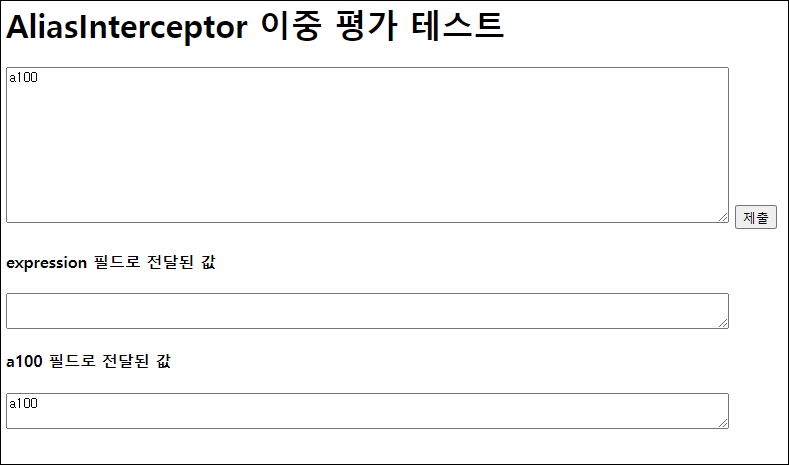

# 💡 Struts 7 버전업 이후 jakarta Servlet으로 전환되어 하위 버전을 동일한 프로젝트에 두기가 어려워져서, 예제 프로젝트는 제거.

* 부모 POM과의 연결성을 제거하고 완전히 독립적으로 동작하게 해도 되기는 되는데, 그렇게 까지 할 필요는 없을 것 같음. 😅
* 예전에 작성한 예제를 확인하도록 Git에서 Tag를 따로 만들어서 내용을 추가해야겠다.
  * ✨ Git Tag: https://github.com/fp024/struts2-study/tree/Struts2-6.x-Javax
    * https://github.com/fp024/struts2-study/tree/Struts2-6.x-Javax/struts-double-evaluation-test

---

# Struts2 이중 평가 취약점 테스트 (아직 잘 모르겠음... 😅)


Struts2에서 이중 평가 보안 취약성이 2.5.30에서 패치되었는데, 어떤 것인지 궁금해서 [m-y-mo 님의 프로젝트](https://github.com/m-y-mo/alias-example)를 참조해서 현재 스터디 프로젝트 기반으로 구현해보고 테스트해보기로 하였다.

[struts2-study-parent](../struts2-study-parent) 부모 POM 프로젝트를 상속받게 구성하지만, 문제점을 확인해야하기 때문에, 이 프로젝트의 Struts2 버전은 2.5.29로 유지해야할 것 같다.

그리고 이 프로젝트는 JUnit 5로 변경한 커스텀 플러그인을 사용하면 안될 것 같다. 현재 커스텀 플러그인을 따로 mvn install 해서 사용하고 있기 때문에 Struts2 코어 버전이 달라져서, 원래 제공되는 Struts JUnit 플러그인을 사용하고 JUnit 4 지원을 위해 `junit-vintage-engine` 를 디펜던시 걸어줘야할 것 같다.

* `struts2-junit-plugin`: Struts2 버전을 동일하게 유지해야하기 때문에 원래 플러그인을 쓰자!
  
  ```xml
  <dependency>
    <groupId>org.apache.struts</groupId>
    <artifactId>struts2-junit-plugin</artifactId>
    <version>${struts2.version}</version>
    <scope>test</scope>
  </dependency>
  ```


* `junit-vintage-engine`: JUnit 4 지원 목적

  ```xml
  <dependency>
    <groupId>org.junit.vintage</groupId>
    <artifactId>junit-vintage-engine</artifactId>
    <!-- parent에서 JUnit BOM을 지정해둔 상태여서, version 항목은 제거 -->
    <scope>test</scope>
  </dependency>
  ```


## 일단 프로젝트는 만들긴 했는데...

테스트할 액션에 alias 인터셉터를 지정하는데, 이때 값 부분에 또다시 재평가 될 수 있는  코드를 넣어서 이중평가가 가능한 상태로 만드는 것이 요점 같다.

```xml
   <action name="aliasTest" class="org.fp024.struts2.study.example.AliasTestAction">
      <param name="aliases">#{'expression' : #parameters['expression'][0]}</param>
      <interceptor-ref name="alias" />
      <result name="success">/WEB-INF/view/example/aliasTest.jsp</result>
    </action>
```

aliases 란 파라라미터 값으로 `#{'expression' : #parameters['expression'][0]}` 를 지정해주면 expression 이란 파라미터를 `#parameters['expression'][0]`의 처리 값으로 바꿔쓰겠다는 것이 되는데.. 이때 expression의 값으로 악의적 목적을 가진 코드 값이 들어온다면 문제가 생길 수 있다는 말 같다.

`http://localhost:8080/aliasTest.action` 로 접속을 하면 아래와 같은 화면이 나오게 했고,  중간의 큰상자는 name 속성으로 expression 을 가진 form안에 든 textarea이다. 아래 화면은 제출 버튼까지 누른 후의 화면이다.



제출을 했을 때 일반적인 상태라면 expression 필드의 값이 a100이 되야하는데... alias 인터셉터 설정에 의해서 a100 필드의 값에 a100이란 값을 넣게된다.

일단은 CMD같은 것을 띄우는 ONGL 평가 식을 넣어봐서 악의적 동작을 확인할 수 있으면 좋았는데, 확인을 할 수 가 없었다. 😅

대충 저런 방식으로 이중평가 되는 구현을 피하라는 권고는 잘 알 것 같다. 😅😅😅


## 참조

* https://struts.apache.org/announce-2022#a20220404
* https://securitylab.github.com/research/apache-struts-double-evaluation/
* https://github.com/m-y-mo/alias-example