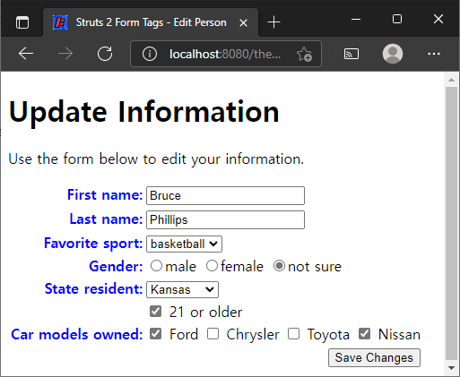
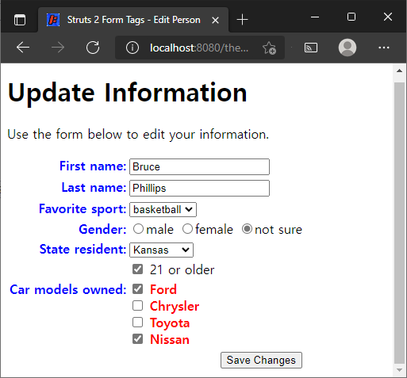

# 테마

> 원문 : https://struts.apache.org/getting-started/themes.html

* 서문
* Struts 2가 사용할 테마 지정하기
* Struts 2 태그가 사용하는 CSS 지정하기
* Struts 2 태그에 자신만의 테마 생성 및 적용하기 
* 요약

이 튜토리얼의 예제 코드인 **themes**는 Struts 2 깃허브의 [struts-example](https://github.com/apache/struts-examples) 레파지토리에서 체크아웃 할 수 있습니다.


## 서문

웹 페이지에서 `s:select`와 같은 Struts 2 태그를 사용할 때 Struts 2 프레임워크는 모양에 스타일을 지정하고 select 컨트롤의 레이아웃을 제어하는 HTML을 생성합니다. 스타일과 레이아웃은 태그에 대해 설정된 Struts 2 테마에 따라 결정됩니다. Struts 2에는 세 가지 기본 제공 테마가 있습니다: `simple`, `xhtml`, `css_xhtml`. 테마를 지정하지 않으면 Struts 2는 기본적으로 `xhtml` 테마를 사용합니다.

Struts 2 [사용자 메일링](http://struts.apache.org/mail.html) 리스트는 도움을 받을 수 있는 훌륭한 장소입니다. 튜토리얼 예제 애플리케이션을 작동시키는데 문제가 있는 경우 Struts 2 메일리스트를 검색하세요. 문제에 대한 답을 찾지 못한 경우 메일링 리스트에 질문을 게시해보세요. 

예를 들어 이 Struts 2 select 태그는 다음과 같습니다:

### Struts 2 Select 태그

```xml
<s:select key="personBean.sport" list="sports" />
```

다음 HTML 마크업을 생성합니다:

### Struts 2 Select 태그가 만든 HTML

```html
<tr>
    <td class="tdLabel">
        <label for="save_personBean_sport" class="label">Favorite sport:</label>
    </td>
    <td>
        <select name="personBean.sport" id="save_personBean_sport">
            <option value="football">football</option>
            <option value="baseball">baseball</option>
            <option value="basketball" selected="selected">basketball</option>
        </select>
    </td>
</tr>
```

생성된 HTML이 테이블 태그를 사용하여 label 레이아웃과 select HTML을 제어하는 방법에 주목하세요. label 태그가 렌더링되는 테이블 열에 적용된 `tdLabel` 클래스도 있습니다. Struts 2 select 태그에 테마가 지정되지 않았기 때문에 기본 `xhmtl` 테마가 사용되었습니다.


## Struts 2가 사용할 테마 지정하기

Struts 2 태그에는 해당 태그에 대한 HTML을 생성할 때 사용해야 하는 Struts 2 테마를 지정하는 데 사용할 수 있는 테마 속성이 있습니다. 테마 속성의 값은 `simple`, `xhtml`, `css_xhtml` 및 `ajax`가 있습니다. 이러한 테마에 대해 자세히 알아보려면 [테마 및 템플릿 문서](https://struts.apache.org/tag-developers/themes-and-templates.html)를 방문해보세요. 이 튜토리얼에서는 `xhtml`, `css_xhtml` 및 `simple` 테마를 검토합니다. `ajax` 테마는 ajax 작업에 사용되는 특수 테마입니다([문서의 Ajax 테마](https://struts.apache.org/tag-developers/ajax-theme.html) 참조).

Struts 2 태그별로 테마를 지정하거나 다음 방법 중 하나를 사용하여 Struts 2에서 사용해야 하는 테마를 지정할 수 있습니다:

1. 특정 태그의 `theme` 속성
2. 태그를 둘러싼 form 태그의 `theme` 속성
3. `theme`라는 이름의 페이지 범위 속성
4. `theme`라는 이름의 요청 범위 속성
5. `theme`라는 이름의 세션 범위 속성
6. `theme`라는 이름의 애플리케이션 범위 속성
7. `struts.xml`의 `struts.ui.theme` 상수(기본값은 `xhtml`)

위의 접근 방식을 사용하여 테마를 설정하는 방법은 [테마 선택](https://struts.apache.org/tag-developers/selecting-themes.html)을 참조하세요.

예제 애플리케이션에서 `edit.jsp`를 검사해보세요. form 태그의 theme 속성은 `xhtml`로 설정됩니다. 애플리케이션을 실행하고(readme.txt 파일 참조) 브라우저에서 렌더링된 후 edit.jsp의 소스를 확인해보세요. 테이블 태그로 제어되는 form HTML 태그 레이아웃이 표시되어야 합니다.

form의 theme 속성에 대해 테마를 simple으로 변경하고 애플리케이션을 재배포합니다. 브라우저에서 렌더링된 후 edit.jsp의 소스를 검사합니다. 레이아웃을 제어하는 테이블 태그가 없고 텍스트 필드에 대한 label 태그도 없는 것을 확인해야 합니다.

form의 theme 속성에 대해 테마를 `css_xhtml`로 변경하고 애플리케이션을 재배포합니다. 브라우저에서 렌더링된 후 edit.jsp의 소스를 검사해보세요. 이제 form 태그의 레이아웃이 div 태그로 제어되고 label 태그가 다시 돌아왔습니다. 


## Struts 2 태그가 사용하는 CSS 지정하기

form 태그의 theme 속성을 xhtml로 다시 변경하세요. edit.jsp가 브라우저에서 렌더링된 후 소스를 볼 때 label이 포함된 테이블 열에 적용된 tdLabel이라는 클래스가 있음을 알 수 있습니다. 이 CSS 클래스는 테이블 열에서 label의 위치를 제어합니다. tdLabel 스타일은 `/themes/struts/xhtml/styles.css`에 정의되어 있습니다. 이 스타일 시트에 대한 링크는 `edit.jsp`에 `s:head` 태그를 추가할 때 edit.jsp의 head 섹션에 포함되었습니다.

브라우저에서 이 스타일 시트를 로드합니다(예제 응용 프로그램에서 링크는 http://localhost:8080/themes-struts/struts/xhtml/styles.css입니다. 서블릿 컨테이너가 localhost, 포트 8080에서 실행 중인 경우). 다음이 표시됩니다.

### styles.css

```css
.label {font-style:italic; }
.errorLabel {font-style:italic; color:red; }
.errorMessage {font-weight:bold; color:red; }
.checkboxLabel {}
.checkboxErrorLabel {color:red; }
.required {color:red;}
.tdLabel {text-align:right; vertical-align:top; }
```

따라서 .label 선택자는 label 태그의 텍스트를 기울임꼴로 렌더링합니다. `.tdLabel` 선택자는 텍스트가 테이블 열의 오른쪽과 위쪽에 정렬되어야 함을 지정합니다.

페이지의 head 섹션에 동일한 선택자를 포함하여 위의 선택자를 재정의할 수 있습니다. 예를 들어 `edit.jsp`의 head 섹션에 다음을 추가합니다.

### Label 스타일 재정의

```html
<style type="text/css">
    .label {color:blue; font-style:normal; font-weight:bold}
</style>
```

이제 label 태그는 파란색, 굵게, 일반(기울임꼴 아님) 스타일로 텍스트를 렌더링합니다.




## Struts 2 태그에 자신만의 테마 생성 및 적용하기 

테마 템플릿(simple, xhtml, css_xhtml)은 Struts 2 코어 jar 파일에서 찾을 수 있습니다. Struts 2 코어 jar 파일을 확장(파일 추출)하면 `template.css_xhtml`, `template.simple` 및 `template.xhtml`이라는 폴더를 찾을 수 있습니다. 이들 폴더에는 세 가지 기본 Struts 2 테마에 대한 템플릿이 포함되어 있습니다. 각 폴더에는 각 Struts 2 태그에 대한 파일이 있습니다. 예를 들어 `template.xhtml` 폴더를 확장하면 `select.ftl` 파일이 표시됩니다.

Struts 2 프레임워크는 FreeMarker 템플릿 엔진을 사용하여 Struts 2 태그용 HTML을 생성합니다. 이것이 파일 확장자가 `.ftl`인 이유입니다. https://freemarker.apache.org/를 방문하여 FreeMarker에 대해 자세히 알아볼 수 있습니다.

또한 `template.xhmtl` 폴더에는 `styles.css` 파일이 있습니다. 이것은 응용 프로그램이 `xhtml` 테마를 사용하는 경우 사용할 `styles.css` 파일입니다.

Struts 2 checkboxlist 태그가 checkbox와 해당 label을 표시하는 방법을 변경하는 자체 테마를 만들고 싶다고 가정해 보겠습니다.

예제 애플리케이션에서 기본 XHMTL 테마를 확장했습니다(`src/main/resources/template/KUTheme` 아래의 `theme.properties` 파일 참조). XHTML 테마의 일부인 `checkedlist.ftl` 테마는 각 label과 다음 checkbox 사이에 공백만 포함합니다(Struts 2 코어의 `template/simple` 폴더에 있는 `checkedlist.ftl` 참조). 그렇기 때문에 모든 checkbox가 브라우저 창의 너비에 걸쳐 표시됩니다. 내 사용자 정의 checkboxlist 테마의 경우 각 checkbox와 해당 label이 자체 줄에 있도록 각 label 태그 뒤에 구분 태그를 지정하고 싶습니다.

예제 애플리케이션에는 `src/main/resources/template/KUTheme`라는 폴더가 있습니다. 그 폴더에는 Struts 2 코어 jar의 `templates.xhtml` 폴더에 있는 `checkedlist.ftl`에서 내가 원래 복사한 내용인 `checkedlist.ftl`이 있습니다.

그런 다음 KUTheme 폴더에서 `checkedlist.ftl`을 다음과 같이 수정했습니다.


### 수정된 checkboxlist.ftl

```jsp
<#include "/${parameters.templateDir}/${parameters.expandTheme}/controlheader.ftl" />

<#include "/${parameters.templateDir}/KUTheme_simple/checkboxlist.ftl" />

<#include "/${parameters.templateDir}/${parameters.expandTheme}/controlfooter.ftl" /><#nt/>
```

두 번째 줄의 변경 사항을 확인해보세요. - 경로에서 KUTheme_simple을 사용한 부분.

그런 다음 예제 애플리케이션의 `src/main/resources/template` 아래에 KUTheme_simple 폴더를 만들었습니다(선택적으로 `webapp` 아래에 배치할 수 있습니다. 예: `src/main/webapp/template`). 그 폴더에서 나는 `checkboxlist.ftl`을 만들고 `template.simple` `checkboxlist.ftl`에서 내용을 복사했습니다(Struts 2 코어 jar에서 다시 찾음).  내용을 `KUTheme_simple` 폴더에 있는 `checkboxlist.ftl`에 복사한 후, label 태그가  굵은 빨간색 텍스트의 스타일을 갖도록 수정하고 각 label 뒤에 break 태그(br)를 추가하여 각각의 checkbox와 label이 각자의 라인에 놓이도록 했습니다.

XHTML 테마가 기본 테마이고 `parent = xhtml`로 정의된 `theme.properties` 파일이 있기 때문에 KUTheme에는 해당 태그의 레이아웃에 대한 정의가 포함되어 있으므로 KUTheme는 checkboxlist 태그에 대한 테마를 제외하고 xhmtl의 모든 테마를 상속합니다. `struts.xml` 파일(`src/main/resources`)에서 기본 테마를 KUTheme로 지정했음을 알 수 있습니다.

배포된 웹 애플리케이션에서 Struts 2는 먼저 애플리케이션의 클래스 경로에서 태그 템플릿을 찾고 거기에서 템플릿을 찾지 못하면 Struts 2 코어 jar의 일부인 기본 템플릿을 사용합니다. 애플리케이션의 웹 루트에 템플릿 폴더를 추가했으므로 이제 Struts 2가 checkboxlist 태그를 표시하는 HTML을 생성할 때 KUTheme 폴더에 있는 템플릿을 사용합니다. (이는 Struts 2 코어 Jar의 일부인 `template.simple` 폴더 대신 KUTheme_simple 폴더에 있는 `checkedlist.ftl` 파일을 사용하도록 지시합니다)

애플리케이션을 다시 배포한 후 소유한 자동차 모델에 대한 checkbox란이 다음과 같이 표시되어야 합니다.




## 요약

Struts 2 태그의 모양과 레이아웃을 제어하기 위해 Struts 2에서 사용하는 기본 테마를 쉽게 재정의할 수 있습니다. 각 Struts 2 태그에는 테마(예: xhtml)의 이름을 딴 폴더에 있는 관련 템플릿 파일(예: `select.ftl`)이 있습니다. 기본적으로 Struts 프레임워크는 테마 폴더 및 템플릿에 대한 Struts 2 코어 Jar 파일을 찾습니다. 그러나 webapp/template(또는 Ant 버전의 WebContent/template) 아래에 고유한 테마 폴더(예: KUTheme)를 포함하고 해당 폴더 이름(예: KUTheme)을 테마 속성의 값으로 지정하면 Struts 2 프레임워크는 해당 테마 폴더에서 태그 템플릿을 찾습니다.

Struts 2 테마를 사용하는 방법과 이를 무시하는 방법에 대해 자세히 알아보려면 [테마 및 템플릿 문서](https://struts.apache.org/tag-developers/themes-and-templates.html)를 방문하세요.


### >  [와일드카드 메서드 선택](../wildcard-method-selection)으로 돌아가기 또는 [스프링과 Struts 2](../spring-and-struts-2)로 이동

---

## 테마 예제 진행...

* 변경사항
  * 프로젝트명: [themes-struts](themes-struts)
* [x] 서문
* [x] Struts 2가 사용할 테마 지정하기
* [x] Struts 2 태그가 사용하는 CSS 지정하기
* [x] Struts 2 태그에 자신만의 테마 생성 및 적용하기 
* [x] 요약
