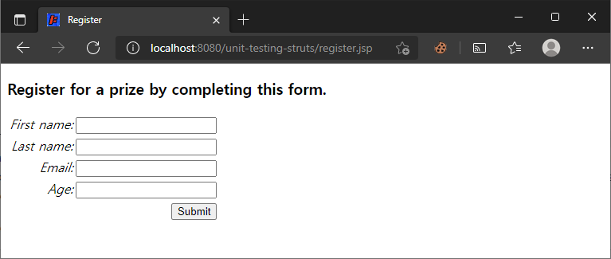

# 단위 테스트

> 원문 : https://struts.apache.org/getting-started/unit-testing.html
>
> * ✨ Jetty의 ContextPath 설정을 프로젝트 이름 대신에 루트로 하기로해서 스크린샷의 브라우저 URL과 문서 내의 테스트 URL이 다를 수 있는데, 이부분 참고 부탁합니다.

* 소개
* 설정
* 단위 테스트 작성
* 유효성 검증 통과 테스트
* 유효성 검증 실패 테스트
* 요약


이 튜토리얼의 예제 코드인 **unit-testing**는 [struts-examples](https://github.com/apache/struts-examples)에서 체크아웃할 수 있습니다.


## 소개

Struts 2는 [Struts 2 JUnit 플러그인](../plugins/struts2-junit5-user-custom-plugin/junit-plugin.md)을 사용하여 Struts 액션 클래스의 메서드에 대한 단위 테스트 실행을 지원합니다. JUnit 플러그인을 사용하면 Struts 2 프레임워크 내에서 액션 클래스의 메서드를 테스트할 수 있습니다. Struts Servlet 필터와 인터셉터는 애플리케이션이 Servlet 컨테이너에서 실행 중인 것처럼 실행됩니다.

Struts 2 [사용자 메일링](http://struts.apache.org/mail.html) 리스트는 도움을 받을 수 있는 훌륭한 장소입니다. 튜토리얼 예제 애플리케이션을 작동시키는데 문제가 있는 경우 Struts 2 메일리스트를 검색하세요. 문제에 대한 답을 찾지 못한 경우 메일링 리스트에 질문을 게시하세요.


## 설정

Struts 2 JUnit 플러그인 jar 파일은 애플리케이션의 클래스 경로에 있어야 합니다. 예제 애플리케이션(위의 정보 참조)에서 `pom.xml`은 `struts2-junit-plugin`에 대한 의존성을 포함합니다. `JUnit` 및 `Spring` 프레임워크를 포함하여 수많은 전이 의존성이 있습니다.


## 단위 테스트 작성

예제 응용 프로그램에서 Register 액션 클래스는 validate 메서드를 사용하게 됩니다. 이 메서드는 execute 메서드 실행전에 Struts 2 프레임워크에 의해 자동으로 실행됩니다. 또는 이 메서드는 액션 클래스의 인스턴스 필드에 이미 제공된 사용자 입력 값이 필요합니다. (이 작업은 다른 Struts 2 인터셉터에의해 수행됨.) 따라서 전체 Struts 2 프레임워크를 실행하지 않고는 validate 메서드를 테스트하기 어려울 것 입니다.

Struts 2 플러그인을 사용하여 Strut 2 프레임워크가 테스트의 일부로 실행되도록 하려면 JUnit 테스트 클래스가 StrutsTestCase를 확장하도록 해야 합니다(예제 애플리케이션의 RegisterTest 클래스 참조).

Struts 2 JUnit 플러그인은 input 메서드와 같은 다른 액션 클래스 메서드의 단위 테스트를 설계하고 인터셉터 스택에 추가한 사용자 정의 인터셉터의 메서드를 테스트하는 데 사용할 수 있습니다. 또한 이 예에서 테스트는 [validate 메서드](../form-validation)에서 수행된 유효성 검증을 위한 것입니다. 그러나 [XML 파일 유효성 검사](https://struts.apache.org/getting-started/form-validation-using-xml.html)를 사용하여 유효성 검사를 수행한 경우에도 동일한 유형의 테스트가 작동합니다.

validate 메서드를 테스트하기 위해 우리는 Struts가 Struts 액션을 호출하여 액션 클래스의 validate 및 execute 메서드가 실행되기를 원합니다. 예제 애플리케이션에서 이 액션은 register입니다. 유효성 검사 오류가 없으면 프레임워크는 execute 메서드를 호출하고 execute 메서드가 반환하는 문자열을 반환합니다.

### struts.xml

```xml
<action name="register" class="org.apache.struts.register.action.Register" method="execute">
    <result name="success">/thankyou.jsp</result>
    <result name="input">/register.jsp</result>
</action>
```

validate 메서드는 execute 메서드를 호출하기 전에 프레임워크에 의해 자동으로 호출된다는 것을 기억하세요. 유효성 검사가 실패하면 Struts 프레임워크가 `input`을 반환합니다.


## 유효성 검증 통과 테스트

첫 번째 테스트에서 유효성 검사 오류가 없어야되는 경우를 테스트 합니다. 이 애플리케이션의 일반적인 흐름에서 사용자는 먼저 register.jsp에 표시된 폼 데이터를 입력합니다.



폼의 입력 필드에는 `personBean.firstName`, `personBean.lastName`, `personBean.email` 및 `personBean.age`와 같은 이름 값이 있습니다. 사용자가 해당 필드를 채울 때 Struts는 값을 가져와 personBean 객체의 적절한 set 메서드에 제공합니다. 따라서 테스트의 일부로 이러한 폼 필드를 채우는 사용자를 시뮬레이션해야 합니다. StrutsTestCase는 request 스코프에서 이러한 값을 설정하는 데 사용할 수 있는 request 객체(`MockHttpServletRequest` 유형)를 제공합니다.

### RegisterTest 클래스의 testExecuteValidationPasses 메서드

```java
@Test
public void testExecuteValidationPasses() throws Exception {
    request.setParameter("personBean.firstName", "Bruce");
    request.setParameter("personBean.lastName", "Phillips");
    request.setParameter("personBean.email", "bphillips@ku.edu");
    request.setParameter("personBean.age", "19");

    ActionProxy actionProxy = getActionProxy("/register.action");
    Register action = (Register) actionProxy.getAction() ;

    assertNotNull("The action is null but should not be.", action);

    String result = actionProxy.execute();

    assertEquals("The execute method did not return " + ActionSupport.SUCCESS + " but should have.", ActionSupport.SUCCESS, result);
}
```

테스트 메서드의 첫 번째 명령문은 request 객체를 사용하여 request 파라미터의 값을 설정합니다. 이는 사용자가 폼 필드에 입력한 값을 시뮬레이션합니다. setParameter에 대한 첫 번째 인수가 register.jsp 페이지의 Struts 텍스트 필드 태그에 있는 name 속성 값과 어떻게 동일한지 확인해보세요.

이 테스트에서는 사용자가 올바른 정보를 제공하는 경우 유효성 검사 로직이 오류를 등록하지 않게 하기 위해 각 폼 필드에 대해 올바른 데이터를 제공하고 있습니다.

그런 다음 "/register.action" 인수를 사용하여 getActionProxy 메서드를 호출한 다음 이 테스트에 대한 Struts 액션 클래스의 참조를 가져오기 위해 getAction 메서드를 호출합니다. 이렇게 하면 Struts 2 JUnit 플러그인이 사용해야 하는 액션 클래스(struts.xml에서 register 액션과 관련된 클래스)를 알 수 있습니다. 이 경우 해당 클래스는 Register 클래스입니다.

assertNotNull 테스트는 getActionProxy에 대한 인수가 struts.xml에서 식별된 액션  클래스를 참조하는지 확인합니다. struts.xml에 이 액션이 올바르게 설정되었는지 확인하는 방법입니다.

그 후에 actionProxy.execute()를 호출할 수 있습니다. 이로 인해 Struts 2 프레임워크는 actionProxy(이 경우에는 register.action)에 의해 식별된 액션에 대해 Servlet 필터 및 인터셉터의 정상적인 프로세스를 거치게 됩니다. Register 클래스의 validate 메서드가 호출되고 필드 또는 액션 오류가 생성되지 않으면 Struts 2가 `execute` 메서드를 호출합니다. 이 예에서 `execute` 메서드는 `success`를 반환해야 합니다.

따라서 다음 문에서 성공이 반환되었는지 확인합니다.


## 유효성 검증 실패 테스트

유효성 검사가 실패하는 테스트를 하려면 양식 폼에 입력을 제공하지 않는 테스트 메서드만 있으면 됩니다. 예를 들어, Register 액션 클래스의 validate 메서드에서 사용자가 personBean.firstName 입력 필드의 정보를 입력했는지 확인하는 테스트입니다. 테스트 메서드에서는 request 객체를 사용하여 해당 필드에 대한 파라미터를 설정하지 않을 것입니다.

### RegisterTest 클래스의 testExecuteValidationFailsMissingFirstName 메서드

```java
@Test
public void testExecuteValidationFailsMissingFirstName() throws Exception {
    //request.setParameter("personBean.firstName", "Bruce");
    request.setParameter("personBean.lastName", "Phillips");
    request.setParameter("personBean.email", "bphillips@ku.edu");
    request.setParameter("personBean.age", "19");
    
    ActionProxy actionProxy = getActionProxy("/register.action");
    Register action = (Register) actionProxy.getAction() ;
    
    assertNotNull("The action is null but should not be.", action);
    
    String result = actionProxy.execute();
    
    assertEquals("The execute method did not return " + ActionSupport.INPUT + " but should have.", ActionSupport.INPUT, result);
}
```

마지막 assertEquals 문에서 내 테스트는 Struts 2 프레임워크가 `input`을 반환했는지 확인합니다. 유효성 검사 로직(validation 메서드)이 필드 또는 액션 오류를 추가하면 Struts 2 프레임워크가 `input`을 반환할 것이기 때문입니다.


## 요약

Struts 2 프레임워크와 함께 액션 클래스의 메서드를 테스트하는 데 도움이 되는 Struts 2 JUnit 플러그인으로 할 수 있는 일이 훨씬 더 많습니다. Struts 2 애플리케이션이 Spring을 사용하여 액션 클래스에 의존성을 주입하는 경우 Struts 2 JUnit 플러그인에는 테스트 클래스에다가 상속해서 사용가능한 StrutsSpringTestCase가 있습니다. 자세한 내용은 [액션 테스트](../plugins/struts2-junit5-user-custom-plugin/junit-plugin.md)를 참조하세요.


### >  [인터셉터 소개](https://struts.apache.org/getting-started/introducing-interceptors.html)로 돌아가기 또는 [HTTP 세션](../http-session)으로 이동

---

## 스텝 진행...

공식 [struts2-junit-plugin](https://github.com/apache/struts/tree/master/plugins/junit)이 JUnit 5를 지원하지 않아서, JUnit 5를 지원하도록 플러그인을 수정해서 커스텀 프로젝트를 만들었다. 

* [struts2-junit5-user-custom-plugin](../plugins/struts2-junit5-user-custom-plugin) 프로젝트

  * Maven 레파지토리에 올리지않고 로컬에서 테스트로만 사용하므로 Maven 로컬 레파지토리에 설치하고 예제를 돌리도록 하자!

    ```bash
    cd ../struts2-junit5-user-custom-plugin
    mvnw clean install
    ```

* 프로젝트 변경사항

  * 프로젝트명: [unit-testing-struts](unit-testing-struts)

  * 커스텀 플러그인 사용을 위해 pom.xml에는 아래 디펜던시를 추가한다.

    ```xml
    <dependency>
      <groupId>org.fp024.struts2.study</groupId>
      <artifactId>struts2-junit5-user-custom-plugin</artifactId>
      <version>1.0.0-SNAPSHOT</version>
      <scope>test</scope>
    </dependency>
    ```

- [x] 소개

- [x] 설정

- [x] 단위 테스트 작성

  * StrutsTestCase 는 JUnit 4 이전의 테스트로 되어있어서 커스텀한 플러그인에서는 완전히 재거 했다. 

  * 커스텀 한 플러그인에서는 아래 클래스를 상속해서 사용하면 된다.

    ```java
    // StrutsJUnit5TestCase<테스트할 액션 클래스> 를 상속 받아 액션 테스트 구성
    class RegisterTest extends StrutsJUnit5TestCase<Register> {
    ...
    }
    ```

    

- [x] 유효성 검증 통과 테스트

  * MockHttpServletRequest 은 spring-test에 들어있는 것을 사용한다.
  * JUnit 5에서는 assertEquals의 message 기입이 맨 뒤쪽 인자로 변경되었는데, 바꿔서 수정했다.

- [x] 유효성 검증 실패 테스트

- [x] 요약

  * 스프링 적용은 spring-struts에서 진행해봤다.
  * 커스텀 플러그인에서는 `StrutsSpringJUnit5TestCase<테스트할_액션_클래스>` 를 상속 받아 사용하면 된다. 

### Action을 스프링 빈으로 관리되게 했을 때의 테스트 예제

* 현재 프로젝트는 Spring 통합은 되어있지 않기 때문에, 통합이 되어있는 [spring-struts](../spring-and-struts-2/spring-struts) 프로젝트에 단위 테스트를 추가해서 확인을 했음
  * [EditAcionTest 클래스](../spring-and-struts-2/spring-struts/src/test/java/org/fp024/struts2/study/edit/action/EditActionTest.java) 를 알맞게 수정함.


