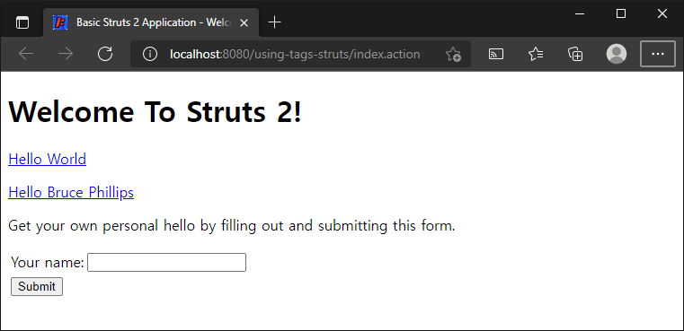
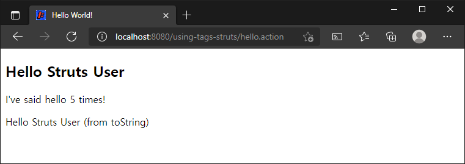

# 태그 사용하기

> 원문 : https://struts.apache.org/getting-started/using-tags.html
>
> * ✨ Jetty의 ContextPath 설정을 프로젝트 이름 대신에 루트로 하기로해서 스크린샷의 브라우저 URL과 문서 내의 테스트 URL이 다를 수 있는데, 이부분 참고 부탁합니다.

* Struts 2 url 태그
* Struts 2 폼 태그
* Struts 2 프로퍼티 태그

이 튜토리얼은 Hello World 튜토리얼을 완료했고 **helloworld** 프로젝트가 작동한다고 가정합니다. 이 튜토리얼의 예제 코드인 **using-tags**는 Struts 2 깃허브의 [struts-example](https://github.com/apache/struts-examples) 레파지토리에서 체크아웃 할 수 있습니다. 예제 프로젝트는 아티펙트 디펜던시를 관리하고 .war파일을 빌드하는데, Maven을 사용합니다.

[Hello World](../hello-world-using-struts-2) 강의에서 Struts 2 url 태그를 `index.jsp`에 추가하여 `hello.action`에 대한 하이퍼링크를 생성했습니다. 이 튜토리얼에서는 url과 그외 Struts 2 태그들을 자세히 살펴볼 것입니다. 

웹 어플리케이션은 동적응답을 생성할 수 있다는 점에서 기존 웹 사이트와 다릅니다. 페이지에서 동적데이터를 더 쉽게 참조할 수 있도록 Struts 2 프레임워크는 태그 집합을 제공합니다. 일부 태그는 추가된 값을 제공하면서 표준 태그를 모방합니다. 다른 태그는 비표준이지만 유용한 컨트롤을 만듭니다.

뷰 페이지에서 Struts 2 태그를 사용하려면 태그 라이브러리 지시문을 포함해야합니다. 일반적으로 taglib 지시문은 `<%@ taglib prefix="s" uri="/struts-tags" %>` 입니다.  따라서 모든 Struts 2 태그의 접두사는 `s`가 됩니다. 실제로 Struts 2 태그 TLD 파일을 읽고 싶다면 Strut 2 코어 JAR 파일을 `META-INF`폴더에서 찾을 수 있습니다.


### Struts 2 url 태그

Struts 2 태그의 한 가지 용도는 다른 웹 리소스, 특히 로컬 애플리케이션의 다른 리소스에 대한 링크를 만드는 것입니다. 

HTML은 하이퍼링크를 생성하기 위한 간단한 태그를 제공하지만 HTML 태그는 종종 중복 정보를 포함해야합니다. 또한 HTML 태그는 프레임워크에서 제공하는 동적 데이터에 쉽게 접근할 수 없습니다.

웹 애플리케이션의 매우 일반적인 사용 사례는 다른 페이지에 링크 하는 것입니다. [Hello World](../hello-world-using-struts-2) 튜토리얼에서 Struts 2 url 태그를 사용하여 `index.jsp` 내부에 `hello.action`에 대한 링크를 추가했습니다. url 태그에 대한 자세한 내용은 [url 문서](https://struts.apache.org/tag-developers/url-tag.html)를 참조하세요.

#### index.jsp

```jsp
<!DOCTYPE html>
<%@ page language="java" contentType="text/html; charset=UTF-8" pageEncoding="UTF-8" %>
<%@ taglib prefix="s" uri="/struts-tags" %>
<html>
  <head>
    <meta http-equiv="Content-Type" content="text/html; charset=UTF-8">
    <title>Basic Struts 2 Application - Welcome</title>
  </head>
  <body>
    <h1>Welcome To Struts 2!</h1>
    <p><a href="<s:url action='hello'/>">Hello World</a></p>
  </body>
</html>
```

서블릿 컨테이너에서 Hello World 튜토리얼을 실행한 다음 Struts 2 url 태그로 생성된 Hello World 하이퍼링크 위로 마우스 커서를 옮기면 생성된 URL이 `hello.action`임을 알 수 있습니다. (웹 컨텍스트의 루트 폴더 기준)

Hello World 튜토리얼에서 `struts.xml` 설정을 보면 다음을 찾을 수 있습니다.

#### struts.xml

```xml
...
<action name="hello" class="org.fp024.struts2.study.helloworld.action.HelloWorldAction" method="execute">
    <result name="success">/WEB-INF/views/HelloWorld.jsp</result>
</action>
...
```

위의 action 노드는 hello.action 을 `HelloWorldAction`클래스의 execute 메서드에 매핑 합니다. execute 메서드가 `success`를 반환하면 뷰 페이지 `HelloWorld.jsp` (웹 컨텍스트 루트 폴더에 있음)가 사용자에게 반환됩니다.

일반적인 사용 사례는 URL에 userName과 같은 쿼리 문자열 파라미터 값도 포함해야한다는 것입니다. 쿼리 문자열 파라미터와 그 값을 추가하려면 url태그 내부에 중첩된 Struts 2 param 태그를 사용하세요.

태그 사용하기 튜토리얼 진행을 위해 `index.jsp`의 Hello World 링크 바로 뒤에 다음 내용을 추가하세요.

#### url 태그에 parm태그를 함께 사용

```xml
...
<s:url action="hello" var="helloLink">
  <s:param name="userName">Bruce Phillips</s:param>
</s:url>

<p><a href="${helloLink}">Hello Bruce Phillips</a></p>
...
```

url 태그를 a 태그의 herf 속성 값으로 두는 대신 s:url 태그를 자체 코드 블록으로 분리했습니다.<br>url 태그 안에 중첩된 것은 Struts 2 param 태그입니다. 이 태그를 사용해서 매개 변수 이름(예: userName)과 해당 매개변수 값(예: Bruce Phillips)을 지정할 수 있습니다.

var 속성에 주목하세요. var속성의 값은 생성된 URL을 참조하기 위해 나중에 코드에서 사용할 수 있는 참조입니다. 

위의 a 태그를 살펴보세요. href 속성의 값은 `${helloLink}`입니다. 뷰 페이지는 `${helloLink}`를 url 태그를 사용하여 생성한 하이퍼링크로 대체합니다. 쿼리 문자열 파라미터는 URL로 올바르게 인코딩 됩니다. (`Bruce+Phillips`).

다음 튜토리얼에서는 Struts가 쿼리 문자열 매개변수 값에 접근하는 방법을 다룰 것입니다.


### Struts 2 폼 태그

대부분의 응용 프로그램은 여러 데이터 입력 폼을 사용합니다. Struts 2 태그를 사용하면 입력 폼을 쉽게 만들 수 있습니다. Struts 2 폼 태그에 대한 모든 세부 사항은 [폼 태그 레퍼런스](https://struts.apache.org/tag-developers/form-tags.html)를 참조하세요.

각 Struts 2 폼 태그에는 일반 HTML 폼 태그 속성을 모방하는 수많은 속성이 있습니다.

폼의 외부 쉘을 작성하려면 Struts 2 폼 태그를 사용하세요. action 속성은 제출할 action 이름을 설정합니다.

`index.jsp`의 Hello Bruce Phillips 링크 뒤에 다음 마크업을 추가합니다.

#### Struts 2 폼

```jsp
<p>Get your own personal hello by filling out and submitting this form.</p>

<s:form action="hello">
  <s:textfield name="userName" label="Your name" />
  <s:submit value="Submit" />
</s:form>
```

Struts 2 텍스트필드 태그는 HTML의 input 태그를 제공하고 submit 태그는 submit 버튼을 생성합니다. index 페이지가 서브에서 브라우저로 반환되면 다음과 같이 표시되어야합니다.



 

Struts form, textfield 및 submit 태그가 아래 HTML로 변환되었습니다. 

#### HTML로 변환된 Struts 폼 태그

```html
<form id="hello" name="hello" action="/using-tags-struts/hello.action" method="post">
  <table class="wwFormTable">
    <tr>
      <td class="tdLabel"><label for="hello_userName" class="label">Your name:</label></td>
      <td class="tdInput"><input type="text" name="userName" value="" id="hello_userName"/></td>
    </tr>
    <tr>
      <td colspan="2">
        <div class="formButton">
          <input type="submit" value="Submit" id="hello_0"/>
        </div>
      </td>
    </tr>
  </table>
</form>
```

Struts 2가 폼 요소를 배치하기위해 폼 내부에 테이블을 어떻게 생성했는지 주목하세요. 이후 튜토리얼에서 레이아웃 (table, CSS)을 지정하는 법을 배웁니다. Struts 2 텍스트필드 태그는 텍스트필드 태그의 이름 값과 일치하는 이름 값을 가진 text 유형의 input HTML태그를 생성했습니다. Struts 2는 또한 텍스트필드 태그의 레이블 값을 기반으로 label HTML 태그를 생성했습니다.

다음 튜토리얼에서는 Struts 2를 사용하여 이 폼 제출을 처리하는 방법을 다룰 것입니다.


### Struts 2 프로퍼티 태그

[Hello World 튜토리얼 예제](../hello-world-using-struts-2) 어플리케이션의 JSP 중 `HelloWorld.jsp` 의 코드: 

#### Struts 프로퍼티 태그

```jsp
<s:property value="messageStore.message" />
```

프로퍼티 태그의 가장 일반적인 용도는 public get 메서드를 호출하여 반환된 값을 "가져온" 다음 (액션 클래스의) 브라우저에 반환된 HTML에 해당 값을 포함하는 것입니다. 

Hello World 튜토리얼에서 논의된 것처럼 `messageStore.message`의 값은 Struts 2가 Action 클래스의 `getMessageStore` 메서드를 호출하도록 지시합니다. 해당 메서드 호출은 `MessageStore` 객체를 반환합니다. `.message` 부분은 Struts 2가 `MessageStore` 객체의 `getMessage` 메서드를 호출하도록 지시합니다. `getMessage` 메서드는 브라우저에 반환된 HTML에 포함될 문자열을 반환합니다.

Struts 2 프로퍼티 태그의 매우 유용한 기능 중 하나는 가장 일반적인 데이터 타입(int, double, boolean)을 동등한 String으로 자동 변환하는 것입니다. 이 기능을 보여주기 위해 HelloWorldAction 클래스에 정적 int 변수를 추가해 보겠습니다.

#### static 필드 멤버 변수 추가

```java
private static int helloCount = 0;
	
public int getHelloCount() {
    return helloCount;
}
```

execute 메서드가 호출될 때마다 `helloCount`를 1씩 증가 시킵니다. 이 코드를 `HelloWorldAction` 클래스의 `execute`메서드에 추가하세요.

#### helloCount 증가시키기

```java
helloCount++;
```

사용자가 index.jsp 페이지의 링크 중 하나를 클릭할 때마다 (또는 폼 제출) HelloWorldAction의 execute 메서드가 실행되고 정적 필드 helloCount가 1만큼 증가합니다.

`HelloWorld.jsp`에 `helloCount` 속성 값을 포함하기 위해 Struts 2 프로퍼티 태그를 사용할 수 있습니다. H`elloWorld.jsp`의 h2 태그 뒤에 다음을 추가합니다.

#### 프로퍼티 태그를 사용하여 helloCount 값을 표시

```jsp
<p>I've said hello <s:property value="helloCount" /> times!</p>
```

위의 코드는 `getHelloCount` 메서드가 정수 타입을 반환하더라도 Struts 2는 이를 String 유형으로 변환하여 p 태그의 본문에 배치합니다.

`helloCount`는 정적 필드지만 `helloCount`의 get 메서드는 정적이 아닙니다. Struts 2가 `getHelloCount` 메서드를 호출하여 `helloCount`의 값을 얻으려면 `getHelloCount` 메서드는 정적일 수 없습니다.

get 메서드에 의해 반환된 값이 객체인 경우 프로퍼티 태그는 Struts 2가 `toString` 메서드를 호출하도록 합니다. 물론 모델 클래스에서 항상 Class Object의 toString 메서드를 재정의해야합니다. `MessageStore` 클래스에 다음 `toString` 메서드를 추가합니다.

#### MessageStore 클래스에 toString 메서드 추가

```java
public String toString() {
    return message + " (from toString)";
}	
```

`HelloWorld.jsp`에 다음을 추가하세요.

#### 프로퍼티 태그를 사용하여 toString 메서드 호출

```jsp
<p><s:property value="messageStore" /></p>
```

HelloWorldAction 클래스의 getMessageStore는 MessageStore 객체를 반환하므로, Struts 2는 MessageStore 클래스의 toString 메서드를 호출합니다. 해당 toString 메서드에 의해 반환된 문자열은 브라우저에 표시됩니다.



이 튜토리얼에서 많은 것을 다루었지만, 실제로는 Struts 2 태그를 사용법의 핵심까지는 파고들지 않았습니다. 모든 Struts 2 태그에 대한 자세한 내용은 [Struts 2 태그 레퍼런스](https://struts.apache.org/tag-developers/tag-reference.html)를 참조하십시오.


### >  [Struts 2를 사용한 Hello World](../hello-world-using-struts-2)으로 돌아가기 또는 [Struts 2 액션 코딩하기](../coding-actions)로 이동


---

## Struts 2 태그 예제 진행...

* 변경사항
  * 프로젝트명: using-tags-struts

  * URL이동시 jsessionId가 노출되어서 pom.xml의 Jetty 서버 설정 부분에 `sessionIdPathParameterName` 내용을 추가했다.
  
    ```xml
    ...
    <webApp>
        <contextPath>/${project.build.finalName}</contextPath>
        <sessionHandler>
            <sessionIdPathParameterName>none</sessionIdPathParameterName>
        </sessionHandler>
    </webApp>
    ...
    ```
  
    * 그런데.. 이게 인터넷 사용기록을 완전히 지우고 하면 다시 나타남.. 
    
      ```xml
      <p><a href="<s:url action='hello' encode='UTF-8'/>">Hello World</a></p>
      ```
    
      * `s:url`을 사용한 부분에 위처럼 encode를 지정해주면 확실히 없어지긴 하는데, 이 프로젝트만 추가해두고 나머지는 어떻게 할지 생각을 해보자!
  
* [x] Struts 2 url 태그

* [x] Struts 2 폼 태그

* [x] Struts 2 프로퍼티 태그

