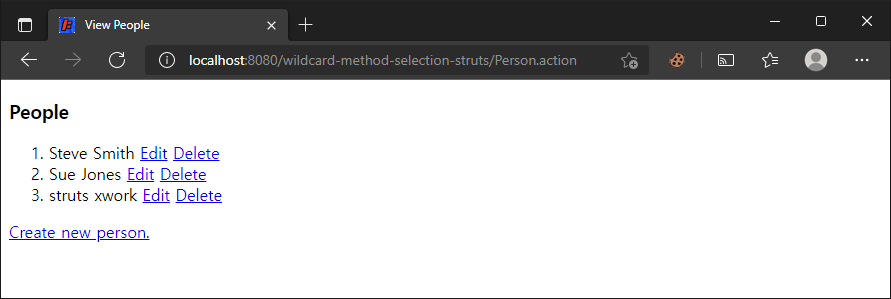

# 와일드카드 메서드 선택

> 원문 : https://struts.apache.org/getting-started/wildcard-method-selection.html

* 서문
* 예제 애플리케이션
* 와일드카드 메서드 선택
* 동적 메서드 호출(Dynamic Method Invocation)
* 요약

이 튜토리얼의 예제 코드인 **wildcard-method-selection**는 Struts 2 깃허브의 [struts-example](https://github.com/apache/struts-examples) 레파지토리에서 체크아웃 할 수 있습니다.


## 서문

이 튜토리얼에서 우리는 struts.xml 설정 파일에서 action 노드를 설정하는 방법을 다룰 것입니다. 그래서 하나의 action 노드가 여러 개의 다른 액션 URL을 액션 클래스의 특정 메서드와 연관시키는 데 사용될 수 있습니다. 이렇게 하면 struts.xml 구성 파일에 작성해야 하는 action 노드의 수가 줄어듭니다.  

Struts 2 [사용자 메일링](http://struts.apache.org/mail.html) 리스트는 도움을 받을 수 있는 훌륭한 장소입니다. 튜토리얼 예제 애플리케이션을 작동시키는데 문제가 있는 경우 Struts 2 메일리스트를 검색하세요. 문제에 대한 답을 찾지 못한 경우 메일링 리스트에 질문을 게시해보세요. 


## 예제 애플리케이션



이 튜토리얼을 지원하는 예제 애플리케이션은 Struts 2의 와일드카드 메서드 선택 방법론을 사용하는 방법을 보여줍니다. 예제는 목록에 일부 사람을 나열하고 편집, 삭제 및  새 사람을 추가할 수 있는 간단한 애플리케이션입니다. 애플리케이션이 `Person`(모델 클래스)과 함께 수행해야 하는 모든 것은 Struts 2 `ActionSupport` 클래스 `PersonAction`에 의해 제어됩니다.   

`PersonAction` 클래스에는 사용자가 원하는 작업에 따라 호출되는 여러 가지 다른 메서드(예: create, edit, delete)가 있습니다. 


## 와일드카드 메서드 선택

와일드카드 메서드 선택 기술을 사용하지 않고 Struts 2 구성 파일에 내가 호출하고 싶은 각각의 개별 액션에 대해 action 매핑 노드를 작성해야 한다고하면 다음의 예와 같습니다: 

### Struts.xml 액션 구성

```xml
<action name="createPerson" class="org.apache.struts.tutorials.wildcardmethod.action.PersonAction" method="create">
    <result name="input">input.jsp</result>
    <result name="success">view.jsp</result>
</action>

<action name="editPerson" class="org.apache.struts.tutorials.wildcardmethod.action.PersonAction" method="edit">
    <result name="input">input.jsp</result>
    <result name="success">view.jsp</result>
</action>
```

위의 내용대로 이 간단한 애플리케이션의 경우에도 구성 파일에 4개의 개별 작업 매핑 노드(create, edit, delete,  saveOrUpdate)를 작성해야 합니다. 따라서 보다 복잡한 애플리케이션에는 수십 개의 action 매핑 노드가 있을 수 있습니다.

와일드카드 메서드 선택 기술을 구현하여 Struts 2 프레임워크가 런타임에 호출할 올바른 메서드를 동적으로 선택하려면 이름 값에 와일드카드 문자 `*`를 사용하고 메서드 값으로 속성 값 자리 표시자(`{1}`)를 사용하면 됩니다. 예:

### 와일드카드 메서드 선택을 사용한 Struts.xml 액션 구성 

```xml
<action name="*Person" class="org.apache.struts.tutorials.wildcardmethod.action.PersonAction" method="{1}">
    <result name="success">view.jsp</result>
    <result name="input">input.jsp</result>
</action>
```

`*`는 와일드카드 문자입니다. "Person"으로 끝나는 모든 액션 이름 값은 이 액션 매핑에 의해 처리됩니다. "Person" 앞에 있는 모든 값은 메서드 속성에 사용되는 값이 됩니다(`{1}` 자리 표시자는 해당 값으로 대체됨). 

예를 들어 아래 URL은 위의 액션 매핑에 의해 처리되고 `PersonAction` 클래스의 `create` 메서드가 호출됩니다. 

* `http://localhost:8080/wildcard-method-selection/createPerson.action` 

아래 URL 은  `PersonAction` 클래스의 `delete` 메서드가 호출되도록 합니다. 

* `http://localhost:8080/wildcard-method-selection/deletePerson.action`

Person 앞에 아무것도 없는 URL이 있으면 어떻게 될까요? 
아래 URL과 같이 Person 앞에 값이 없으면 Struts 2 프레임워크는 `PersonAction` 클래스의 `execute` 메서드를 호출합니다. 

* `http://localhost:8080/wildcard-method-selection/Person.action` 


## 동적 메서드 호출(Dynamic Method Invocation)

위에서 설명한 와일드카드 메서드 선택 기술을 "동적 메서드 호출 (Dynamic Method Invocation)" 기술과 혼동해서는 안 됩니다. Struts 2 문서에서는 이 기술(액션 이름에 bang, `!`, 연산자 사용)을 설명하고 이 기술이 내부적으로 구현되는 방식과 관련된 보안 및 기타 이유 때문에 "동적 메서드 호출" 기술을 사용하지 말 것을 권장합니다.  

Struts 2 문서에서는 Struts 구성에서 `struts.enable.DynamicMethodInvocation`을 `FALSE`로 설정하여 동적 메서드 호출을 사용하는 옵션을 끌 것을 권장합니다. 


## 요약

위에서 설명한 와일드카드 메서드 선택 기술을 사용하면 Struts 2 XML 구성 파일에서 작성하고 관리해야 하는 action 매핑 노드의 수를 크게 줄일 수 있습니다. 


### >  [XML을 사용한 폼 유효성 검증](../form-validation-using-xml)로 돌아가기 또는 [테마](../themes)으로 이동

---

## 와일드카드 메서드 선택 예제 진행...

* 변경사항
  * 프로젝트명: [wildcard-method-selection-struts](wildcard-method-selection-struts)
  
  * 이 프로젝트에도 JPA Hibernate와 HyperSQL DB를 붙여봤다.
  
  * 테스트 코드를 상세히 추가했다.
  
    
  
* [x] 서문

* [x] 예제 애플리케이션

* [x] 와일드카드 메서드 선택

* [x] 동적 메서드 발동(Dynamic Method Invocation)

  `struts.enable.DynamicMethodInvocation` 을 true로 바꿔서 해보려고 했는데, 테스트시  없는 것 처럼 동작했다. Struts 2 `2.5.28` 버전에서는 확실히 막혀있는 것 같음.

* [x] 요약


## 기타

* [invocation](https://en.dict.naver.com/#/entry/enko/8e53482bc5554ed7b76439369bdbcd67)
  * 컴퓨터 (법적 권한 등의) 발동[실시]
  * [발동](https://ko.dict.naver.com/#/entry/koko/72f838466a0044b48b1b771ea62b80f3) (發動)
    * 움직이거나 작용하기 시작함
